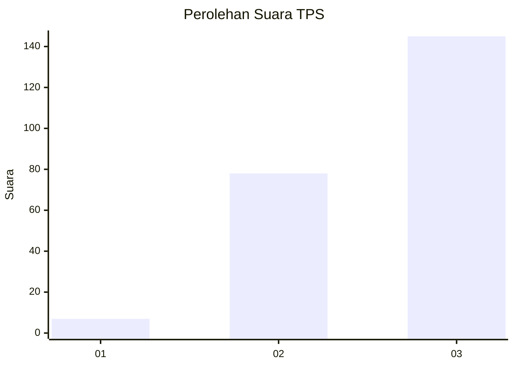
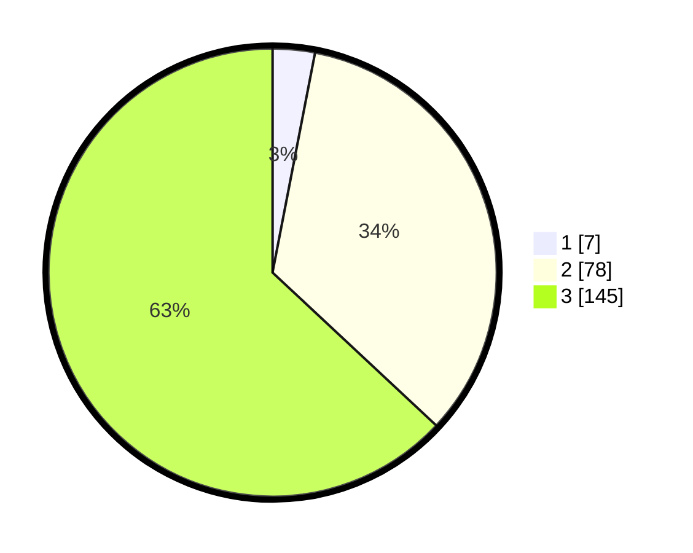

# Hasil

## Grafik

## Tabel

| No. | Nama Paslon    | Suara | Suara (raw) | Persentase |
|:--- |:-------------- | -----:| -----------:| ----------:|
| 1   | ANIES MUHAIMIN | 7     | [7][p-1]    | 3,04       |
| 2   | PRABOWO GIBRAN | 78    | [78][p-2]   | 33,91      |
| 3   | GANJAR MAHFUD  | 145   | [145][p-3]  | 63,04      |

[p-1]: https://github.com/gigit-pemilu/pemilu-2024-33-jawa-tengah/blob/main/pilpres/hitung-suara/sub/33-jawa-tengah/sub/08-magelang/sub/05-srumbung/sub/2012-mranggen/sub/014-tps/sub/paslon-1.txt
[p-2]: https://github.com/gigit-pemilu/pemilu-2024-33-jawa-tengah/blob/main/pilpres/hitung-suara/sub/33-jawa-tengah/sub/08-magelang/sub/05-srumbung/sub/2012-mranggen/sub/014-tps/sub/paslon-2.txt
[p-3]: https://github.com/gigit-pemilu/pemilu-2024-33-jawa-tengah/blob/main/pilpres/hitung-suara/sub/33-jawa-tengah/sub/08-magelang/sub/05-srumbung/sub/2012-mranggen/sub/014-tps/sub/paslon-3.txt

## Foto C Plano

https://sirekap-obj-formc.kpu.go.id/4a57/pemilu/ppwp/33/08/05/20/12/3308052012014-20240215-001333--dd8277a9-ca8c-403e-9aa2-a6ba115de5e3.jpg

https://sirekap-obj-formc.kpu.go.id/4a57/pemilu/ppwp/33/08/05/20/12/3308052012014-20240215-001442--f87441d9-7dc5-4f99-a988-3146be4b8947.jpg

https://sirekap-obj-formc.kpu.go.id/4a57/pemilu/ppwp/33/08/05/20/12/3308052012014-20240215-001608--5dd71b3c-febf-49d3-aab6-de42af39137a.jpg

## Metadata

| Key        | Value               |
| ---------- | ------------------- |
| Time Stamp | 2024-02-16 21:01:00 |

