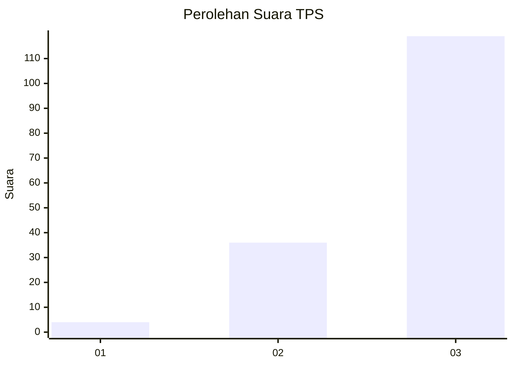
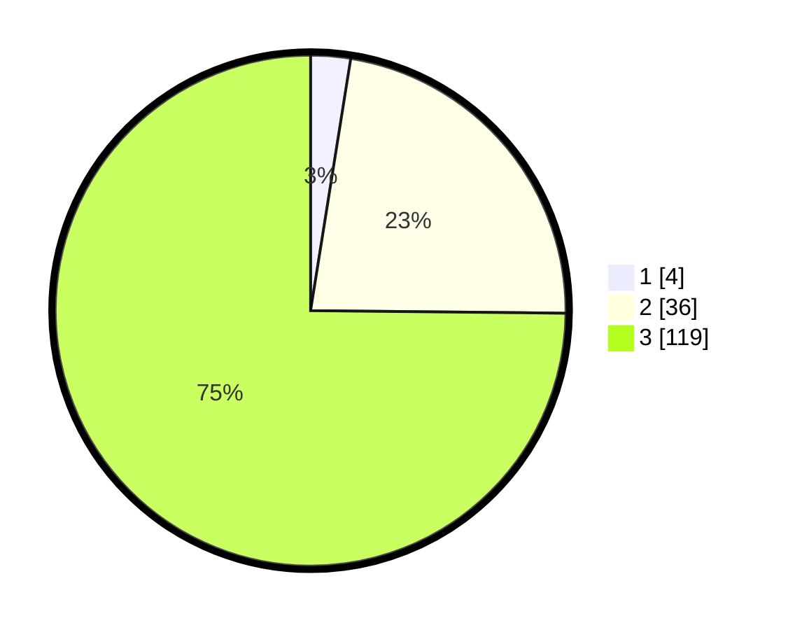

# Hasil

## Grafik

## Tabel

| No. | Nama Paslon    | Suara | Suara (raw) | Persentase |
|:--- |:-------------- | -----:| -----------:| ----------:|
| 1   | ANIES MUHAIMIN | 4     | [4][p-1]    | 2,52       |
| 2   | PRABOWO GIBRAN | 36    | [36][p-2]   | 22,64      |
| 3   | GANJAR MAHFUD  | 119   | [119][p-3]  | 74,84      |

[p-1]: https://github.com/gigit-pemilu/pemilu-2024-33-jawa-tengah/blob/main/pilpres/hitung-suara/sub/33-jawa-tengah/sub/08-magelang/sub/05-srumbung/sub/2012-mranggen/sub/018-tps/sub/paslon-1.txt
[p-2]: https://github.com/gigit-pemilu/pemilu-2024-33-jawa-tengah/blob/main/pilpres/hitung-suara/sub/33-jawa-tengah/sub/08-magelang/sub/05-srumbung/sub/2012-mranggen/sub/018-tps/sub/paslon-2.txt
[p-3]: https://github.com/gigit-pemilu/pemilu-2024-33-jawa-tengah/blob/main/pilpres/hitung-suara/sub/33-jawa-tengah/sub/08-magelang/sub/05-srumbung/sub/2012-mranggen/sub/018-tps/sub/paslon-3.txt

## Foto C Plano

https://sirekap-obj-formc.kpu.go.id/431d/pemilu/ppwp/33/08/05/20/12/3308052012018-20240215-031932--b5391bd8-61dd-4f0a-9277-ed198c6c4741.jpg

https://sirekap-obj-formc.kpu.go.id/431d/pemilu/ppwp/33/08/05/20/12/3308052012018-20240215-032102--ee793b6e-3305-4cf9-a57d-11eb4546f322.jpg

https://sirekap-obj-formc.kpu.go.id/431d/pemilu/ppwp/33/08/05/20/12/3308052012018-20240215-032237--2ddfe26c-cef9-4194-aac7-69038c906920.jpg

## Metadata

| Key        | Value               |
| ---------- | ------------------- |
| Time Stamp | 2024-02-16 21:01:00 |

