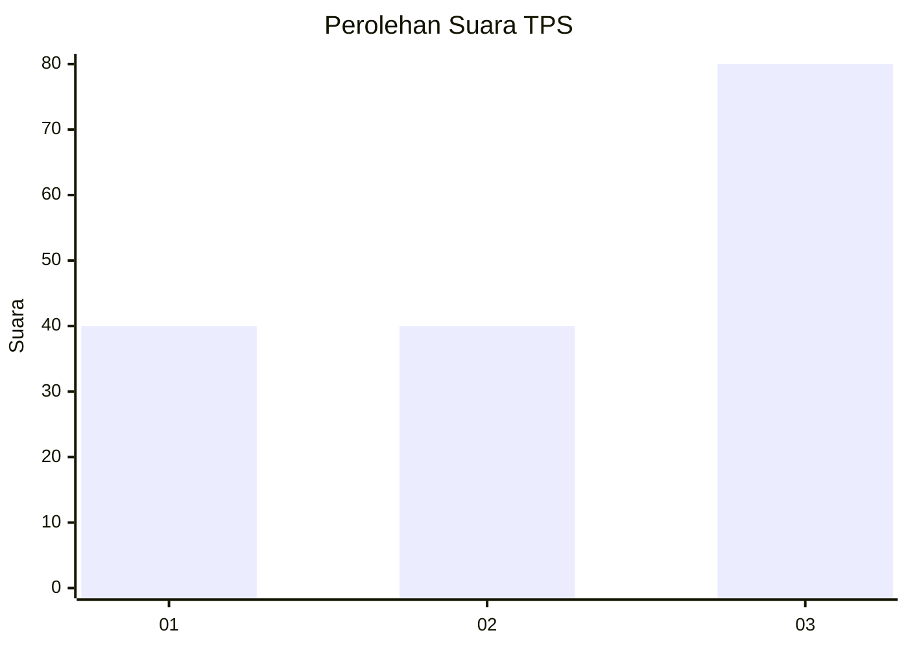
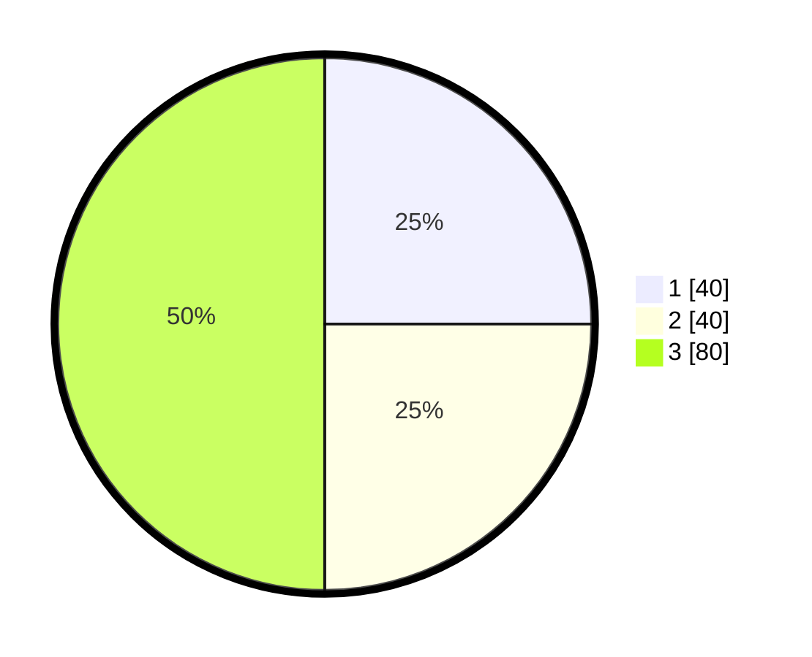

# Hasil

## Grafik

## Tabel

| No. | Nama Paslon    | Suara | Suara (raw) | Persentase |
|:--- |:-------------- | -----:| -----------:| ----------:|
| 1   | ANIES MUHAIMIN | 40    | [40][p-1]   | 25,00      |
| 2   | PRABOWO GIBRAN | 40    | [40][p-2]   | 25,00      |
| 3   | GANJAR MAHFUD  | 80    | [80][p-3]   | 50,00      |

[p-1]: https://github.com/gigit-pemilu/pemilu-2024-33-jawa-tengah/blob/main/pilpres/hitung-suara/sub/33-jawa-tengah/sub/08-magelang/sub/05-srumbung/sub/2015-pucanganom/sub/007-tps/sub/paslon-1.txt
[p-2]: https://github.com/gigit-pemilu/pemilu-2024-33-jawa-tengah/blob/main/pilpres/hitung-suara/sub/33-jawa-tengah/sub/08-magelang/sub/05-srumbung/sub/2015-pucanganom/sub/007-tps/sub/paslon-2.txt
[p-3]: https://github.com/gigit-pemilu/pemilu-2024-33-jawa-tengah/blob/main/pilpres/hitung-suara/sub/33-jawa-tengah/sub/08-magelang/sub/05-srumbung/sub/2015-pucanganom/sub/007-tps/sub/paslon-3.txt

## Foto C Plano

https://sirekap-obj-formc.kpu.go.id/7ef6/pemilu/ppwp/33/08/05/20/15/3308052015007-20240218-145200--781e0fb9-21b9-4960-9891-d5d355d15bc9.jpg

https://sirekap-obj-formc.kpu.go.id/7ef6/pemilu/ppwp/33/08/05/20/15/3308052015007-20240215-013621--62e33a5b-ce72-4029-880d-c458e75a303b.jpg

https://sirekap-obj-formc.kpu.go.id/7ef6/pemilu/ppwp/33/08/05/20/15/3308052015007-20240215-013922--23266f7a-fcb8-4f3f-b138-3861c90fd372.jpg

## Metadata

| Key        | Value               |
| ---------- | ------------------- |
| Time Stamp | 2024-02-19 06:16:00 |

