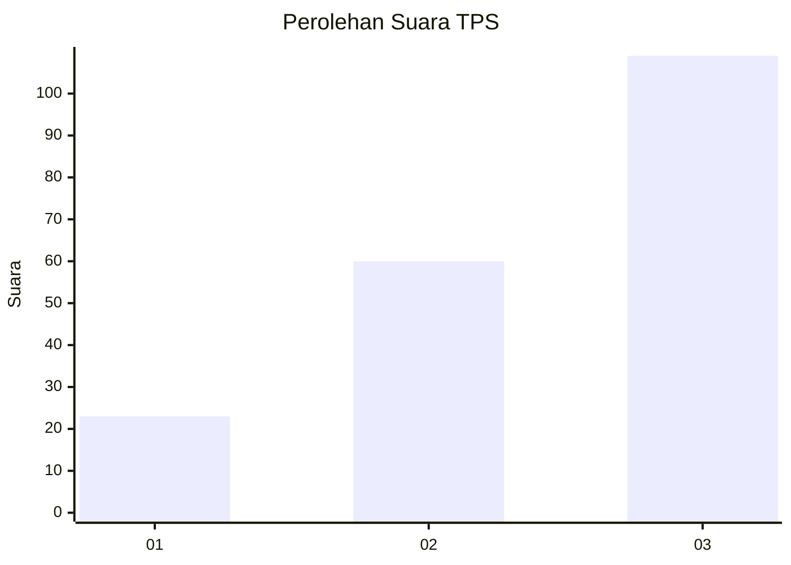
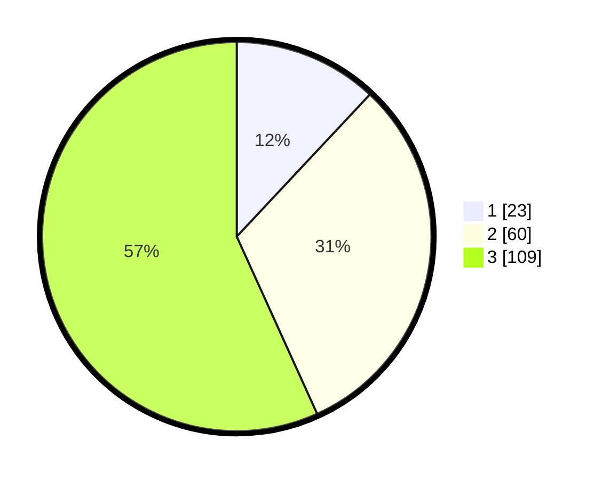

# Hasil

## Grafik

## Tabel

| No. | Nama Paslon    | Suara | Suara (raw) | Persentase |
|:--- |:-------------- | -----:| -----------:| ----------:|
| 1   | ANIES MUHAIMIN | 23    | [23][p-1]   | 11,98      |
| 2   | PRABOWO GIBRAN | 60    | [60][p-2]   | 31,25      |
| 3   | GANJAR MAHFUD  | 109   | [109][p-3]  | 56,77      |

[p-1]: https://github.com/gigit-pemilu/pemilu-2024/blob/main/pilpres/hitung-suara/sub/33-jawa-tengah/sub/08-magelang/sub/06-dukun/sub/2002-wates/sub/002-tps/sub/paslon-1.txt
[p-2]: https://github.com/gigit-pemilu/pemilu-2024/blob/main/pilpres/hitung-suara/sub/33-jawa-tengah/sub/08-magelang/sub/06-dukun/sub/2002-wates/sub/002-tps/sub/paslon-2.txt
[p-3]: https://github.com/gigit-pemilu/pemilu-2024/blob/main/pilpres/hitung-suara/sub/33-jawa-tengah/sub/08-magelang/sub/06-dukun/sub/2002-wates/sub/002-tps/sub/paslon-3.txt

## Foto C Plano

https://sirekap-obj-formc.kpu.go.id/5ebe/pemilu/ppwp/33/08/06/20/02/3308062002002-20240215-003851--abd0a8fd-fae9-4b77-9c3e-dc8ccf9bec81.jpg

https://sirekap-obj-formc.kpu.go.id/5ebe/pemilu/ppwp/33/08/06/20/02/3308062002002-20240215-025050--f2e08887-00a9-4c77-8da5-d7f6ebf235f3.jpg

https://sirekap-obj-formc.kpu.go.id/5ebe/pemilu/ppwp/33/08/06/20/02/3308062002002-20240215-004244--4b0a309d-a068-4afa-8ce1-22892e353e34.jpg

## Metadata

| Key        | Value               |
| ---------- | ------------------- |
| Time Stamp | 2024-02-15 21:30:27 |

