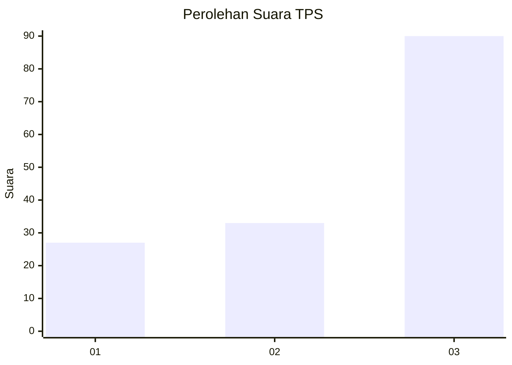
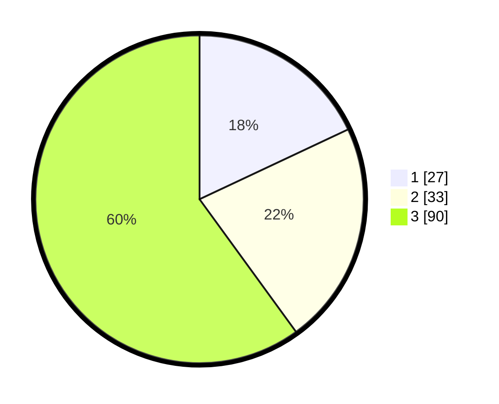

# Hasil

## Grafik

## Tabel

| No. | Nama Paslon    | Suara | Suara (raw) | Persentase |
|:--- |:-------------- | -----:| -----------:| ----------:|
| 1   | ANIES MUHAIMIN | 27    | [27][p-1]   | 18,00      |
| 2   | PRABOWO GIBRAN | 33    | [33][p-2]   | 22,00      |
| 3   | GANJAR MAHFUD  | 90    | [90][p-3]   | 60,00      |

[p-1]: https://github.com/gigit-pemilu/pemilu-2024/blob/main/pilpres/hitung-suara/sub/33-jawa-tengah/sub/08-magelang/sub/06-dukun/sub/2004-banyubiru/sub/015-tps/sub/paslon-1.txt
[p-2]: https://github.com/gigit-pemilu/pemilu-2024/blob/main/pilpres/hitung-suara/sub/33-jawa-tengah/sub/08-magelang/sub/06-dukun/sub/2004-banyubiru/sub/015-tps/sub/paslon-2.txt
[p-3]: https://github.com/gigit-pemilu/pemilu-2024/blob/main/pilpres/hitung-suara/sub/33-jawa-tengah/sub/08-magelang/sub/06-dukun/sub/2004-banyubiru/sub/015-tps/sub/paslon-3.txt

## Foto C Plano

https://sirekap-obj-formc.kpu.go.id/5742/pemilu/ppwp/33/08/06/20/04/3308062004015-20240214-214134--ecfd5215-be3a-4231-b278-516685bb7579.jpg

https://sirekap-obj-formc.kpu.go.id/5742/pemilu/ppwp/33/08/06/20/04/3308062004015-20240214-223717--8c6cc61e-8c0c-46f4-bc12-8dc2872837e1.jpg

https://sirekap-obj-formc.kpu.go.id/5742/pemilu/ppwp/33/08/06/20/04/3308062004015-20240214-214628--6dccd6c9-3305-43ff-8999-7a13f8542a9a.jpg

## Metadata

| Key        | Value               |
| ---------- | ------------------- |
| Time Stamp | 2024-02-19 06:16:00 |

