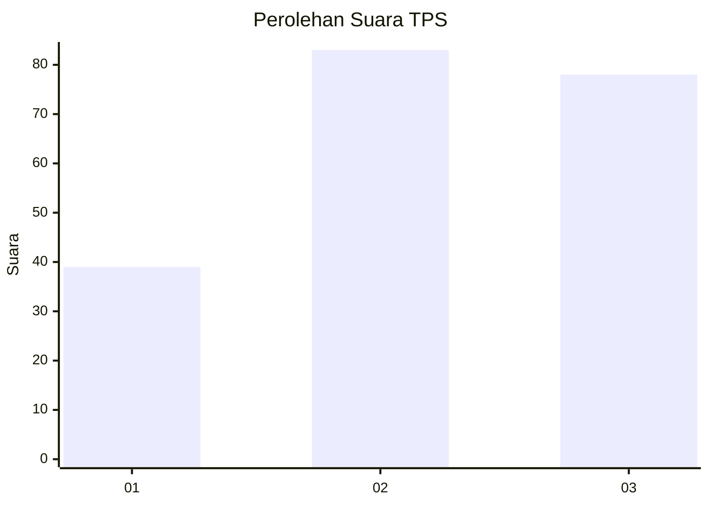
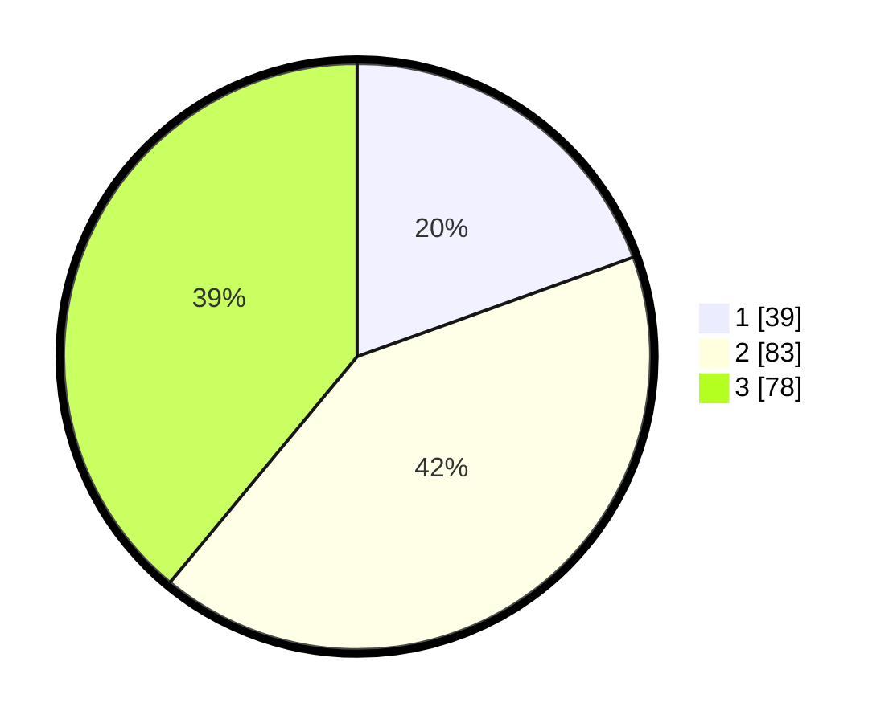

# Hasil

## Grafik

## Tabel

| No. | Nama Paslon    | Suara | Suara (raw) | Persentase |
|:--- |:-------------- | -----:| -----------:| ----------:|
| 1   | ANIES MUHAIMIN | 39    | [39][p-1]   | 19,50      |
| 2   | PRABOWO GIBRAN | 83    | [83][p-2]   | 41,50      |
| 3   | GANJAR MAHFUD  | 78    | [78][p-3]   | 39,00      |

[p-1]: https://github.com/gigit-pemilu/pemilu-2024-33-jawa-tengah/blob/main/pilpres/hitung-suara/sub/33-jawa-tengah/sub/08-magelang/sub/06-dukun/sub/2006-dukun/sub/004-tps/sub/paslon-1.txt
[p-2]: https://github.com/gigit-pemilu/pemilu-2024-33-jawa-tengah/blob/main/pilpres/hitung-suara/sub/33-jawa-tengah/sub/08-magelang/sub/06-dukun/sub/2006-dukun/sub/004-tps/sub/paslon-2.txt
[p-3]: https://github.com/gigit-pemilu/pemilu-2024-33-jawa-tengah/blob/main/pilpres/hitung-suara/sub/33-jawa-tengah/sub/08-magelang/sub/06-dukun/sub/2006-dukun/sub/004-tps/sub/paslon-3.txt

## Foto C Plano

https://sirekap-obj-formc.kpu.go.id/ce9d/pemilu/ppwp/33/08/06/20/06/3308062006004-20240215-010234--f677e7a2-4407-4f9b-ae58-aeccadbcf8b8.jpg

https://sirekap-obj-formc.kpu.go.id/ce9d/pemilu/ppwp/33/08/06/20/06/3308062006004-20240214-202809--e5de1cf5-2030-449d-a91a-b1b4c4fc88ea.jpg

https://sirekap-obj-formc.kpu.go.id/ce9d/pemilu/ppwp/33/08/06/20/06/3308062006004-20240214-202903--9a56f9f6-9f36-4f4a-8415-70727c284acf.jpg

## Metadata

| Key        | Value               |
| ---------- | ------------------- |
| Time Stamp | 2024-02-15 15:00:29 |

