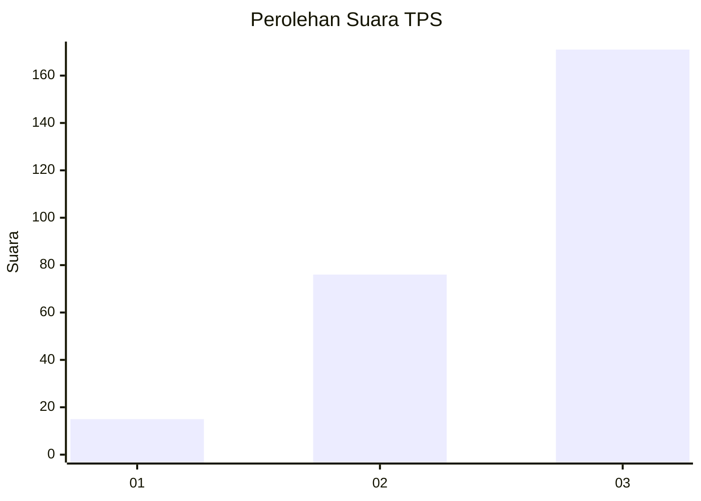
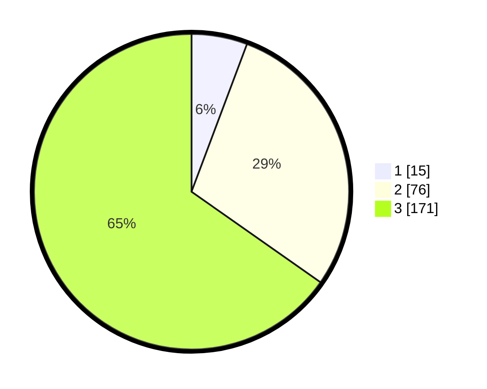

# Hasil

## Grafik

## Tabel

| No. | Nama Paslon    | Suara | Suara (raw) | Persentase |
|:--- |:-------------- | -----:| -----------:| ----------:|
| 1   | ANIES MUHAIMIN | 15    | [15][p-1]   | 5,73       |
| 2   | PRABOWO GIBRAN | 76    | [76][p-2]   | 29,01      |
| 3   | GANJAR MAHFUD  | 171   | [171][p-3]  | 65,27      |

[p-1]: https://github.com/gigit-pemilu/pemilu-2024-33-jawa-tengah/blob/main/pilpres/hitung-suara/sub/33-jawa-tengah/sub/08-magelang/sub/06-dukun/sub/2015-keningar/sub/001-tps/sub/paslon-1.txt
[p-2]: https://github.com/gigit-pemilu/pemilu-2024-33-jawa-tengah/blob/main/pilpres/hitung-suara/sub/33-jawa-tengah/sub/08-magelang/sub/06-dukun/sub/2015-keningar/sub/001-tps/sub/paslon-2.txt
[p-3]: https://github.com/gigit-pemilu/pemilu-2024-33-jawa-tengah/blob/main/pilpres/hitung-suara/sub/33-jawa-tengah/sub/08-magelang/sub/06-dukun/sub/2015-keningar/sub/001-tps/sub/paslon-3.txt

## Foto C Plano

https://sirekap-obj-formc.kpu.go.id/3a3b/pemilu/ppwp/33/08/06/20/15/3308062015001-20240215-004532--4460a6bc-d7e6-43d2-ae47-87537972fb32.jpg

https://sirekap-obj-formc.kpu.go.id/3a3b/pemilu/ppwp/33/08/06/20/15/3308062015001-20240215-005707--0e676fd2-ef30-42f1-a7ff-0db087991443.jpg

https://sirekap-obj-formc.kpu.go.id/3a3b/pemilu/ppwp/33/08/06/20/15/3308062015001-20240215-004719--8162042e-7634-415c-861a-01b1ee04d596.jpg

## Metadata

| Key        | Value               |
| ---------- | ------------------- |
| Time Stamp | 2024-02-15 22:00:27 |

