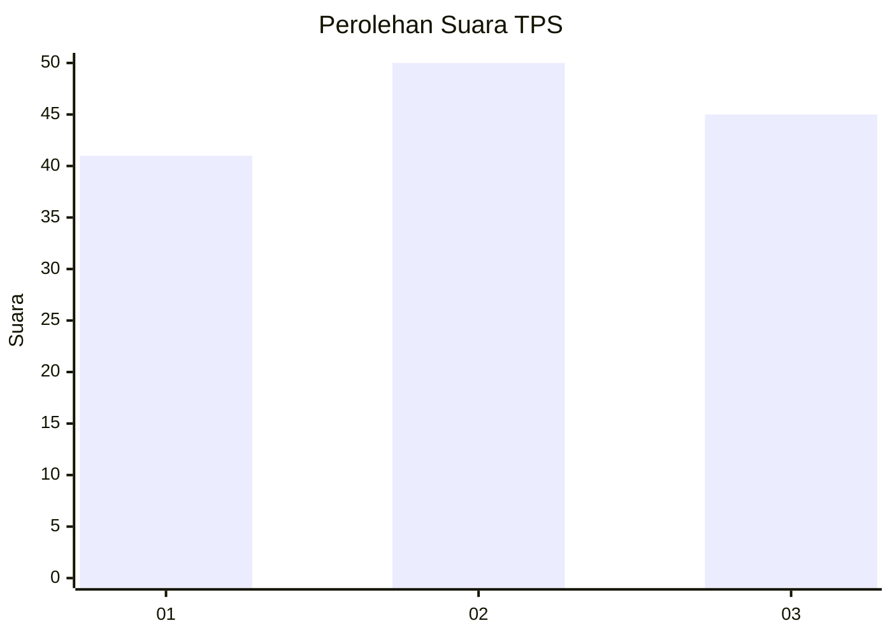
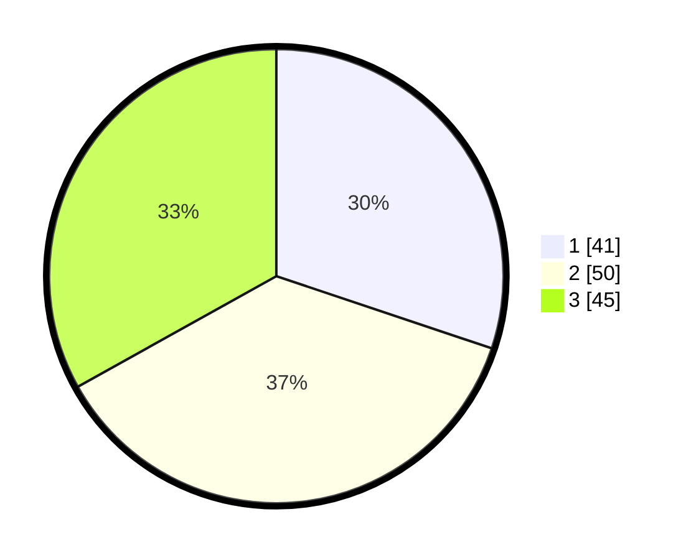

# Hasil

## Grafik

## Tabel

| No. | Nama Paslon    | Suara | Suara (raw) | Persentase |
|:--- |:-------------- | -----:| -----------:| ----------:|
| 1   | ANIES MUHAIMIN | 41    | [41][p-1]   | 30,15      |
| 2   | PRABOWO GIBRAN | 50    | [50][p-2]   | 36,76      |
| 3   | GANJAR MAHFUD  | 45    | [45][p-3]   | 33,09      |

[p-1]: https://github.com/gigit-pemilu/pemilu-2024/blob/main/pilpres/hitung-suara/sub/33-jawa-tengah/sub/08-magelang/sub/07-sawangan/sub/2002-sawangan/sub/002-tps/sub/paslon-1.txt
[p-2]: https://github.com/gigit-pemilu/pemilu-2024/blob/main/pilpres/hitung-suara/sub/33-jawa-tengah/sub/08-magelang/sub/07-sawangan/sub/2002-sawangan/sub/002-tps/sub/paslon-2.txt
[p-3]: https://github.com/gigit-pemilu/pemilu-2024/blob/main/pilpres/hitung-suara/sub/33-jawa-tengah/sub/08-magelang/sub/07-sawangan/sub/2002-sawangan/sub/002-tps/sub/paslon-3.txt

## Foto C Plano

https://sirekap-obj-formc.kpu.go.id/bd29/pemilu/ppwp/33/08/07/20/02/3308072002002-20240214-201304--5170ce24-a848-47c4-9453-eec286fa266f.jpg

https://sirekap-obj-formc.kpu.go.id/bd29/pemilu/ppwp/33/08/07/20/02/3308072002002-20240214-201518--aed54f47-0af2-48eb-907d-c7080b3536ba.jpg

https://sirekap-obj-formc.kpu.go.id/bd29/pemilu/ppwp/33/08/07/20/02/3308072002002-20240214-201605--b0b2a65a-4bd3-49bf-9f95-0fec8af754a1.jpg

## Metadata

| Key        | Value               |
| ---------- | ------------------- |
| Time Stamp | 2024-02-15 18:00:26 |

