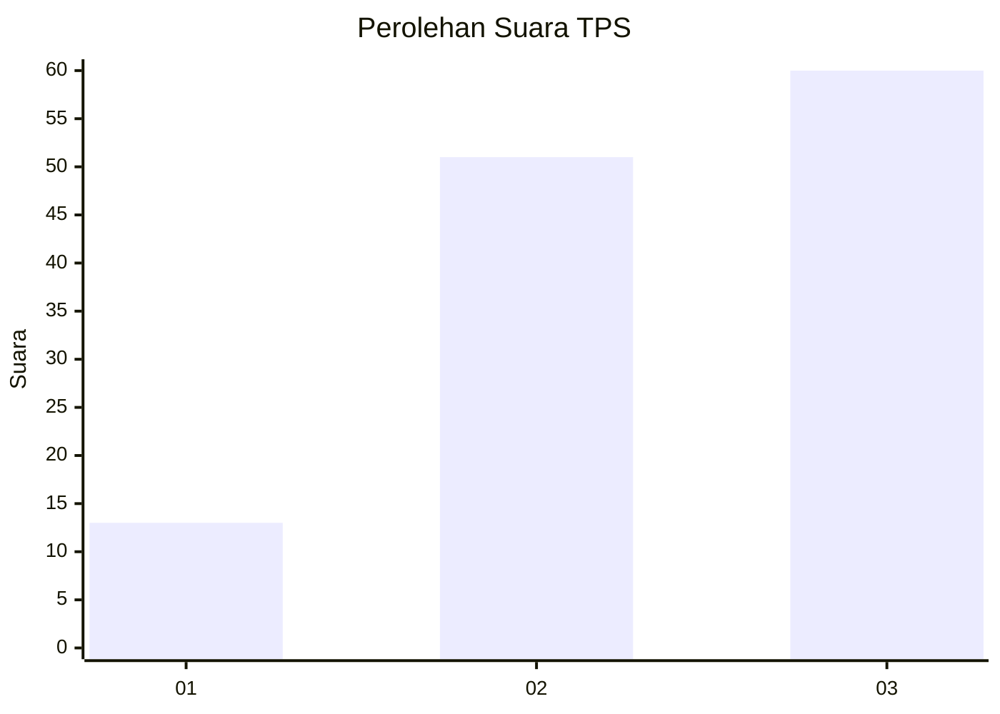
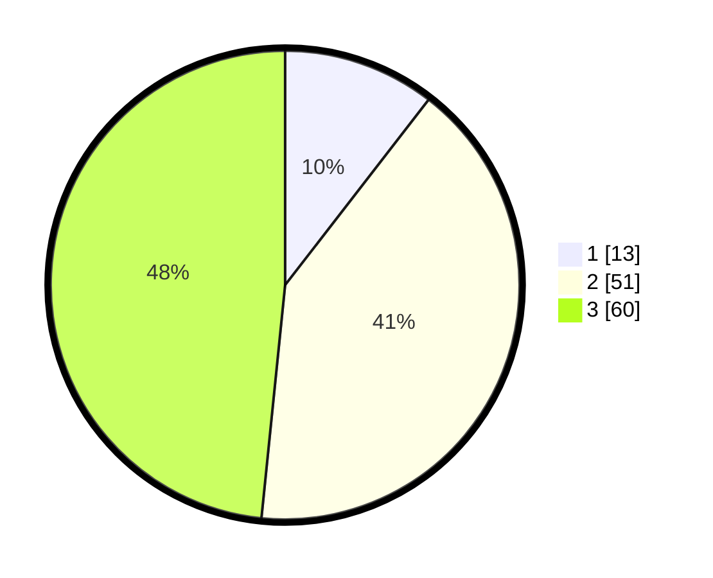

# Hasil

## Grafik

## Tabel

| No. | Nama Paslon    | Suara | Suara (raw) | Persentase |
|:--- |:-------------- | -----:| -----------:| ----------:|
| 1   | ANIES MUHAIMIN | 13    | [13][p-1]   | 10,48      |
| 2   | PRABOWO GIBRAN | 51    | [51][p-2]   | 41,13      |
| 3   | GANJAR MAHFUD  | 60    | [60][p-3]   | 48,39      |

[p-1]: https://github.com/gigit-pemilu/pemilu-2024-33-jawa-tengah/blob/main/pilpres/hitung-suara/sub/33-jawa-tengah/sub/08-magelang/sub/07-sawangan/sub/2004-kapuhan/sub/013-tps/sub/paslon-1.txt
[p-2]: https://github.com/gigit-pemilu/pemilu-2024-33-jawa-tengah/blob/main/pilpres/hitung-suara/sub/33-jawa-tengah/sub/08-magelang/sub/07-sawangan/sub/2004-kapuhan/sub/013-tps/sub/paslon-2.txt
[p-3]: https://github.com/gigit-pemilu/pemilu-2024-33-jawa-tengah/blob/main/pilpres/hitung-suara/sub/33-jawa-tengah/sub/08-magelang/sub/07-sawangan/sub/2004-kapuhan/sub/013-tps/sub/paslon-3.txt

## Foto C Plano

https://sirekap-obj-formc.kpu.go.id/d056/pemilu/ppwp/33/08/07/20/04/3308072004013-20240214-201104--7878d1c2-5495-4d07-991c-d02ff4b97f9e.jpg

https://sirekap-obj-formc.kpu.go.id/d056/pemilu/ppwp/33/08/07/20/04/3308072004013-20240214-223713--45ec266d-72d2-4107-94d3-6b14215e920e.jpg

https://sirekap-obj-formc.kpu.go.id/d056/pemilu/ppwp/33/08/07/20/04/3308072004013-20240214-223814--791d96b2-ecaa-4df8-adef-30624007cd5e.jpg

## Metadata

| Key        | Value               |
| ---------- | ------------------- |
| Time Stamp | 2024-02-15 18:30:25 |

