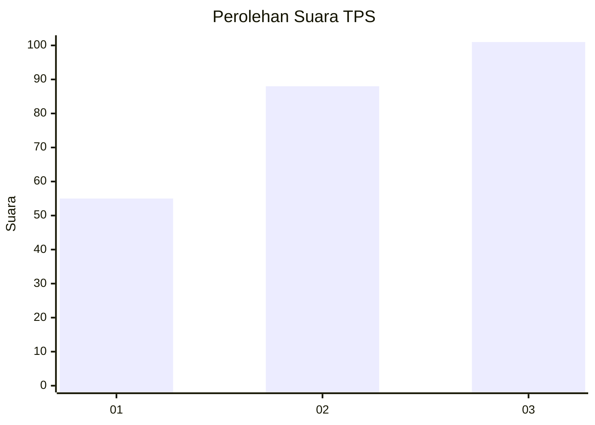
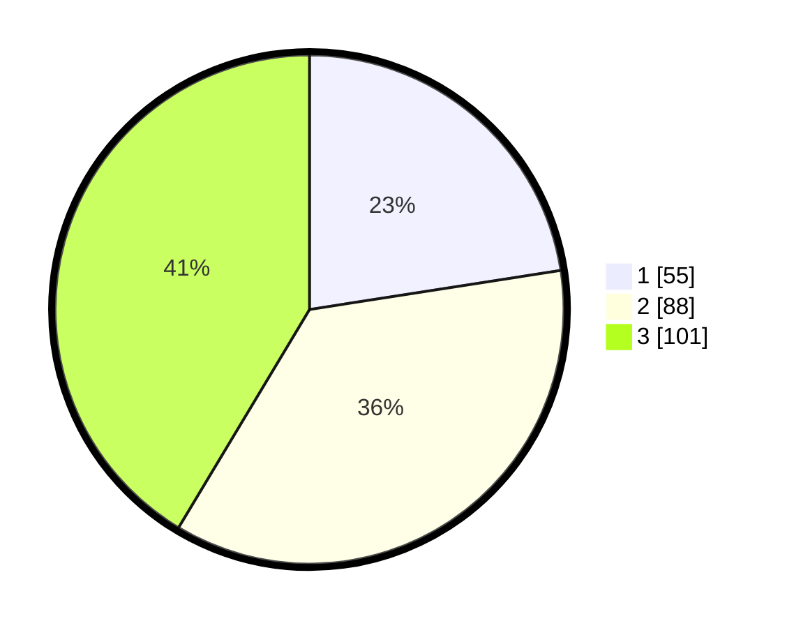

# Hasil

## Grafik

## Tabel

| No. | Nama Paslon    | Suara | Suara (raw) | Persentase |
|:--- |:-------------- | -----:| -----------:| ----------:|
| 1   | ANIES MUHAIMIN | 55    | [55][p-1]   | 22,54      |
| 2   | PRABOWO GIBRAN | 88    | [88][p-2]   | 36,07      |
| 3   | GANJAR MAHFUD  | 101   | [101][p-3]  | 41,39      |

[p-1]: https://github.com/gigit-pemilu/pemilu-2024-33-jawa-tengah/blob/main/pilpres/hitung-suara/sub/33-jawa-tengah/sub/08-magelang/sub/07-sawangan/sub/2007-banyuroto/sub/002-tps/sub/paslon-1.txt
[p-2]: https://github.com/gigit-pemilu/pemilu-2024-33-jawa-tengah/blob/main/pilpres/hitung-suara/sub/33-jawa-tengah/sub/08-magelang/sub/07-sawangan/sub/2007-banyuroto/sub/002-tps/sub/paslon-2.txt
[p-3]: https://github.com/gigit-pemilu/pemilu-2024-33-jawa-tengah/blob/main/pilpres/hitung-suara/sub/33-jawa-tengah/sub/08-magelang/sub/07-sawangan/sub/2007-banyuroto/sub/002-tps/sub/paslon-3.txt

## Foto C Plano

https://sirekap-obj-formc.kpu.go.id/3408/pemilu/ppwp/33/08/07/20/07/3308072007002-20240214-185704--968417bc-1504-4c2f-b785-97df994ad821.jpg

https://sirekap-obj-formc.kpu.go.id/3408/pemilu/ppwp/33/08/07/20/07/3308072007002-20240214-185715--0d3f4543-7a94-44e1-a6e2-96b798cd9505.jpg

https://sirekap-obj-formc.kpu.go.id/3408/pemilu/ppwp/33/08/07/20/07/3308072007002-20240214-185727--8877047c-d43f-4971-9c09-dc8850da1795.jpg

## Metadata

| Key        | Value               |
| ---------- | ------------------- |
| Time Stamp | 2024-02-15 21:01:18 |

