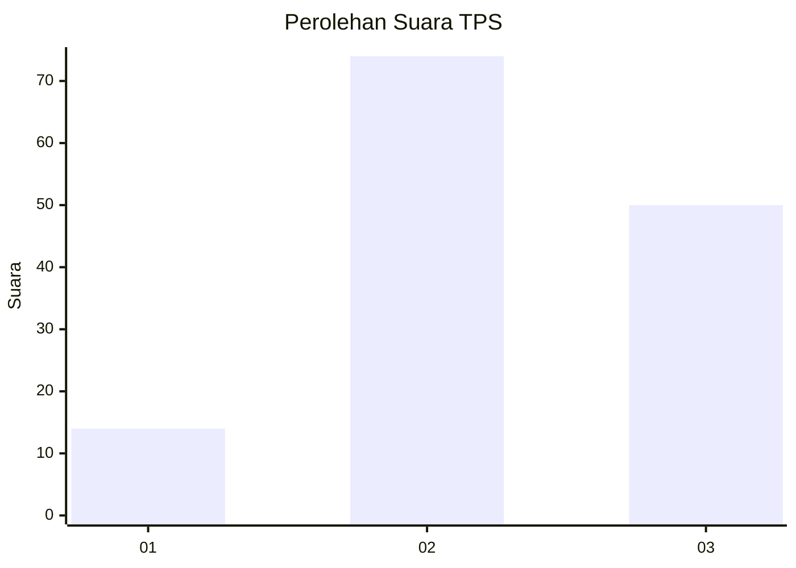
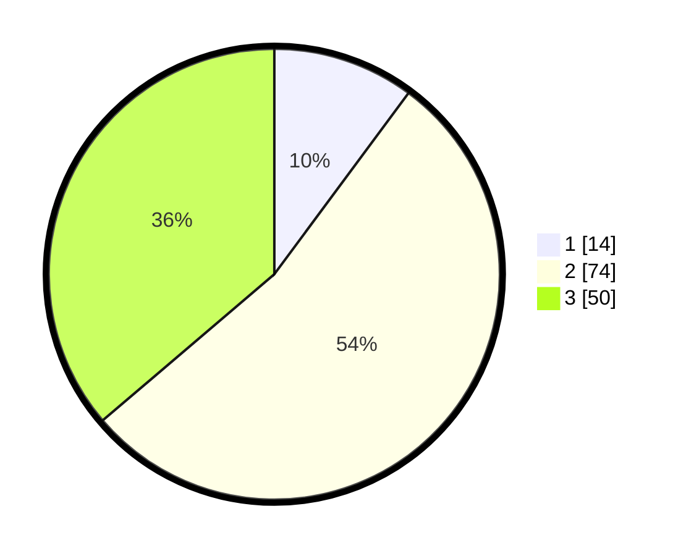

# Hasil

## Grafik

## Tabel

| No. | Nama Paslon    | Suara | Suara (raw) | Persentase |
|:--- |:-------------- | -----:| -----------:| ----------:|
| 1   | ANIES MUHAIMIN | 14    | [14][p-1]   | 10,14      |
| 2   | PRABOWO GIBRAN | 74    | [74][p-2]   | 53,62      |
| 3   | GANJAR MAHFUD  | 50    | [50][p-3]   | 36,23      |

[p-1]: https://github.com/gigit-pemilu/pemilu-2024-33-jawa-tengah/blob/main/pilpres/hitung-suara/sub/33-jawa-tengah/sub/08-magelang/sub/07-sawangan/sub/2009-gantang/sub/004-tps/sub/paslon-1.txt
[p-2]: https://github.com/gigit-pemilu/pemilu-2024-33-jawa-tengah/blob/main/pilpres/hitung-suara/sub/33-jawa-tengah/sub/08-magelang/sub/07-sawangan/sub/2009-gantang/sub/004-tps/sub/paslon-2.txt
[p-3]: https://github.com/gigit-pemilu/pemilu-2024-33-jawa-tengah/blob/main/pilpres/hitung-suara/sub/33-jawa-tengah/sub/08-magelang/sub/07-sawangan/sub/2009-gantang/sub/004-tps/sub/paslon-3.txt

## Foto C Plano

https://sirekap-obj-formc.kpu.go.id/f6e4/pemilu/ppwp/33/08/07/20/09/3308072009004-20240214-221947--4dae220c-b97e-4ae3-86e8-5e802edf6c8a.jpg

https://sirekap-obj-formc.kpu.go.id/f6e4/pemilu/ppwp/33/08/07/20/09/3308072009004-20240214-224427--678b1f60-4e20-46a7-a2f9-f93a6dda1153.jpg

https://sirekap-obj-formc.kpu.go.id/f6e4/pemilu/ppwp/33/08/07/20/09/3308072009004-20240214-225138--a5a0062a-29a1-4cbd-a294-bfa0657d2351.jpg

## Metadata

| Key        | Value               |
| ---------- | ------------------- |
| Time Stamp | 2024-02-15 21:30:27 |

