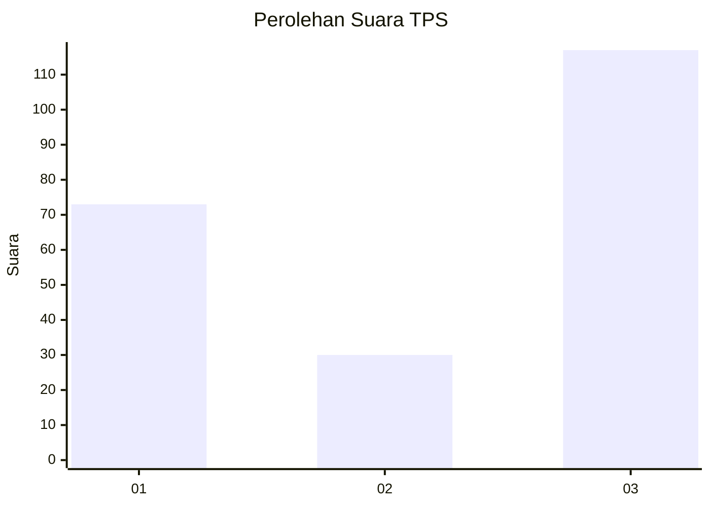
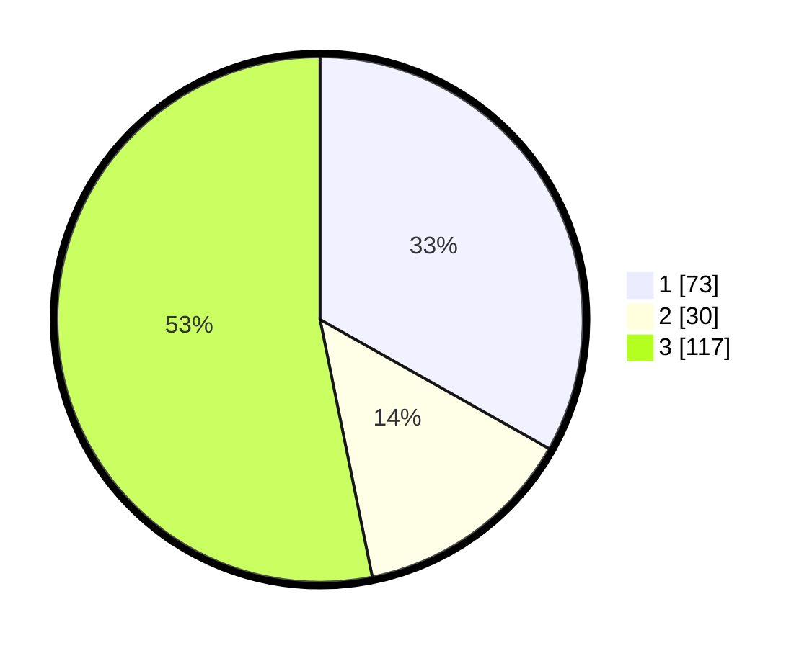

# Hasil

## Grafik

## Tabel

| No. | Nama Paslon    | Suara | Suara (raw) | Persentase |
|:--- |:-------------- | -----:| -----------:| ----------:|
| 1   | ANIES MUHAIMIN | 73    | [73][p-1]   | 33,18      |
| 2   | PRABOWO GIBRAN | 30    | [30][p-2]   | 13,64      |
| 3   | GANJAR MAHFUD  | 117   | [117][p-3]  | 53,18      |

[p-1]: https://github.com/gigit-pemilu/pemilu-2024/blob/main/pilpres/hitung-suara/sub/33-jawa-tengah/sub/08-magelang/sub/07-sawangan/sub/2009-gantang/sub/008-tps/sub/paslon-1.txt
[p-2]: https://github.com/gigit-pemilu/pemilu-2024/blob/main/pilpres/hitung-suara/sub/33-jawa-tengah/sub/08-magelang/sub/07-sawangan/sub/2009-gantang/sub/008-tps/sub/paslon-2.txt
[p-3]: https://github.com/gigit-pemilu/pemilu-2024/blob/main/pilpres/hitung-suara/sub/33-jawa-tengah/sub/08-magelang/sub/07-sawangan/sub/2009-gantang/sub/008-tps/sub/paslon-3.txt

## Foto C Plano

https://sirekap-obj-formc.kpu.go.id/22b3/pemilu/ppwp/33/08/07/20/09/3308072009008-20240214-141257--8e11554f-5ee0-433e-98cc-57f5d0958a63.jpg

https://sirekap-obj-formc.kpu.go.id/22b3/pemilu/ppwp/33/08/07/20/09/3308072009008-20240214-141347--e8fd09e0-23cf-44c4-9fa5-e4f83df54096.jpg

https://sirekap-obj-formc.kpu.go.id/22b3/pemilu/ppwp/33/08/07/20/09/3308072009008-20240214-141407--40e47e04-c249-4728-a291-d3f178a01969.jpg

## Metadata

| Key        | Value               |
| ---------- | ------------------- |
| Time Stamp | 2024-02-14 21:46:01 |

