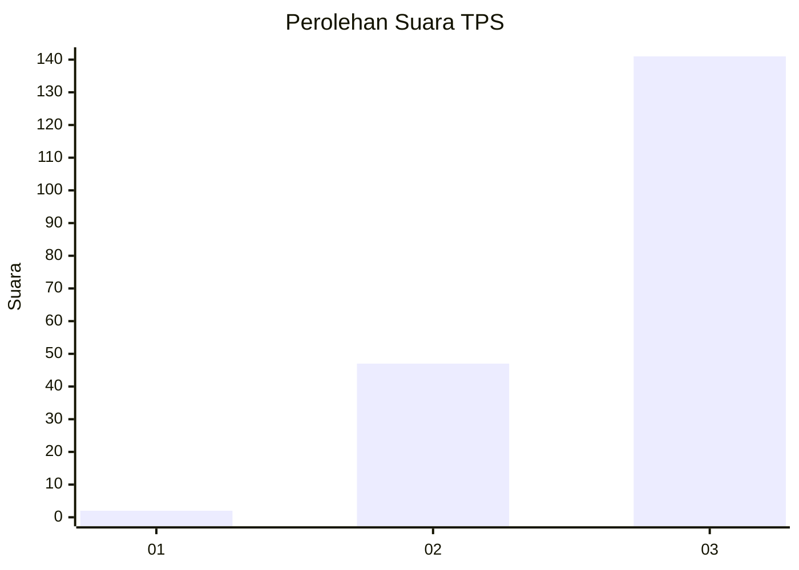
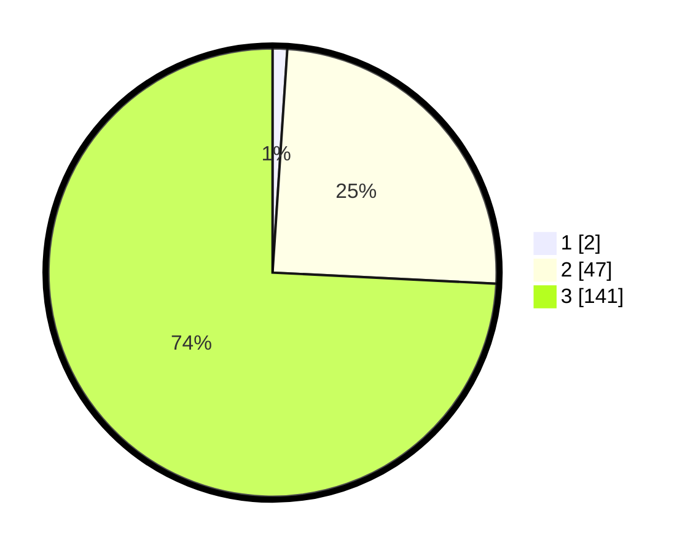

# Hasil

## Grafik

## Tabel

| No. | Nama Paslon    | Suara | Suara (raw) | Persentase |
|:--- |:-------------- | -----:| -----------:| ----------:|
| 1   | ANIES MUHAIMIN | 2     | [2][p-1]    | 1,05       |
| 2   | PRABOWO GIBRAN | 47    | [47][p-2]   | 24,74      |
| 3   | GANJAR MAHFUD  | 141   | [141][p-3]  | 74,21      |

[p-1]: https://github.com/gigit-pemilu/pemilu-2024-33-jawa-tengah/blob/main/pilpres/hitung-suara/sub/33-jawa-tengah/sub/08-magelang/sub/07-sawangan/sub/2009-gantang/sub/012-tps/sub/paslon-1.txt
[p-2]: https://github.com/gigit-pemilu/pemilu-2024-33-jawa-tengah/blob/main/pilpres/hitung-suara/sub/33-jawa-tengah/sub/08-magelang/sub/07-sawangan/sub/2009-gantang/sub/012-tps/sub/paslon-2.txt
[p-3]: https://github.com/gigit-pemilu/pemilu-2024-33-jawa-tengah/blob/main/pilpres/hitung-suara/sub/33-jawa-tengah/sub/08-magelang/sub/07-sawangan/sub/2009-gantang/sub/012-tps/sub/paslon-3.txt

## Foto C Plano

https://sirekap-obj-formc.kpu.go.id/faf1/pemilu/ppwp/33/08/07/20/09/3308072009012-20240214-231829--c3ca90f0-45e0-4a02-bdea-2f576ea03c0f.jpg

https://sirekap-obj-formc.kpu.go.id/faf1/pemilu/ppwp/33/08/07/20/09/3308072009012-20240214-232121--bbb9bc74-c4ba-40d6-83aa-2fb7ca88e232.jpg

https://sirekap-obj-formc.kpu.go.id/faf1/pemilu/ppwp/33/08/07/20/09/3308072009012-20240214-232319--6cafc707-50d8-4adb-af92-4ed9d07f7fb7.jpg

## Metadata

| Key        | Value               |
| ---------- | ------------------- |
| Time Stamp | 2024-02-15 21:30:27 |

