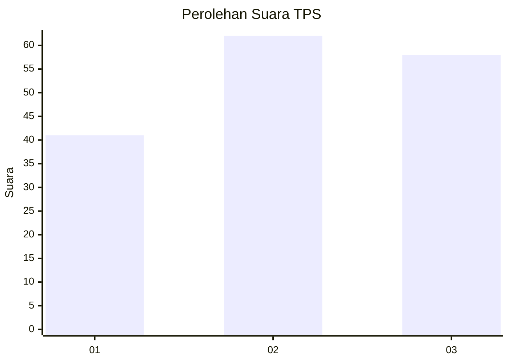
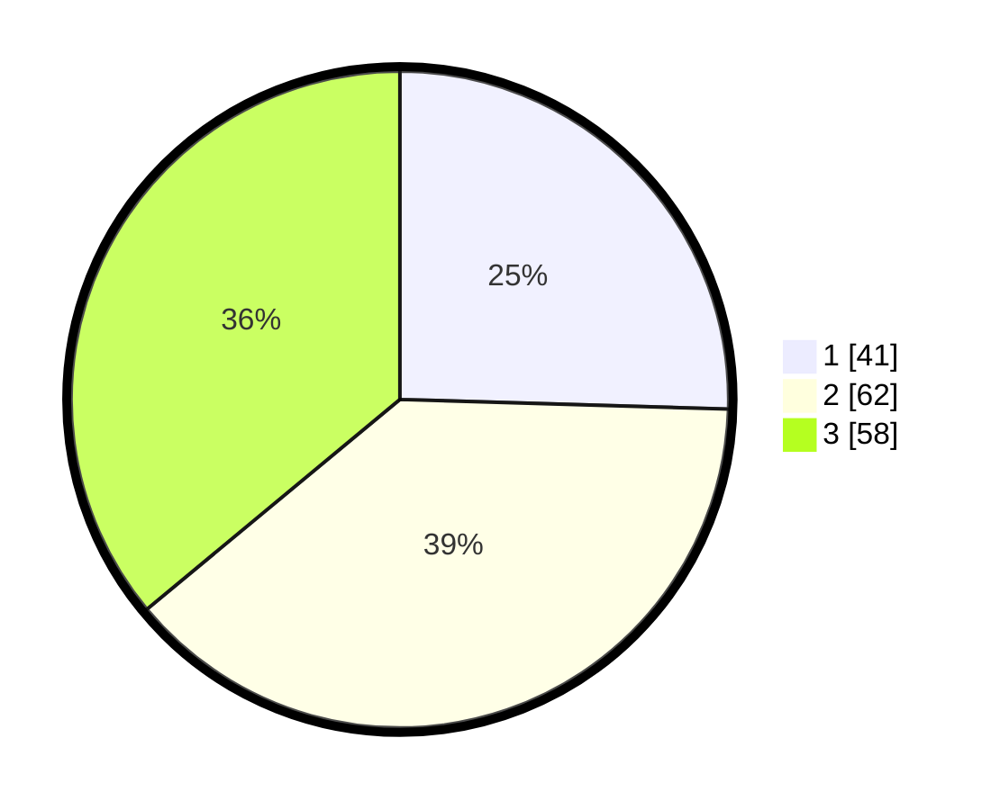

# Hasil

## Grafik

## Tabel

| No. | Nama Paslon    | Suara | Suara (raw) | Persentase |
|:--- |:-------------- | -----:| -----------:| ----------:|
| 1   | ANIES MUHAIMIN | 41    | [41][p-1]   | 25,47      |
| 2   | PRABOWO GIBRAN | 62    | [62][p-2]   | 38,51      |
| 3   | GANJAR MAHFUD  | 58    | [58][p-3]   | 36,02      |

[p-1]: https://github.com/gigit-pemilu/pemilu-2024-33-jawa-tengah/blob/main/pilpres/hitung-suara/sub/33-jawa-tengah/sub/08-magelang/sub/08-muntilan/sub/2001-tanjung/sub/007-tps/sub/paslon-1.txt
[p-2]: https://github.com/gigit-pemilu/pemilu-2024-33-jawa-tengah/blob/main/pilpres/hitung-suara/sub/33-jawa-tengah/sub/08-magelang/sub/08-muntilan/sub/2001-tanjung/sub/007-tps/sub/paslon-2.txt
[p-3]: https://github.com/gigit-pemilu/pemilu-2024-33-jawa-tengah/blob/main/pilpres/hitung-suara/sub/33-jawa-tengah/sub/08-magelang/sub/08-muntilan/sub/2001-tanjung/sub/007-tps/sub/paslon-3.txt

## Foto C Plano

https://sirekap-obj-formc.kpu.go.id/d96f/pemilu/ppwp/33/08/08/20/01/3308082001007-20240214-231933--b4920613-52be-40e5-808c-57c85138891d.jpg

https://sirekap-obj-formc.kpu.go.id/d96f/pemilu/ppwp/33/08/08/20/01/3308082001007-20240216-122456--f45368f1-ffb0-4ffc-aa52-961059ecd585.jpg

https://sirekap-obj-formc.kpu.go.id/d96f/pemilu/ppwp/33/08/08/20/01/3308082001007-20240214-232030--32858973-3917-4aac-a1e4-1d987bb1c17c.jpg

## Metadata

| Key        | Value               |
| ---------- | ------------------- |
| Time Stamp | 2024-02-19 06:16:00 |

