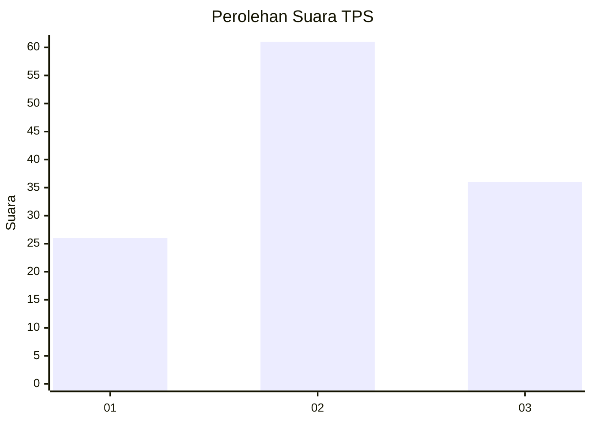
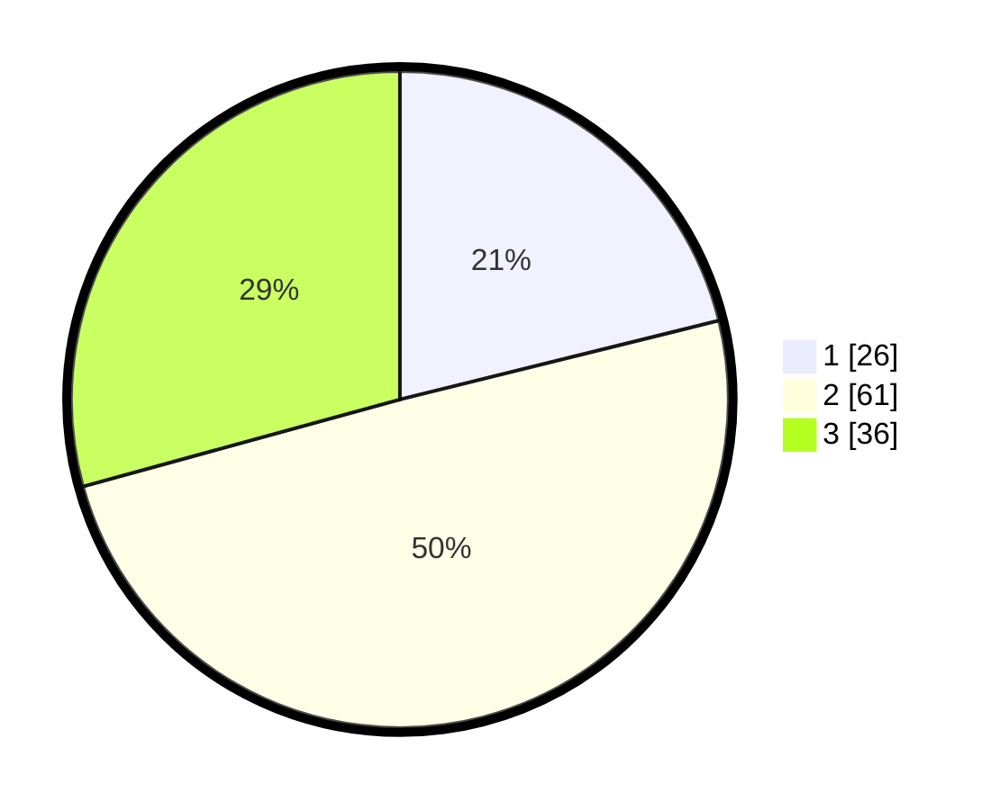

# Hasil

## Grafik

## Tabel

| No. | Nama Paslon    | Suara | Suara (raw) | Persentase |
|:--- |:-------------- | -----:| -----------:| ----------:|
| 1   | ANIES MUHAIMIN | 26    | [26][p-1]   | 21,14      |
| 2   | PRABOWO GIBRAN | 61    | [61][p-2]   | 49,59      |
| 3   | GANJAR MAHFUD  | 36    | [36][p-3]   | 29,27      |

[p-1]: https://github.com/gigit-pemilu/pemilu-2024/blob/main/pilpres/hitung-suara/sub/33-jawa-tengah/sub/08-magelang/sub/08-muntilan/sub/2003-sriwedari/sub/011-tps/sub/paslon-1.txt
[p-2]: https://github.com/gigit-pemilu/pemilu-2024/blob/main/pilpres/hitung-suara/sub/33-jawa-tengah/sub/08-magelang/sub/08-muntilan/sub/2003-sriwedari/sub/011-tps/sub/paslon-2.txt
[p-3]: https://github.com/gigit-pemilu/pemilu-2024/blob/main/pilpres/hitung-suara/sub/33-jawa-tengah/sub/08-magelang/sub/08-muntilan/sub/2003-sriwedari/sub/011-tps/sub/paslon-3.txt

## Foto C Plano

https://sirekap-obj-formc.kpu.go.id/623b/pemilu/ppwp/33/08/08/20/03/3308082003011-20240214-190147--d1abd7cd-6151-4bef-a399-114a62959302.jpg

https://sirekap-obj-formc.kpu.go.id/623b/pemilu/ppwp/33/08/08/20/03/3308082003011-20240214-195339--dcafe2a1-4ae1-4346-8877-0d23073ca3b8.jpg

https://sirekap-obj-formc.kpu.go.id/623b/pemilu/ppwp/33/08/08/20/03/3308082003011-20240214-195521--23614966-b859-4305-a73c-4565eeca9852.jpg

## Metadata

| Key        | Value               |
| ---------- | ------------------- |
| Time Stamp | 2024-02-14 21:46:01 |

