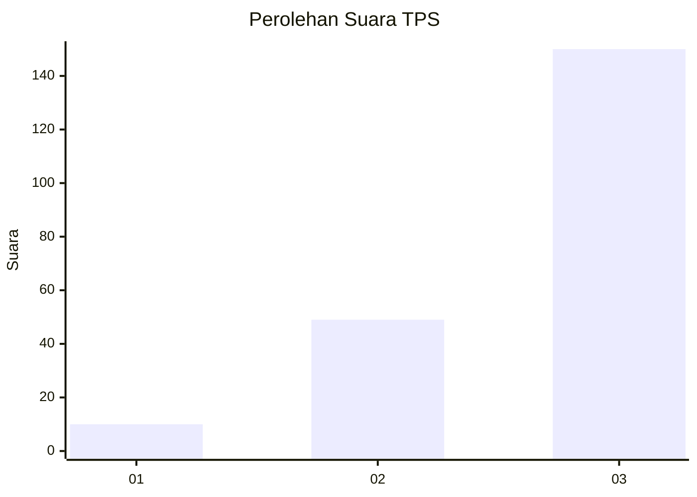
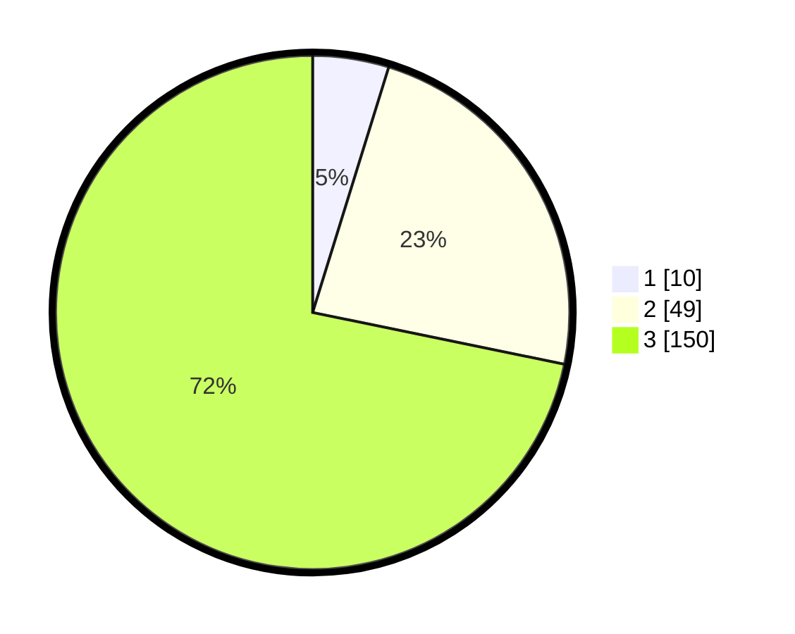

# Hasil

## Grafik

## Tabel

| No. | Nama Paslon    | Suara | Suara (raw) | Persentase |
|:--- |:-------------- | -----:| -----------:| ----------:|
| 1   | ANIES MUHAIMIN | 10    | [10][p-1]   | 4,78       |
| 2   | PRABOWO GIBRAN | 49    | [49][p-2]   | 23,44      |
| 3   | GANJAR MAHFUD  | 150   | [150][p-3]  | 71,77      |

[p-1]: https://github.com/gigit-pemilu/pemilu-2024-33-jawa-tengah/blob/main/pilpres/hitung-suara/sub/33-jawa-tengah/sub/08-magelang/sub/08-muntilan/sub/2008-ngawen/sub/003-tps/sub/paslon-1.txt
[p-2]: https://github.com/gigit-pemilu/pemilu-2024-33-jawa-tengah/blob/main/pilpres/hitung-suara/sub/33-jawa-tengah/sub/08-magelang/sub/08-muntilan/sub/2008-ngawen/sub/003-tps/sub/paslon-2.txt
[p-3]: https://github.com/gigit-pemilu/pemilu-2024-33-jawa-tengah/blob/main/pilpres/hitung-suara/sub/33-jawa-tengah/sub/08-magelang/sub/08-muntilan/sub/2008-ngawen/sub/003-tps/sub/paslon-3.txt

## Foto C Plano

https://sirekap-obj-formc.kpu.go.id/0bf6/pemilu/ppwp/33/08/08/20/08/3308082008003-20240215-000533--4b1a29d1-fd40-4354-8745-a6a6981f5f99.jpg

https://sirekap-obj-formc.kpu.go.id/0bf6/pemilu/ppwp/33/08/08/20/08/3308082008003-20240215-000754--58ad32c3-b613-4e15-9010-5ab5341beffd.jpg

https://sirekap-obj-formc.kpu.go.id/0bf6/pemilu/ppwp/33/08/08/20/08/3308082008003-20240215-013909--91d9006b-044e-4688-8277-1c942c4101f4.jpg

## Metadata

| Key        | Value               |
| ---------- | ------------------- |
| Time Stamp | 2024-02-15 23:29:50 |

