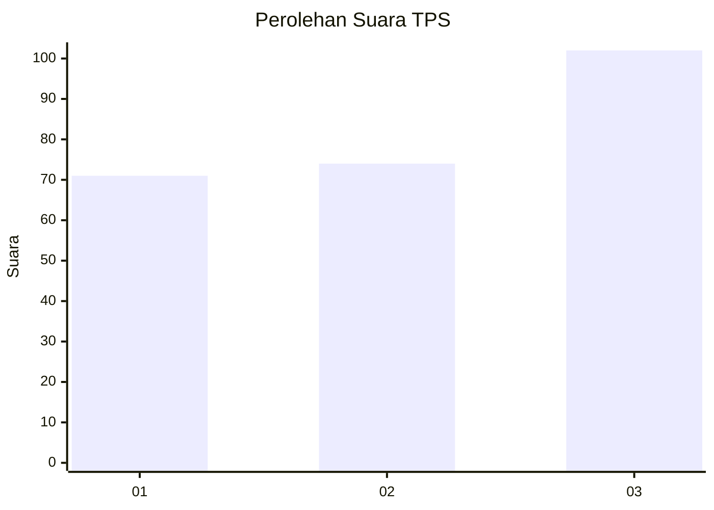
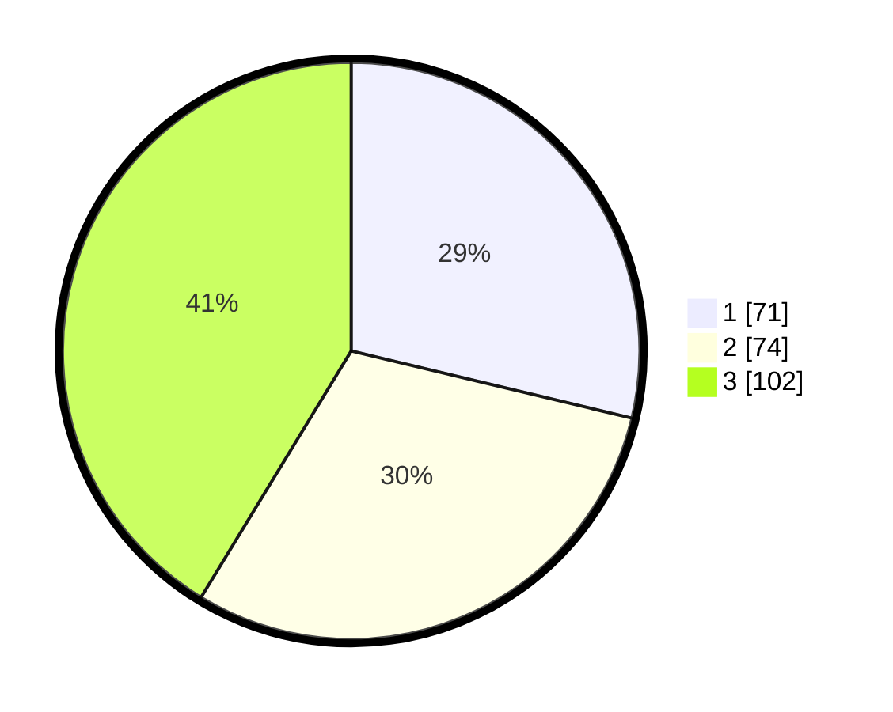

# Hasil

## Grafik

## Tabel

| No. | Nama Paslon    | Suara | Suara (raw) | Persentase |
|:--- |:-------------- | -----:| -----------:| ----------:|
| 1   | ANIES MUHAIMIN | 71    | [71][p-1]   | 28,74      |
| 2   | PRABOWO GIBRAN | 74    | [74][p-2]   | 29,96      |
| 3   | GANJAR MAHFUD  | 102   | [102][p-3]  | 41,30      |

[p-1]: https://github.com/gigit-pemilu/pemilu-2024/blob/main/pilpres/hitung-suara/sub/33-jawa-tengah/sub/08-magelang/sub/08-muntilan/sub/2009-gunungpring/sub/001-tps/sub/paslon-1.txt
[p-2]: https://github.com/gigit-pemilu/pemilu-2024/blob/main/pilpres/hitung-suara/sub/33-jawa-tengah/sub/08-magelang/sub/08-muntilan/sub/2009-gunungpring/sub/001-tps/sub/paslon-2.txt
[p-3]: https://github.com/gigit-pemilu/pemilu-2024/blob/main/pilpres/hitung-suara/sub/33-jawa-tengah/sub/08-magelang/sub/08-muntilan/sub/2009-gunungpring/sub/001-tps/sub/paslon-3.txt

## Foto C Plano

https://sirekap-obj-formc.kpu.go.id/35ef/pemilu/ppwp/33/08/08/20/09/3308082009001-20240216-201808--d3a63066-2dfb-48bb-a834-f638cab5adc2.jpg

https://sirekap-obj-formc.kpu.go.id/35ef/pemilu/ppwp/33/08/08/20/09/3308082009001-20240216-203617--8fea9301-e756-4575-a646-61b8437e3bc2.jpg

https://sirekap-obj-formc.kpu.go.id/35ef/pemilu/ppwp/33/08/08/20/09/3308082009001-20240216-203757--fc469ee7-abc9-4570-b864-75add1aef834.jpg

## Metadata

| Key        | Value               |
| ---------- | ------------------- |
| Time Stamp | 2024-02-25 15:00:00 |

