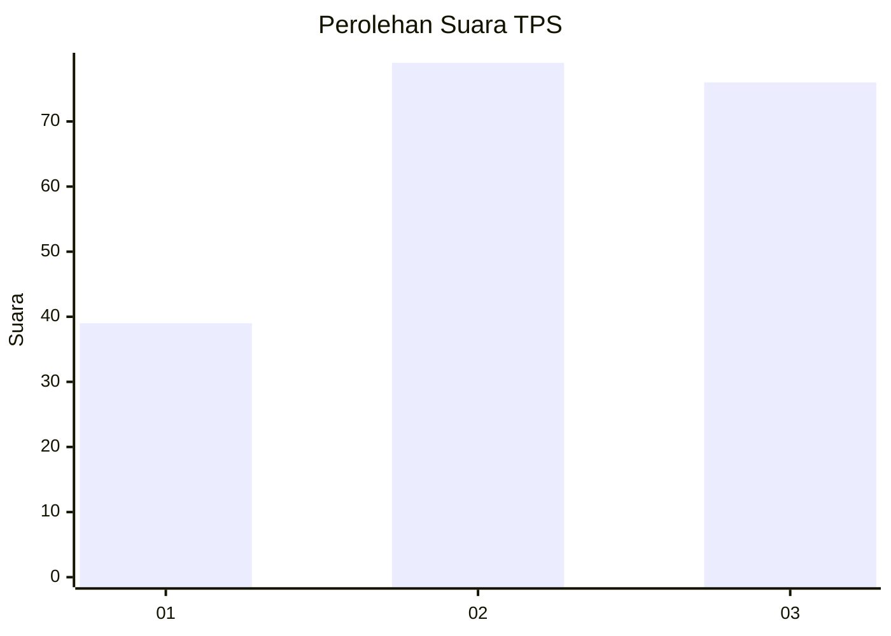
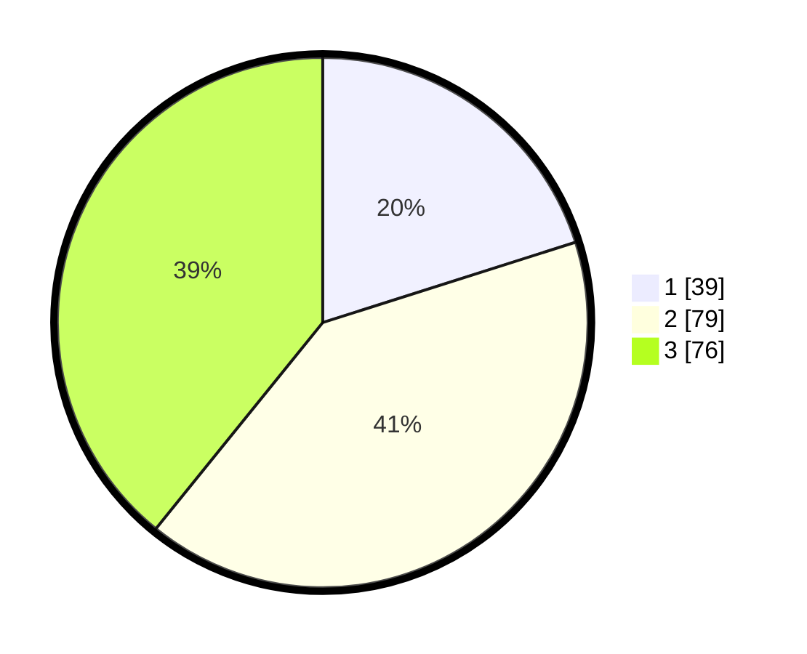

# Hasil

## Grafik

## Tabel

| No. | Nama Paslon    | Suara | Suara (raw) | Persentase |
|:--- |:-------------- | -----:| -----------:| ----------:|
| 1   | ANIES MUHAIMIN | 39    | [39][p-1]   | 20,10      |
| 2   | PRABOWO GIBRAN | 79    | [79][p-2]   | 40,72      |
| 3   | GANJAR MAHFUD  | 76    | [76][p-3]   | 39,18      |

[p-1]: https://github.com/gigit-pemilu/pemilu-2024-33-jawa-tengah/blob/main/pilpres/hitung-suara/sub/33-jawa-tengah/sub/08-magelang/sub/08-muntilan/sub/2009-gunungpring/sub/005-tps/sub/paslon-1.txt
[p-2]: https://github.com/gigit-pemilu/pemilu-2024-33-jawa-tengah/blob/main/pilpres/hitung-suara/sub/33-jawa-tengah/sub/08-magelang/sub/08-muntilan/sub/2009-gunungpring/sub/005-tps/sub/paslon-2.txt
[p-3]: https://github.com/gigit-pemilu/pemilu-2024-33-jawa-tengah/blob/main/pilpres/hitung-suara/sub/33-jawa-tengah/sub/08-magelang/sub/08-muntilan/sub/2009-gunungpring/sub/005-tps/sub/paslon-3.txt

## Foto C Plano

https://sirekap-obj-formc.kpu.go.id/3202/pemilu/ppwp/33/08/08/20/09/3308082009005-20240216-214925--1d99e247-662d-43c3-ae64-3e1bd451ebff.jpg

https://sirekap-obj-formc.kpu.go.id/3202/pemilu/ppwp/33/08/08/20/09/3308082009005-20240216-215313--2cb7a5f7-d008-4442-a88e-d1128c5af109.jpg

https://sirekap-obj-formc.kpu.go.id/3202/pemilu/ppwp/33/08/08/20/09/3308082009005-20240216-215444--d35597ce-e2ad-4c03-8868-d809857df08f.jpg

## Metadata

| Key        | Value               |
| ---------- | ------------------- |
| Time Stamp | 2024-02-17 16:00:02 |

