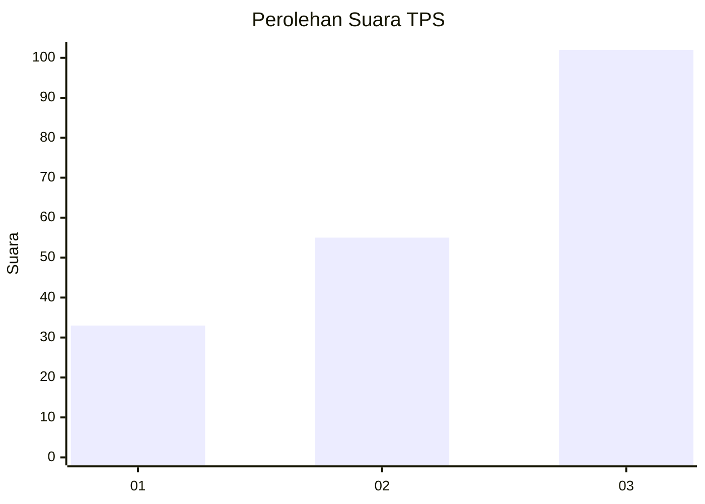
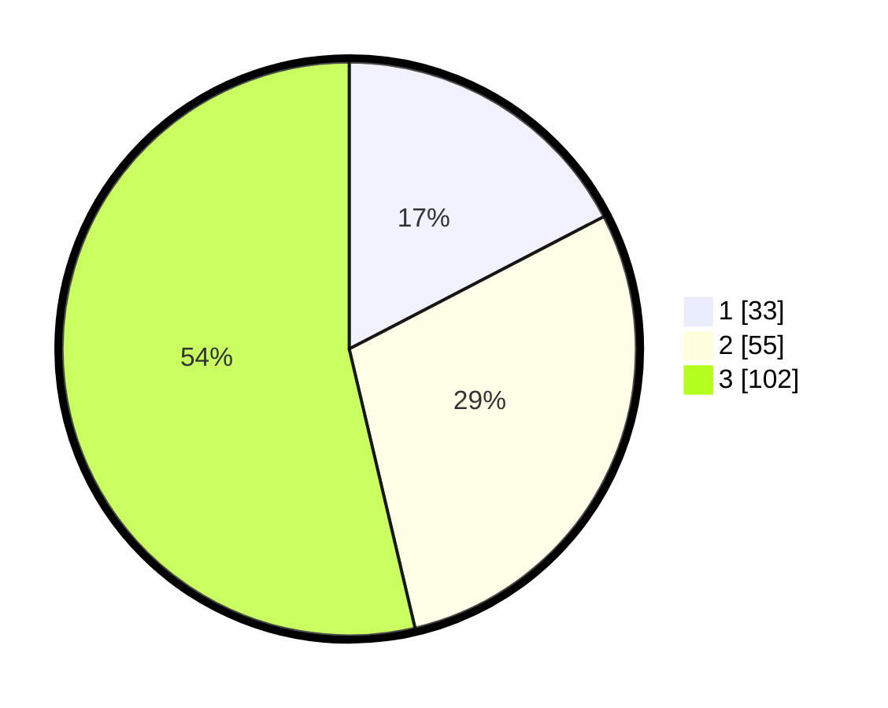

# Hasil

## Grafik

## Tabel

| No. | Nama Paslon    | Suara | Suara (raw) | Persentase |
|:--- |:-------------- | -----:| -----------:| ----------:|
| 1   | ANIES MUHAIMIN | 33    | [33][p-1]   | 17,37      |
| 2   | PRABOWO GIBRAN | 55    | [55][p-2]   | 28,95      |
| 3   | GANJAR MAHFUD  | 102   | [102][p-3]  | 53,68      |

[p-1]: https://github.com/gigit-pemilu/pemilu-2024/blob/main/pilpres/hitung-suara/sub/33-jawa-tengah/sub/08-magelang/sub/08-muntilan/sub/2010-pucungrejo/sub/019-tps/sub/paslon-1.txt
[p-2]: https://github.com/gigit-pemilu/pemilu-2024/blob/main/pilpres/hitung-suara/sub/33-jawa-tengah/sub/08-magelang/sub/08-muntilan/sub/2010-pucungrejo/sub/019-tps/sub/paslon-2.txt
[p-3]: https://github.com/gigit-pemilu/pemilu-2024/blob/main/pilpres/hitung-suara/sub/33-jawa-tengah/sub/08-magelang/sub/08-muntilan/sub/2010-pucungrejo/sub/019-tps/sub/paslon-3.txt

## Foto C Plano

https://sirekap-obj-formc.kpu.go.id/37ce/pemilu/ppwp/33/08/08/20/10/3308082010019-20240217-003550--9830b380-6c1f-4c3c-92b7-624d7f0f1a12.jpg

https://sirekap-obj-formc.kpu.go.id/37ce/pemilu/ppwp/33/08/08/20/10/3308082010019-20240214-193030--c60054ed-808b-4da9-b1bc-ff3af0f575e3.jpg

https://sirekap-obj-formc.kpu.go.id/37ce/pemilu/ppwp/33/08/08/20/10/3308082010019-20240214-193204--08d27086-1321-4e36-8517-2a81a3ab0039.jpg

## Metadata

| Key        | Value               |
| ---------- | ------------------- |
| Time Stamp | 2024-02-17 01:00:00 |

