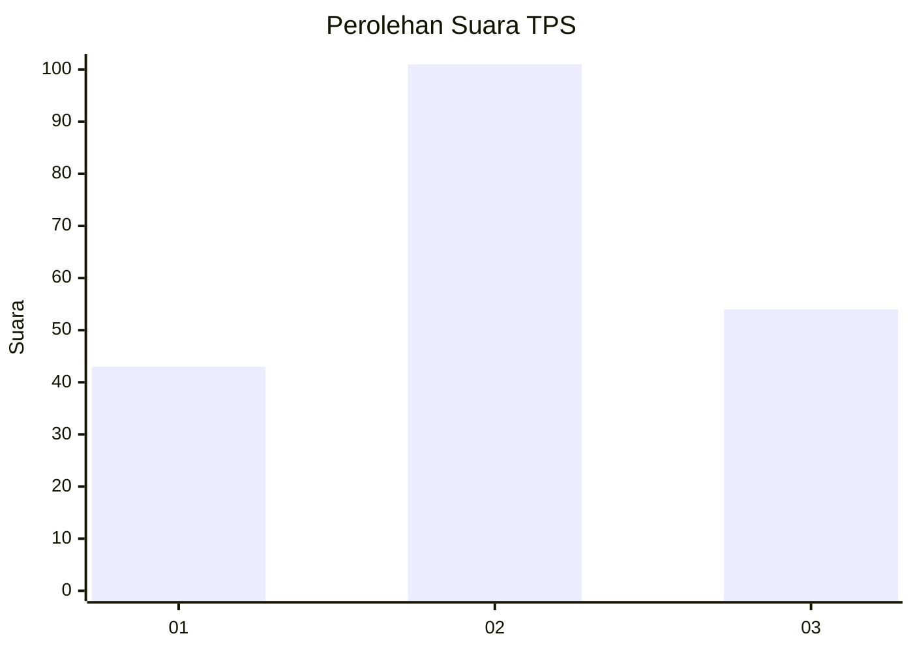
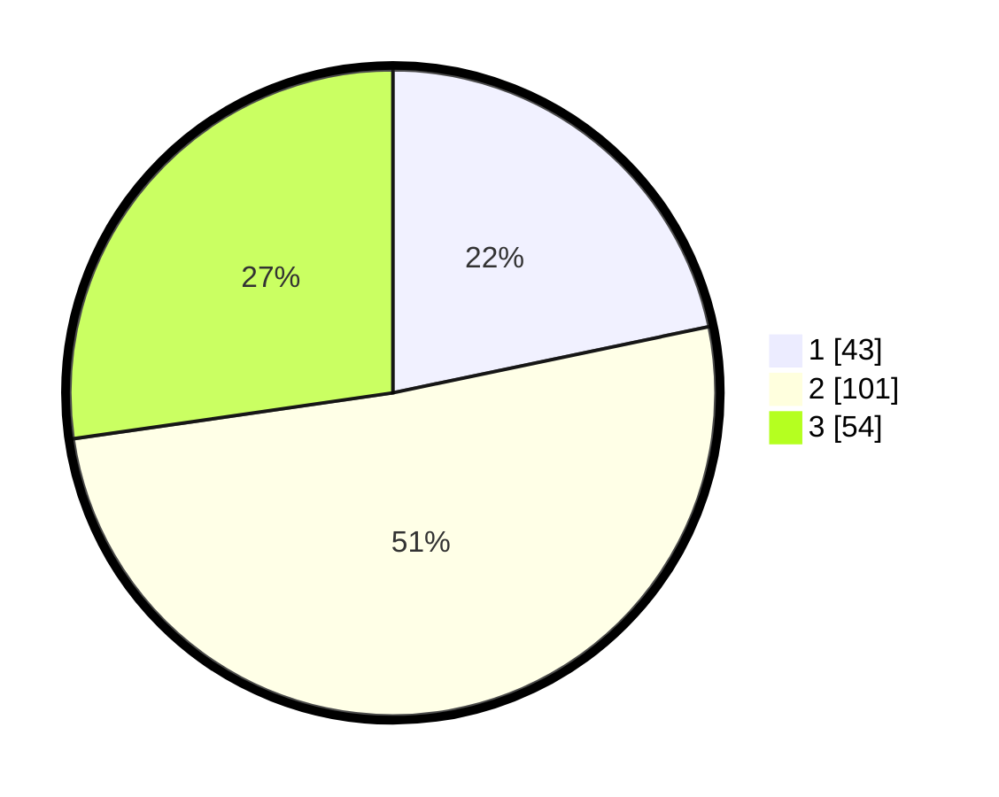

# Hasil

## Grafik

## Tabel

| No. | Nama Paslon    | Suara | Suara (raw) | Persentase |
|:--- |:-------------- | -----:| -----------:| ----------:|
| 1   | ANIES MUHAIMIN | 43    | [43][p-1]   | 21,72      |
| 2   | PRABOWO GIBRAN | 101   | [101][p-2]  | 51,01      |
| 3   | GANJAR MAHFUD  | 54    | [54][p-3]   | 27,27      |

[p-1]: https://github.com/gigit-pemilu/pemilu-2024/blob/main/pilpres/hitung-suara/sub/33-jawa-tengah/sub/08-magelang/sub/10-mertoyudan/sub/1009-sumberrejo/sub/005-tps/sub/paslon-1.txt
[p-2]: https://github.com/gigit-pemilu/pemilu-2024/blob/main/pilpres/hitung-suara/sub/33-jawa-tengah/sub/08-magelang/sub/10-mertoyudan/sub/1009-sumberrejo/sub/005-tps/sub/paslon-2.txt
[p-3]: https://github.com/gigit-pemilu/pemilu-2024/blob/main/pilpres/hitung-suara/sub/33-jawa-tengah/sub/08-magelang/sub/10-mertoyudan/sub/1009-sumberrejo/sub/005-tps/sub/paslon-3.txt

## Foto C Plano

https://sirekap-obj-formc.kpu.go.id/abb0/pemilu/ppwp/33/08/10/10/09/3308101009005-20240215-184057--ec0c1d9f-f46b-488a-8c66-1cd64b97e862.jpg

https://sirekap-obj-formc.kpu.go.id/abb0/pemilu/ppwp/33/08/10/10/09/3308101009005-20240214-190913--e506702b-c51c-435d-a296-8a77d22de04d.jpg

https://sirekap-obj-formc.kpu.go.id/abb0/pemilu/ppwp/33/08/10/10/09/3308101009005-20240214-141859--4a9f0817-2455-4561-846d-bb2bbced3582.jpg

## Metadata

| Key        | Value               |
| ---------- | ------------------- |
| Time Stamp | 2024-02-15 22:00:27 |

