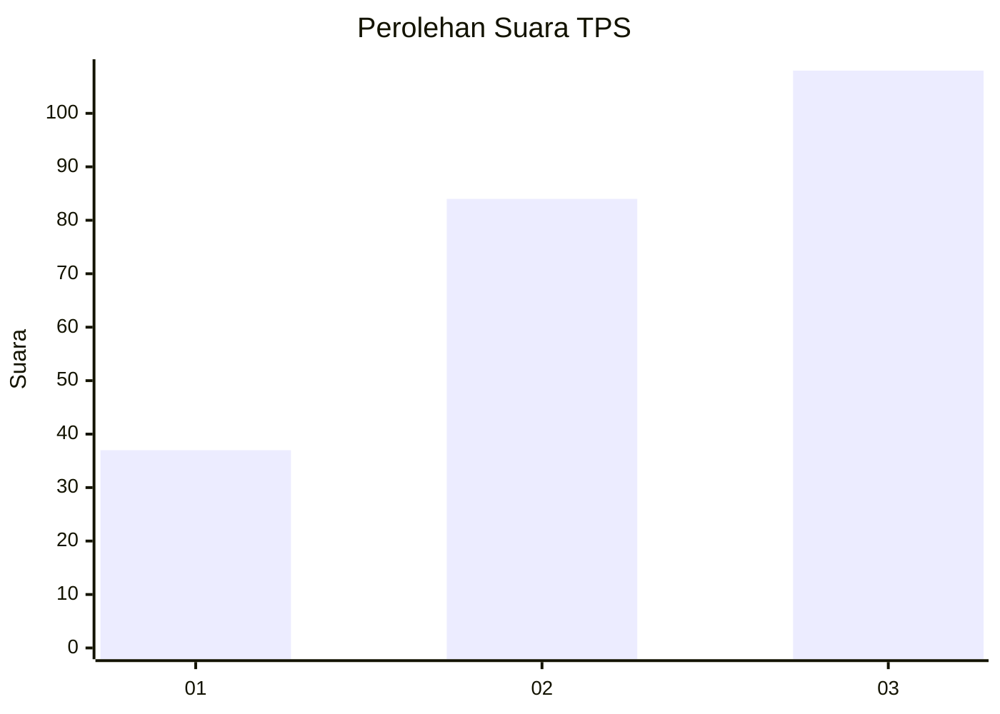
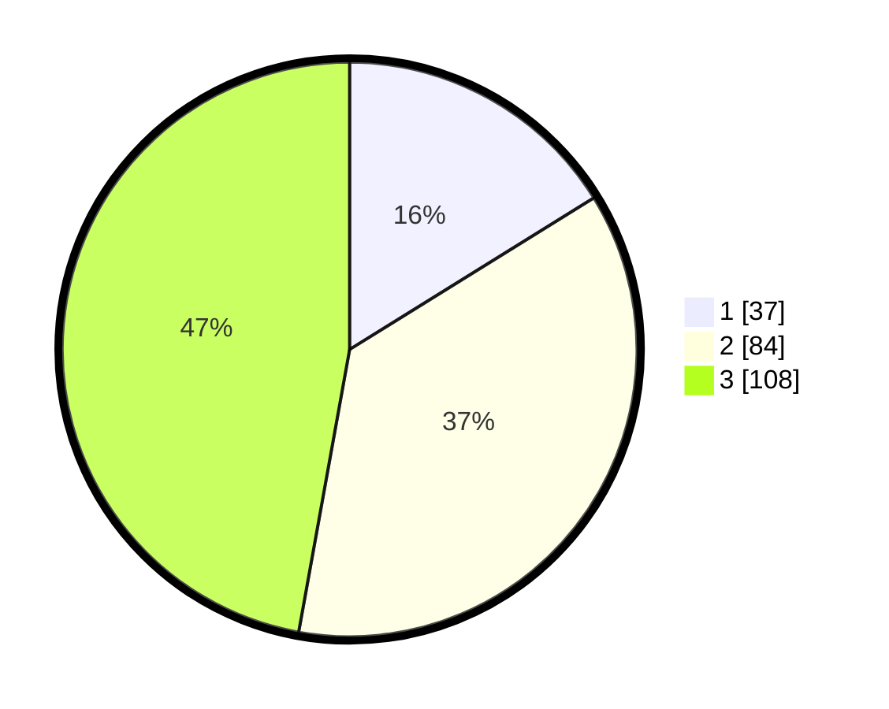

# Hasil

## Grafik

## Tabel

| No. | Nama Paslon    | Suara | Suara (raw) | Persentase |
|:--- |:-------------- | -----:| -----------:| ----------:|
| 1   | ANIES MUHAIMIN | 37    | [37][p-1]   | 16,16      |
| 2   | PRABOWO GIBRAN | 84    | [84][p-2]   | 36,68      |
| 3   | GANJAR MAHFUD  | 108   | [108][p-3]  | 47,16      |

[p-1]: https://github.com/gigit-pemilu/pemilu-2024-33-jawa-tengah/blob/main/pilpres/hitung-suara/sub/33-jawa-tengah/sub/08-magelang/sub/10-mertoyudan/sub/1009-sumberrejo/sub/028-tps/sub/paslon-1.txt
[p-2]: https://github.com/gigit-pemilu/pemilu-2024-33-jawa-tengah/blob/main/pilpres/hitung-suara/sub/33-jawa-tengah/sub/08-magelang/sub/10-mertoyudan/sub/1009-sumberrejo/sub/028-tps/sub/paslon-2.txt
[p-3]: https://github.com/gigit-pemilu/pemilu-2024-33-jawa-tengah/blob/main/pilpres/hitung-suara/sub/33-jawa-tengah/sub/08-magelang/sub/10-mertoyudan/sub/1009-sumberrejo/sub/028-tps/sub/paslon-3.txt

## Foto C Plano

https://sirekap-obj-formc.kpu.go.id/781a/pemilu/ppwp/33/08/10/10/09/3308101009028-20240216-114527--9bd5b4ec-6eea-4a04-8af6-3da5f2988fa8.jpg

https://sirekap-obj-formc.kpu.go.id/781a/pemilu/ppwp/33/08/10/10/09/3308101009028-20240216-114705--e2dfe1be-d2d2-4653-8633-54f05ff726f1.jpg

https://sirekap-obj-formc.kpu.go.id/781a/pemilu/ppwp/33/08/10/10/09/3308101009028-20240215-144132--6601fbf3-68de-4823-a51f-3f073ed506ea.jpg

## Metadata

| Key        | Value               |
| ---------- | ------------------- |
| Time Stamp | 2024-02-17 16:00:02 |

