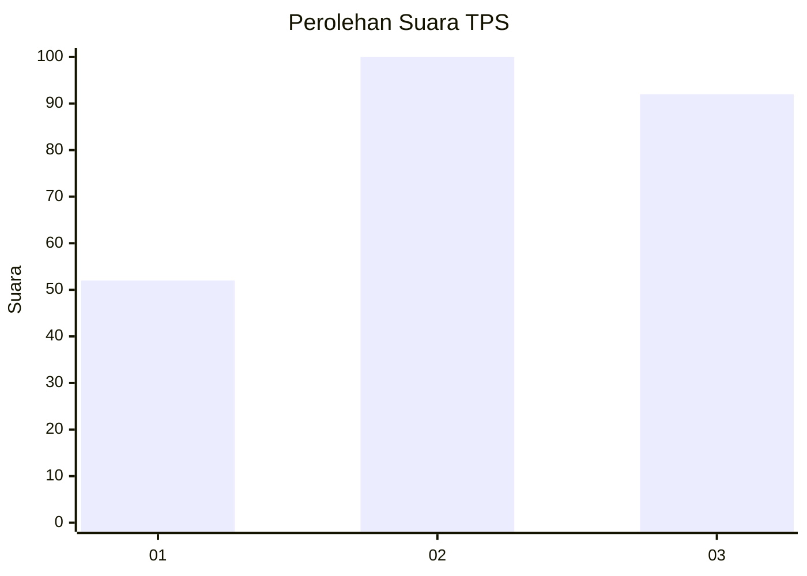
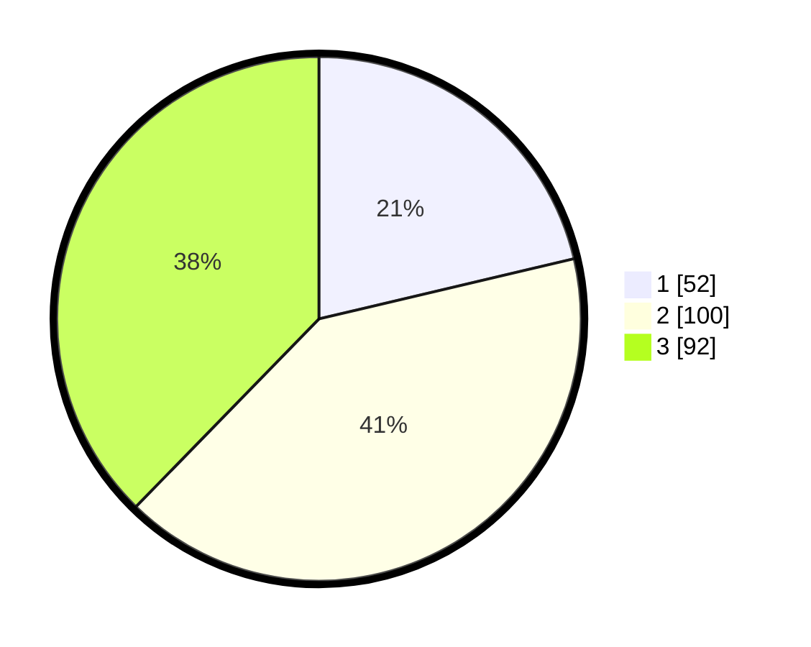

# Hasil

## Grafik

## Tabel

| No. | Nama Paslon    | Suara | Suara (raw) | Persentase |
|:--- |:-------------- | -----:| -----------:| ----------:|
| 1   | ANIES MUHAIMIN | 52    | [52][p-1]   | 21,31      |
| 2   | PRABOWO GIBRAN | 100   | [100][p-2]  | 40,98      |
| 3   | GANJAR MAHFUD  | 92    | [92][p-3]   | 37,70      |

[p-1]: https://github.com/gigit-pemilu/pemilu-2024-33-jawa-tengah/blob/main/pilpres/hitung-suara/sub/33-jawa-tengah/sub/08-magelang/sub/10-mertoyudan/sub/2005-jogonegoro/sub/004-tps/sub/paslon-1.txt
[p-2]: https://github.com/gigit-pemilu/pemilu-2024-33-jawa-tengah/blob/main/pilpres/hitung-suara/sub/33-jawa-tengah/sub/08-magelang/sub/10-mertoyudan/sub/2005-jogonegoro/sub/004-tps/sub/paslon-2.txt
[p-3]: https://github.com/gigit-pemilu/pemilu-2024-33-jawa-tengah/blob/main/pilpres/hitung-suara/sub/33-jawa-tengah/sub/08-magelang/sub/10-mertoyudan/sub/2005-jogonegoro/sub/004-tps/sub/paslon-3.txt

## Foto C Plano

https://sirekap-obj-formc.kpu.go.id/3b87/pemilu/ppwp/33/08/10/20/05/3308102005004-20240214-223343--1f7a78ba-f513-4b92-9ec3-c3d11cc7c6f4.jpg

https://sirekap-obj-formc.kpu.go.id/3b87/pemilu/ppwp/33/08/10/20/05/3308102005004-20240214-223449--46128efd-13f5-4b4a-b679-c64600a17b7b.jpg

https://sirekap-obj-formc.kpu.go.id/3b87/pemilu/ppwp/33/08/10/20/05/3308102005004-20240214-223727--745947e7-203a-49c1-86c5-e0d1d7698ae5.jpg

## Metadata

| Key        | Value               |
| ---------- | ------------------- |
| Time Stamp | 2024-02-15 23:29:50 |

