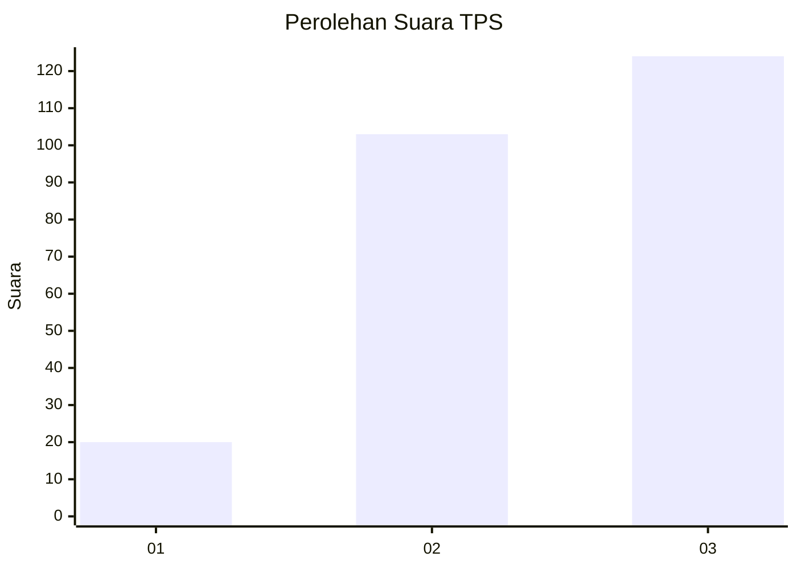
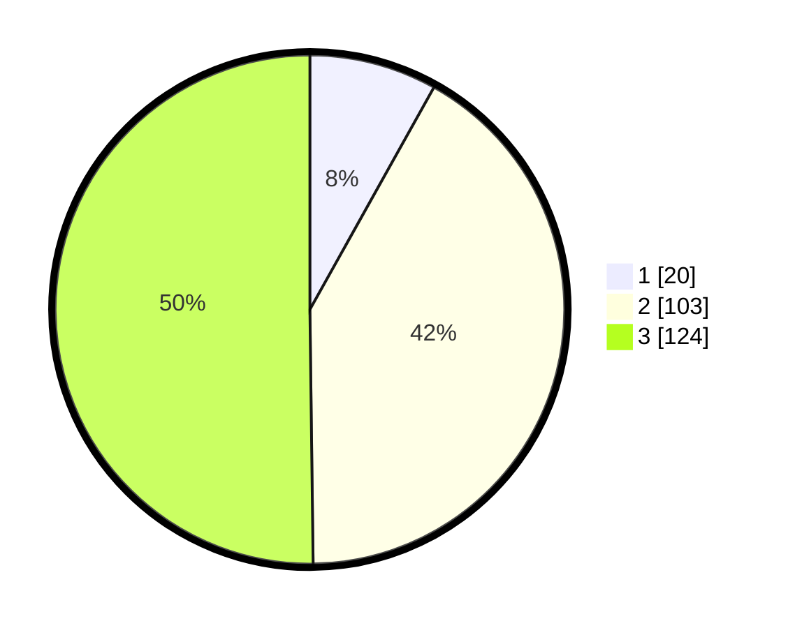

# Hasil

## Grafik

## Tabel

| No. | Nama Paslon    | Suara | Suara (raw) | Persentase |
|:--- |:-------------- | -----:| -----------:| ----------:|
| 1   | ANIES MUHAIMIN | 20    | [20][p-1]   | 8,10       |
| 2   | PRABOWO GIBRAN | 103   | [103][p-2]  | 41,70      |
| 3   | GANJAR MAHFUD  | 124   | [124][p-3]  | 50,20      |

[p-1]: https://github.com/gigit-pemilu/pemilu-2024-33-jawa-tengah/blob/main/pilpres/hitung-suara/sub/33-jawa-tengah/sub/08-magelang/sub/10-mertoyudan/sub/2008-danurejo/sub/001-tps/sub/paslon-1.txt
[p-2]: https://github.com/gigit-pemilu/pemilu-2024-33-jawa-tengah/blob/main/pilpres/hitung-suara/sub/33-jawa-tengah/sub/08-magelang/sub/10-mertoyudan/sub/2008-danurejo/sub/001-tps/sub/paslon-2.txt
[p-3]: https://github.com/gigit-pemilu/pemilu-2024-33-jawa-tengah/blob/main/pilpres/hitung-suara/sub/33-jawa-tengah/sub/08-magelang/sub/10-mertoyudan/sub/2008-danurejo/sub/001-tps/sub/paslon-3.txt

## Foto C Plano

https://sirekap-obj-formc.kpu.go.id/7836/pemilu/ppwp/33/08/10/20/08/3308102008001-20240214-215511--09a5ee18-01d4-4e1c-a302-e75448041265.jpg

https://sirekap-obj-formc.kpu.go.id/7836/pemilu/ppwp/33/08/10/20/08/3308102008001-20240214-215529--fe87a8f0-2204-405c-9537-d5079cd7a656.jpg

https://sirekap-obj-formc.kpu.go.id/7836/pemilu/ppwp/33/08/10/20/08/3308102008001-20240214-215547--7837fa05-e7ab-408a-979c-135f5abe7ff0.jpg

## Metadata

| Key        | Value               |
| ---------- | ------------------- |
| Time Stamp | 2024-02-15 23:29:50 |

