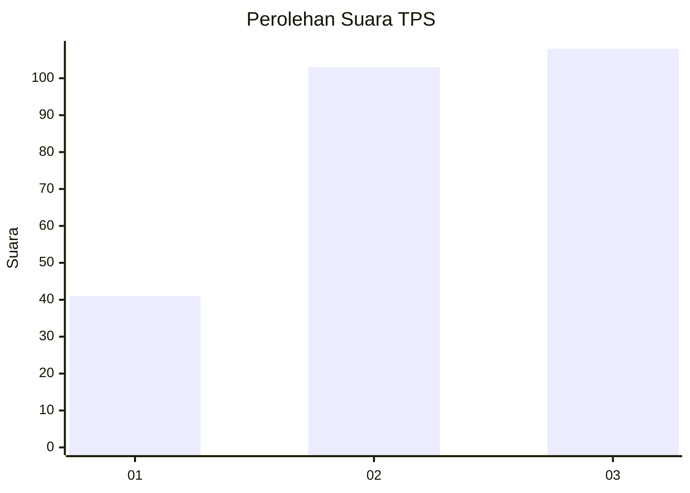
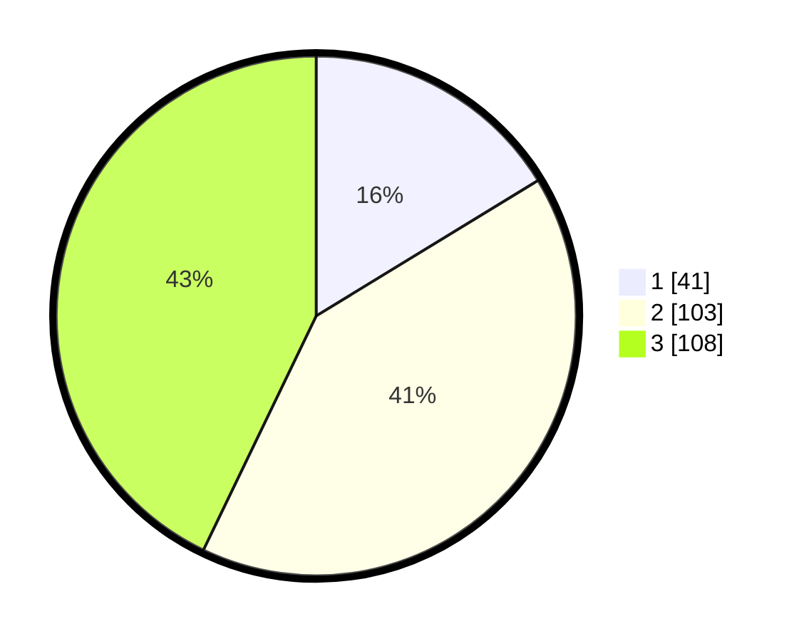

# Hasil

## Grafik

## Tabel

| No. | Nama Paslon    | Suara | Suara (raw) | Persentase |
|:--- |:-------------- | -----:| -----------:| ----------:|
| 1   | ANIES MUHAIMIN | 41    | [41][p-1]   | 16,27      |
| 2   | PRABOWO GIBRAN | 103   | [103][p-2]  | 40,87      |
| 3   | GANJAR MAHFUD  | 108   | [108][p-3]  | 42,86      |

[p-1]: https://github.com/gigit-pemilu/pemilu-2024-33-jawa-tengah/blob/main/pilpres/hitung-suara/sub/33-jawa-tengah/sub/08-magelang/sub/10-mertoyudan/sub/2010-banyurojo/sub/017-tps/sub/paslon-1.txt
[p-2]: https://github.com/gigit-pemilu/pemilu-2024-33-jawa-tengah/blob/main/pilpres/hitung-suara/sub/33-jawa-tengah/sub/08-magelang/sub/10-mertoyudan/sub/2010-banyurojo/sub/017-tps/sub/paslon-2.txt
[p-3]: https://github.com/gigit-pemilu/pemilu-2024-33-jawa-tengah/blob/main/pilpres/hitung-suara/sub/33-jawa-tengah/sub/08-magelang/sub/10-mertoyudan/sub/2010-banyurojo/sub/017-tps/sub/paslon-3.txt

## Foto C Plano

https://sirekap-obj-formc.kpu.go.id/e84c/pemilu/ppwp/33/08/10/20/10/3308102010017-20240214-222826--4c219b5a-f65e-4071-89ed-4e310c846324.jpg

https://sirekap-obj-formc.kpu.go.id/e84c/pemilu/ppwp/33/08/10/20/10/3308102010017-20240214-222941--d090175b-0de8-4299-8909-74d08dd2f44f.jpg

https://sirekap-obj-formc.kpu.go.id/e84c/pemilu/ppwp/33/08/10/20/10/3308102010017-20240214-223106--ed664d50-39c0-4f51-b903-80d86ddfdc4a.jpg

## Metadata

| Key        | Value               |
| ---------- | ------------------- |
| Time Stamp | 2024-02-15 22:30:27 |

