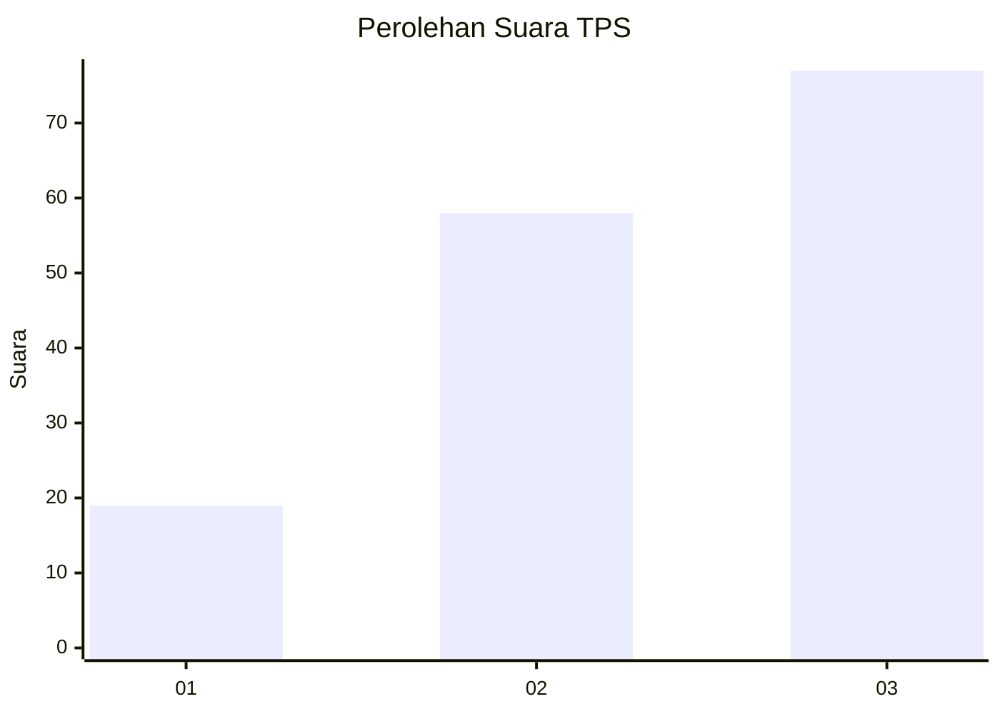
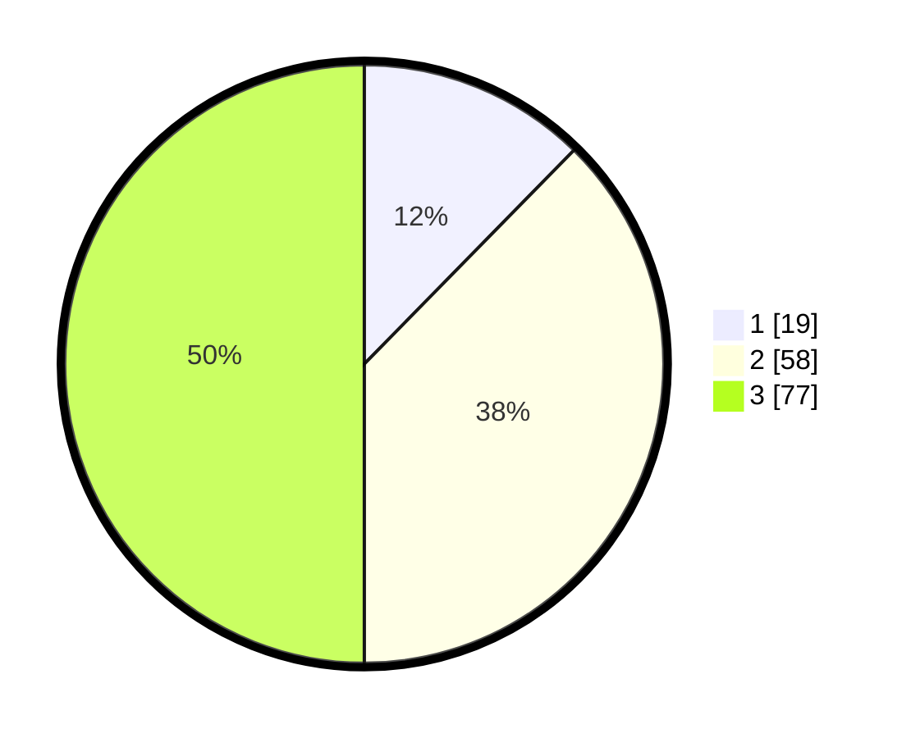

# Hasil

## Grafik

## Tabel

| No. | Nama Paslon    | Suara | Suara (raw) | Persentase |
|:--- |:-------------- | -----:| -----------:| ----------:|
| 1   | ANIES MUHAIMIN | 19    | [19][p-1]   | 12,34      |
| 2   | PRABOWO GIBRAN | 58    | [58][p-2]   | 37,66      |
| 3   | GANJAR MAHFUD  | 77    | [77][p-3]   | 50,00      |

[p-1]: https://github.com/gigit-pemilu/pemilu-2024/blob/main/pilpres/hitung-suara/sub/33-jawa-tengah/sub/08-magelang/sub/10-mertoyudan/sub/2011-banjarnegoro/sub/014-tps/sub/paslon-1.txt
[p-2]: https://github.com/gigit-pemilu/pemilu-2024/blob/main/pilpres/hitung-suara/sub/33-jawa-tengah/sub/08-magelang/sub/10-mertoyudan/sub/2011-banjarnegoro/sub/014-tps/sub/paslon-2.txt
[p-3]: https://github.com/gigit-pemilu/pemilu-2024/blob/main/pilpres/hitung-suara/sub/33-jawa-tengah/sub/08-magelang/sub/10-mertoyudan/sub/2011-banjarnegoro/sub/014-tps/sub/paslon-3.txt

## Foto C Plano

https://sirekap-obj-formc.kpu.go.id/67a0/pemilu/ppwp/33/08/10/20/11/3308102011014-20240214-185127--32bab599-52fa-4801-8c81-a4a8a3252ba1.jpg

https://sirekap-obj-formc.kpu.go.id/67a0/pemilu/ppwp/33/08/10/20/11/3308102011014-20240214-212759--81b6a420-40c3-42ef-89be-cf7941d59975.jpg

https://sirekap-obj-formc.kpu.go.id/67a0/pemilu/ppwp/33/08/10/20/11/3308102011014-20240214-212915--079ed54a-2fc9-47b6-bb7c-661390ba1d80.jpg

## Metadata

| Key        | Value               |
| ---------- | ------------------- |
| Time Stamp | 2024-02-15 22:30:27 |

