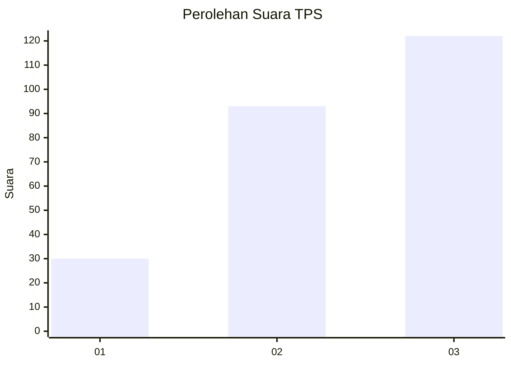
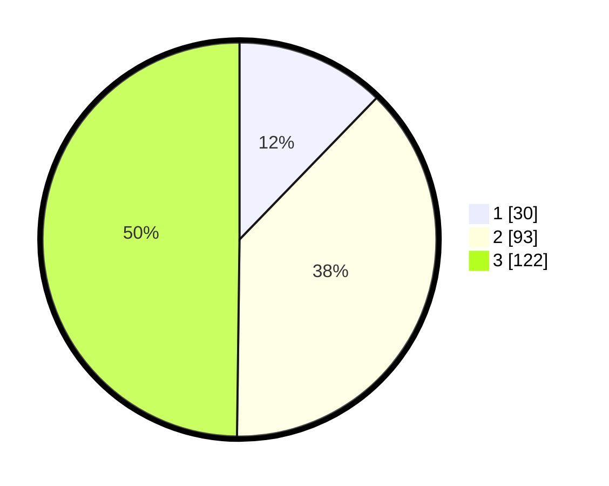

# Hasil

## Grafik

## Tabel

| No. | Nama Paslon    | Suara | Suara (raw) | Persentase |
|:--- |:-------------- | -----:| -----------:| ----------:|
| 1   | ANIES MUHAIMIN | 30    | [30][p-1]   | 12,24      |
| 2   | PRABOWO GIBRAN | 93    | [93][p-2]   | 37,96      |
| 3   | GANJAR MAHFUD  | 122   | [122][p-3]  | 49,80      |

[p-1]: https://github.com/gigit-pemilu/pemilu-2024/blob/main/pilpres/hitung-suara/sub/33-jawa-tengah/sub/08-magelang/sub/10-mertoyudan/sub/2011-banjarnegoro/sub/029-tps/sub/paslon-1.txt
[p-2]: https://github.com/gigit-pemilu/pemilu-2024/blob/main/pilpres/hitung-suara/sub/33-jawa-tengah/sub/08-magelang/sub/10-mertoyudan/sub/2011-banjarnegoro/sub/029-tps/sub/paslon-2.txt
[p-3]: https://github.com/gigit-pemilu/pemilu-2024/blob/main/pilpres/hitung-suara/sub/33-jawa-tengah/sub/08-magelang/sub/10-mertoyudan/sub/2011-banjarnegoro/sub/029-tps/sub/paslon-3.txt

## Foto C Plano

https://sirekap-obj-formc.kpu.go.id/e874/pemilu/ppwp/33/08/10/20/11/3308102011029-20240215-011659--29d33ec4-feb5-4c8e-921f-938c67318d82.jpg

https://sirekap-obj-formc.kpu.go.id/e874/pemilu/ppwp/33/08/10/20/11/3308102011029-20240215-011918--5dd63171-0663-47cc-a03a-a8a43f02e4c5.jpg

https://sirekap-obj-formc.kpu.go.id/e874/pemilu/ppwp/33/08/10/20/11/3308102011029-20240215-012104--4db9d839-57cd-4646-b710-dc90e4223c36.jpg

## Metadata

| Key        | Value               |
| ---------- | ------------------- |
| Time Stamp | 2024-02-15 22:40:13 |

