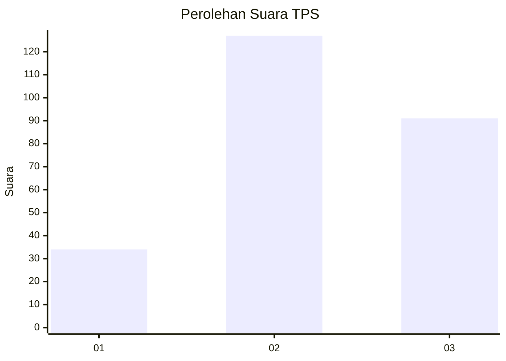
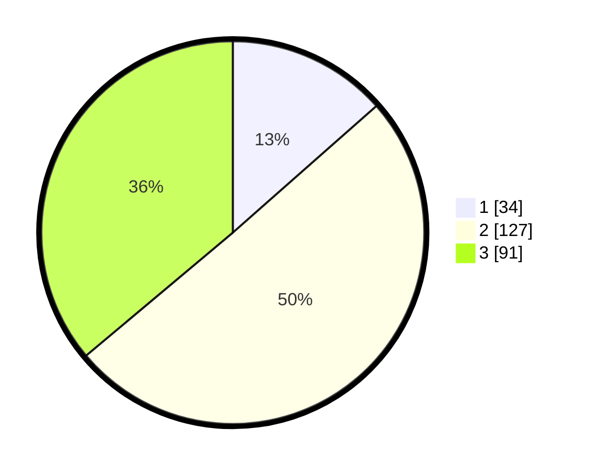

# Hasil

## Grafik

## Tabel

| No. | Nama Paslon    | Suara | Suara (raw) | Persentase |
|:--- |:-------------- | -----:| -----------:| ----------:|
| 1   | ANIES MUHAIMIN | 34    | [34][p-1]   | 13,49      |
| 2   | PRABOWO GIBRAN | 127   | [127][p-2]  | 50,40      |
| 3   | GANJAR MAHFUD  | 91    | [91][p-3]   | 36,11      |

[p-1]: https://github.com/gigit-pemilu/pemilu-2024/blob/main/pilpres/hitung-suara/sub/33-jawa-tengah/sub/08-magelang/sub/11-tempuran/sub/2003-sidoagung/sub/008-tps/sub/paslon-1.txt
[p-2]: https://github.com/gigit-pemilu/pemilu-2024/blob/main/pilpres/hitung-suara/sub/33-jawa-tengah/sub/08-magelang/sub/11-tempuran/sub/2003-sidoagung/sub/008-tps/sub/paslon-2.txt
[p-3]: https://github.com/gigit-pemilu/pemilu-2024/blob/main/pilpres/hitung-suara/sub/33-jawa-tengah/sub/08-magelang/sub/11-tempuran/sub/2003-sidoagung/sub/008-tps/sub/paslon-3.txt

## Foto C Plano

https://sirekap-obj-formc.kpu.go.id/8aca/pemilu/ppwp/33/08/11/20/03/3308112003008-20240214-232307--1118c65c-77a2-4f6f-965f-c77d2b689761.jpg

https://sirekap-obj-formc.kpu.go.id/8aca/pemilu/ppwp/33/08/11/20/03/3308112003008-20240214-232353--c973a28b-5263-4ebb-a330-bde82a40cd26.jpg

https://sirekap-obj-formc.kpu.go.id/8aca/pemilu/ppwp/33/08/11/20/03/3308112003008-20240214-232420--a161d4fa-1be5-4554-94af-59c03c63ff55.jpg

## Metadata

| Key        | Value               |
| ---------- | ------------------- |
| Time Stamp | 2024-02-16 06:00:27 |

