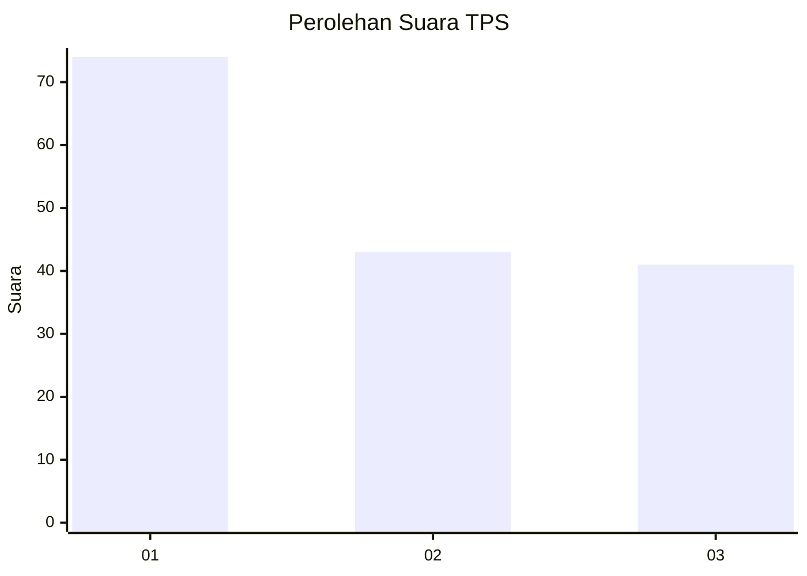
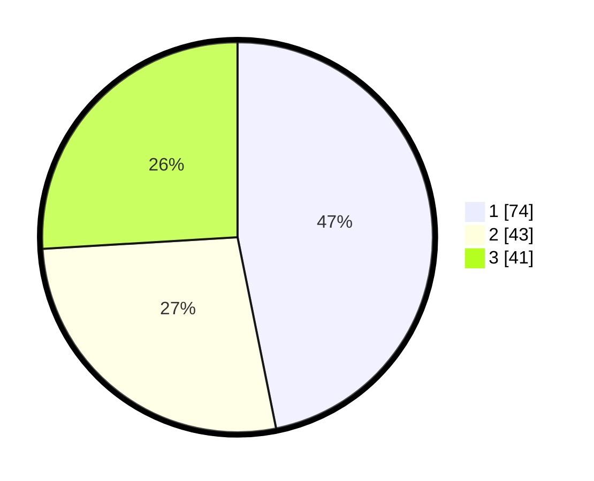

# Hasil

## Grafik

## Tabel

| No. | Nama Paslon    | Suara | Suara (raw) | Persentase |
|:--- |:-------------- | -----:| -----------:| ----------:|
| 1   | ANIES MUHAIMIN | 74    | [74][p-1]   | 46,84      |
| 2   | PRABOWO GIBRAN | 43    | [43][p-2]   | 27,22      |
| 3   | GANJAR MAHFUD  | 41    | [41][p-3]   | 25,95      |

[p-1]: https://github.com/gigit-pemilu/pemilu-2024/blob/main/pilpres/hitung-suara/sub/33-jawa-tengah/sub/08-magelang/sub/12-kajoran/sub/2004-bumiayu/sub/004-tps/sub/paslon-1.txt
[p-2]: https://github.com/gigit-pemilu/pemilu-2024/blob/main/pilpres/hitung-suara/sub/33-jawa-tengah/sub/08-magelang/sub/12-kajoran/sub/2004-bumiayu/sub/004-tps/sub/paslon-2.txt
[p-3]: https://github.com/gigit-pemilu/pemilu-2024/blob/main/pilpres/hitung-suara/sub/33-jawa-tengah/sub/08-magelang/sub/12-kajoran/sub/2004-bumiayu/sub/004-tps/sub/paslon-3.txt

## Foto C Plano

https://sirekap-obj-formc.kpu.go.id/cae9/pemilu/ppwp/33/08/12/20/04/3308122004004-20240215-013433--a2642dec-8b84-48a5-989f-085f564fcbfb.jpg

https://sirekap-obj-formc.kpu.go.id/cae9/pemilu/ppwp/33/08/12/20/04/3308122004004-20240215-013428--adf846ea-2670-434e-ae96-b02d8235d8c5.jpg

https://sirekap-obj-formc.kpu.go.id/cae9/pemilu/ppwp/33/08/12/20/04/3308122004004-20240215-013422--304c8c30-7f01-41b6-a435-090ae01df351.jpg

## Metadata

| Key        | Value               |
| ---------- | ------------------- |
| Time Stamp | 2024-02-24 22:31:28 |

