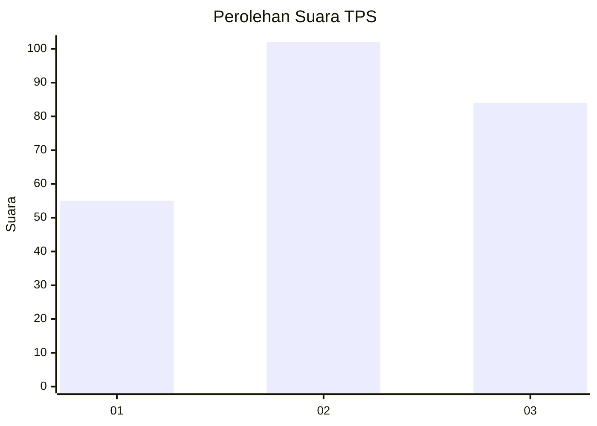
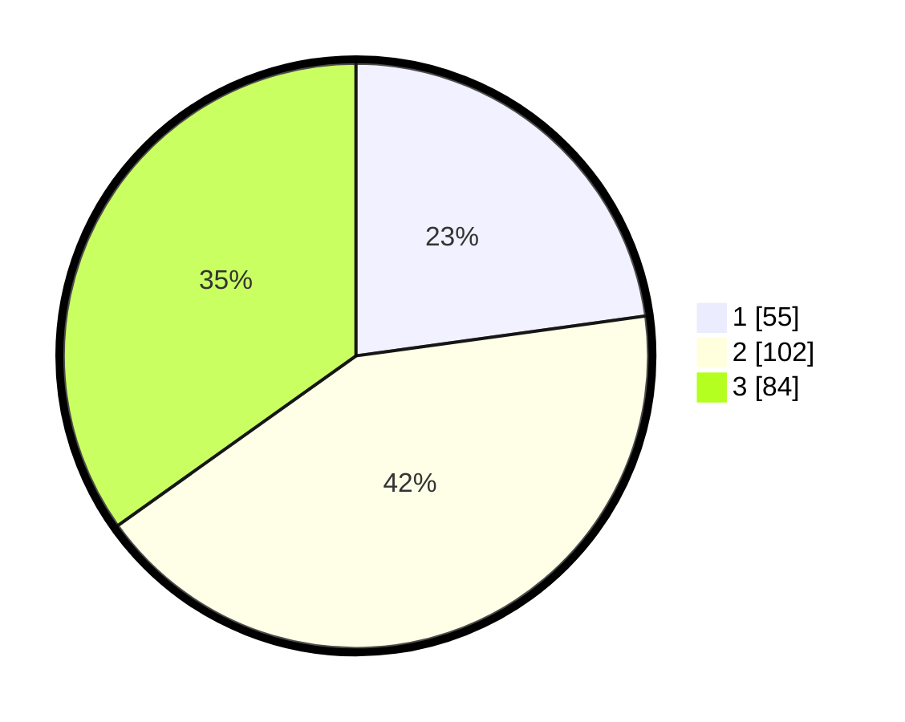

# Hasil

## Grafik

## Tabel

| No. | Nama Paslon    | Suara | Suara (raw) | Persentase |
|:--- |:-------------- | -----:| -----------:| ----------:|
| 1   | ANIES MUHAIMIN | 55    | [55][p-1]   | 22,82      |
| 2   | PRABOWO GIBRAN | 102   | [102][p-2]  | 42,32      |
| 3   | GANJAR MAHFUD  | 84    | [84][p-3]   | 34,85      |

[p-1]: https://github.com/gigit-pemilu/pemilu-2024/blob/main/pilpres/hitung-suara/sub/33-jawa-tengah/sub/08-magelang/sub/12-kajoran/sub/2005-madugondo/sub/002-tps/sub/paslon-1.txt
[p-2]: https://github.com/gigit-pemilu/pemilu-2024/blob/main/pilpres/hitung-suara/sub/33-jawa-tengah/sub/08-magelang/sub/12-kajoran/sub/2005-madugondo/sub/002-tps/sub/paslon-2.txt
[p-3]: https://github.com/gigit-pemilu/pemilu-2024/blob/main/pilpres/hitung-suara/sub/33-jawa-tengah/sub/08-magelang/sub/12-kajoran/sub/2005-madugondo/sub/002-tps/sub/paslon-3.txt

## Foto C Plano

https://sirekap-obj-formc.kpu.go.id/b558/pemilu/ppwp/33/08/12/20/05/3308122005002-20240216-154537--45e0a112-7dd8-4a45-ba59-f8ded6be8acd.jpg

https://sirekap-obj-formc.kpu.go.id/b558/pemilu/ppwp/33/08/12/20/05/3308122005002-20240214-194540--8e35113f-3960-4dfb-89d8-18fbc5eb43c4.jpg

https://sirekap-obj-formc.kpu.go.id/b558/pemilu/ppwp/33/08/12/20/05/3308122005002-20240214-194323--45e90746-0262-451d-959f-de903143fd2e.jpg

## Metadata

| Key        | Value               |
| ---------- | ------------------- |
| Time Stamp | 2024-02-16 16:25:10 |

