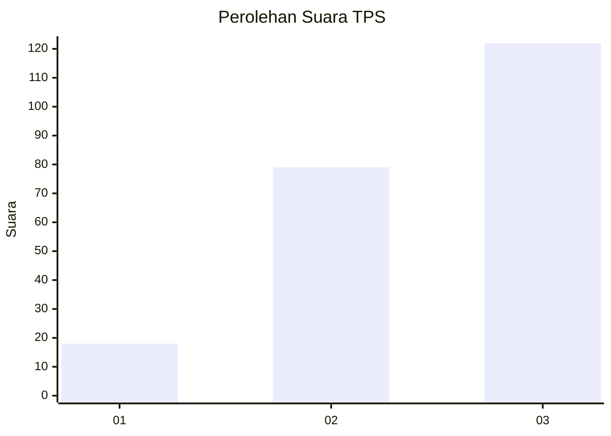
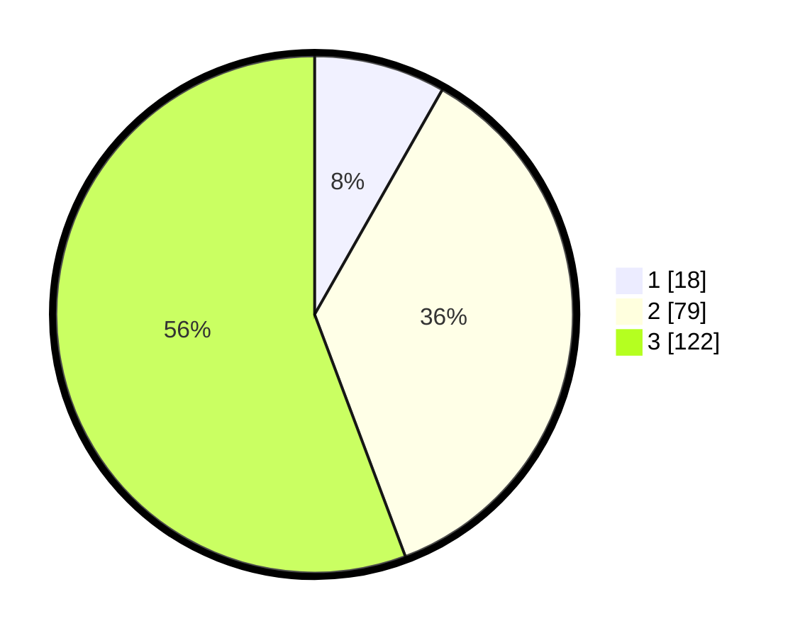

# Hasil

## Grafik

## Tabel

| No. | Nama Paslon    | Suara | Suara (raw) | Persentase |
|:--- |:-------------- | -----:| -----------:| ----------:|
| 1   | ANIES MUHAIMIN | 18    | [18][p-1]   | 8,22       |
| 2   | PRABOWO GIBRAN | 79    | [79][p-2]   | 36,07      |
| 3   | GANJAR MAHFUD  | 122   | [122][p-3]  | 55,71      |

[p-1]: https://github.com/gigit-pemilu/pemilu-2024-33-jawa-tengah/blob/main/pilpres/hitung-suara/sub/33-jawa-tengah/sub/08-magelang/sub/12-kajoran/sub/2021-banjaragung/sub/001-tps/sub/paslon-1.txt
[p-2]: https://github.com/gigit-pemilu/pemilu-2024-33-jawa-tengah/blob/main/pilpres/hitung-suara/sub/33-jawa-tengah/sub/08-magelang/sub/12-kajoran/sub/2021-banjaragung/sub/001-tps/sub/paslon-2.txt
[p-3]: https://github.com/gigit-pemilu/pemilu-2024-33-jawa-tengah/blob/main/pilpres/hitung-suara/sub/33-jawa-tengah/sub/08-magelang/sub/12-kajoran/sub/2021-banjaragung/sub/001-tps/sub/paslon-3.txt

## Foto C Plano

https://sirekap-obj-formc.kpu.go.id/e42c/pemilu/ppwp/33/08/12/20/21/3308122021001-20240217-104651--6c02701f-ba61-43e3-af6d-e09062c95800.jpg

https://sirekap-obj-formc.kpu.go.id/e42c/pemilu/ppwp/33/08/12/20/21/3308122021001-20240214-220921--03f7dba6-544a-4c64-a87c-e632f27fc484.jpg

https://sirekap-obj-formc.kpu.go.id/e42c/pemilu/ppwp/33/08/12/20/21/3308122021001-20240214-221036--2788ec9b-f83d-45a3-9caf-1f0ae1fc3524.jpg

## Metadata

| Key        | Value               |
| ---------- | ------------------- |
| Time Stamp | 2024-02-17 11:00:02 |

