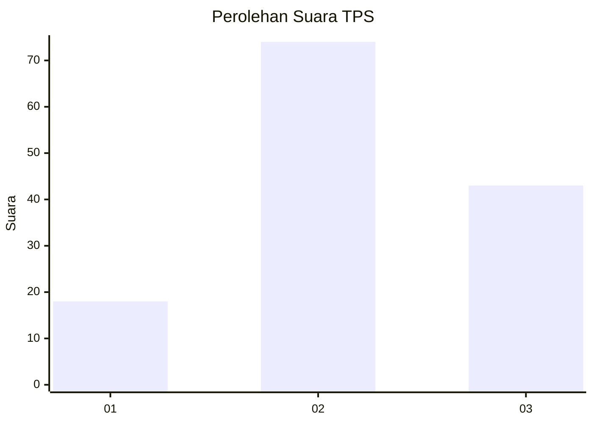
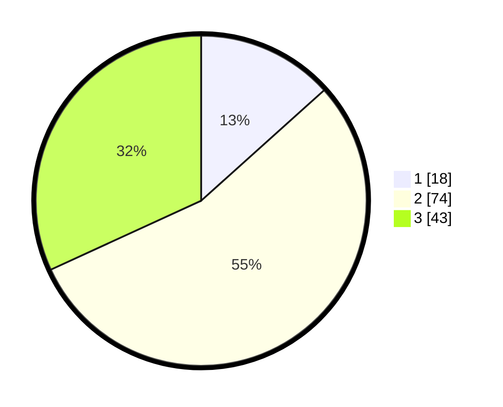

# Hasil

## Grafik

## Tabel

| No. | Nama Paslon    | Suara | Suara (raw) | Persentase |
|:--- |:-------------- | -----:| -----------:| ----------:|
| 1   | ANIES MUHAIMIN | 18    | [18][p-1]   | 13,33      |
| 2   | PRABOWO GIBRAN | 74    | [74][p-2]   | 54,81      |
| 3   | GANJAR MAHFUD  | 43    | [43][p-3]   | 31,85      |

[p-1]: https://github.com/gigit-pemilu/pemilu-2024-33-jawa-tengah/blob/main/pilpres/hitung-suara/sub/33-jawa-tengah/sub/08-magelang/sub/12-kajoran/sub/2024-sidorejo/sub/003-tps/sub/paslon-1.txt
[p-2]: https://github.com/gigit-pemilu/pemilu-2024-33-jawa-tengah/blob/main/pilpres/hitung-suara/sub/33-jawa-tengah/sub/08-magelang/sub/12-kajoran/sub/2024-sidorejo/sub/003-tps/sub/paslon-2.txt
[p-3]: https://github.com/gigit-pemilu/pemilu-2024-33-jawa-tengah/blob/main/pilpres/hitung-suara/sub/33-jawa-tengah/sub/08-magelang/sub/12-kajoran/sub/2024-sidorejo/sub/003-tps/sub/paslon-3.txt

## Foto C Plano

https://sirekap-obj-formc.kpu.go.id/d1af/pemilu/ppwp/33/08/12/20/24/3308122024003-20240215-043145--43be0fd8-2e1b-4763-8de7-d961cccf66ee.jpg

https://sirekap-obj-formc.kpu.go.id/d1af/pemilu/ppwp/33/08/12/20/24/3308122024003-20240215-043315--0188dc5b-4346-4ec5-811a-9e7b60933bf6.jpg

https://sirekap-obj-formc.kpu.go.id/d1af/pemilu/ppwp/33/08/12/20/24/3308122024003-20240215-043422--6748b986-104f-4f52-a0c4-332182a23f81.jpg

## Metadata

| Key        | Value               |
| ---------- | ------------------- |
| Time Stamp | 2024-02-24 22:31:28 |

