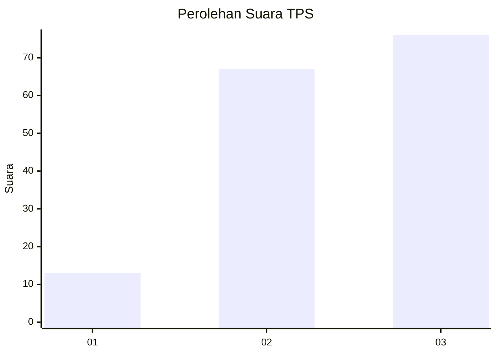
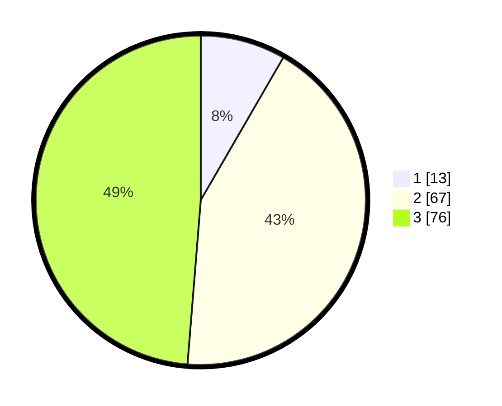

# Hasil

## Grafik

## Tabel

| No. | Nama Paslon    | Suara | Suara (raw) | Persentase |
|:--- |:-------------- | -----:| -----------:| ----------:|
| 1   | ANIES MUHAIMIN | 13    | [13][p-1]   | 8,33       |
| 2   | PRABOWO GIBRAN | 67    | [67][p-2]   | 42,95      |
| 3   | GANJAR MAHFUD  | 76    | [76][p-3]   | 48,72      |

[p-1]: https://github.com/gigit-pemilu/pemilu-2024/blob/main/pilpres/hitung-suara/sub/33-jawa-tengah/sub/08-magelang/sub/12-kajoran/sub/2027-sukorejo/sub/001-tps/sub/paslon-1.txt
[p-2]: https://github.com/gigit-pemilu/pemilu-2024/blob/main/pilpres/hitung-suara/sub/33-jawa-tengah/sub/08-magelang/sub/12-kajoran/sub/2027-sukorejo/sub/001-tps/sub/paslon-2.txt
[p-3]: https://github.com/gigit-pemilu/pemilu-2024/blob/main/pilpres/hitung-suara/sub/33-jawa-tengah/sub/08-magelang/sub/12-kajoran/sub/2027-sukorejo/sub/001-tps/sub/paslon-3.txt

## Foto C Plano

https://sirekap-obj-formc.kpu.go.id/c84c/pemilu/ppwp/33/08/12/20/27/3308122027001-20240215-020352--0a80beb0-40ed-4c4f-8f58-392239949600.jpg

https://sirekap-obj-formc.kpu.go.id/c84c/pemilu/ppwp/33/08/12/20/27/3308122027001-20240215-083717--3eb59a84-e3d8-429e-948d-32e15bbb6ae3.jpg

https://sirekap-obj-formc.kpu.go.id/c84c/pemilu/ppwp/33/08/12/20/27/3308122027001-20240215-020142--122b077b-0b95-48e7-ae0a-ceee3dc49454.jpg

## Metadata

| Key        | Value               |
| ---------- | ------------------- |
| Time Stamp | 2024-02-25 16:00:00 |

