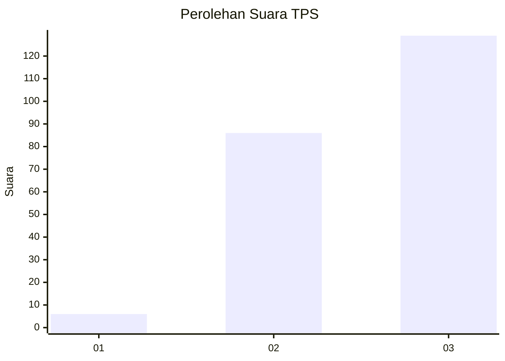
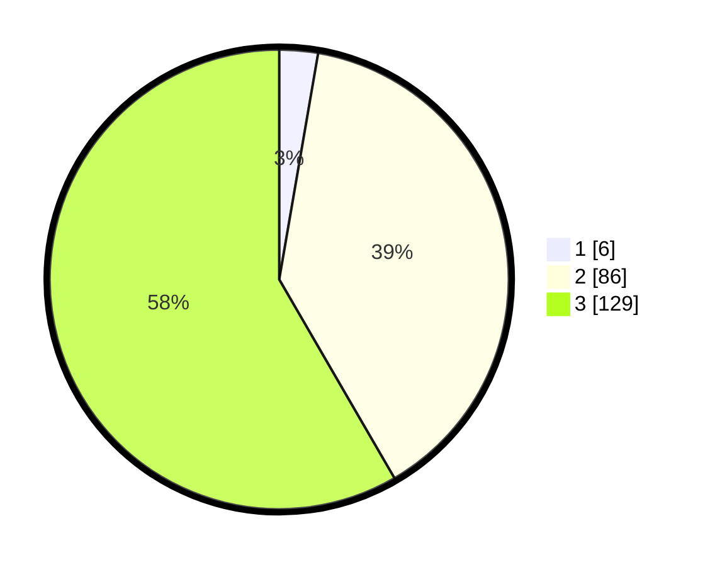

# Hasil

## Grafik

## Tabel

| No. | Nama Paslon    | Suara | Suara (raw) | Persentase |
|:--- |:-------------- | -----:| -----------:| ----------:|
| 1   | ANIES MUHAIMIN | 6     | [6][p-1]    | 2,71       |
| 2   | PRABOWO GIBRAN | 86    | [86][p-2]   | 38,91      |
| 3   | GANJAR MAHFUD  | 129   | [129][p-3]  | 58,37      |

[p-1]: https://github.com/gigit-pemilu/pemilu-2024/blob/main/pilpres/hitung-suara/sub/33-jawa-tengah/sub/08-magelang/sub/12-kajoran/sub/2028-sutopati/sub/019-tps/sub/paslon-1.txt
[p-2]: https://github.com/gigit-pemilu/pemilu-2024/blob/main/pilpres/hitung-suara/sub/33-jawa-tengah/sub/08-magelang/sub/12-kajoran/sub/2028-sutopati/sub/019-tps/sub/paslon-2.txt
[p-3]: https://github.com/gigit-pemilu/pemilu-2024/blob/main/pilpres/hitung-suara/sub/33-jawa-tengah/sub/08-magelang/sub/12-kajoran/sub/2028-sutopati/sub/019-tps/sub/paslon-3.txt

## Foto C Plano

https://sirekap-obj-formc.kpu.go.id/0472/pemilu/ppwp/33/08/12/20/28/3308122028019-20240216-171517--7a0632c7-3e14-4ba2-b04a-cba0b8a3ea28.jpg

https://sirekap-obj-formc.kpu.go.id/0472/pemilu/ppwp/33/08/12/20/28/3308122028019-20240214-141829--2367c860-2778-42b0-85c2-46c67b5fce68.jpg

https://sirekap-obj-formc.kpu.go.id/0472/pemilu/ppwp/33/08/12/20/28/3308122028019-20240214-141721--4a71fcc3-bb21-476b-b919-0a6426013adf.jpg

## Metadata

| Key        | Value               |
| ---------- | ------------------- |
| Time Stamp | 2024-02-24 22:31:28 |

