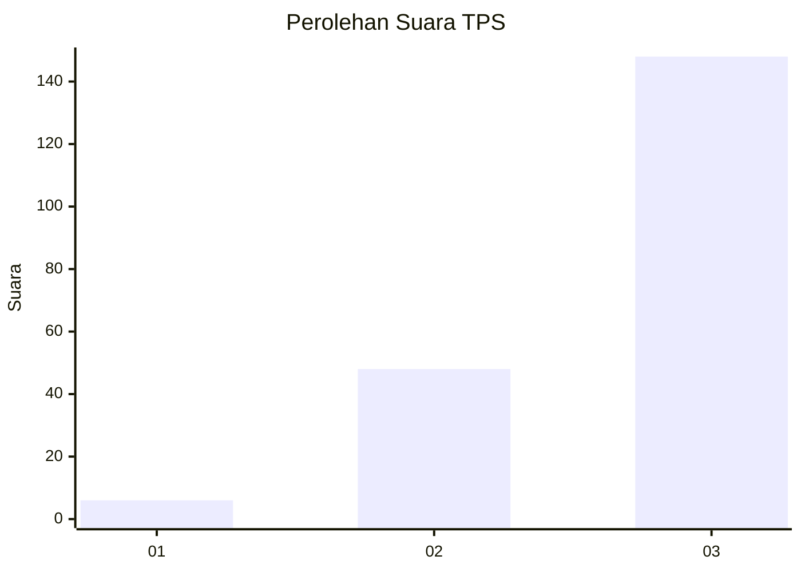
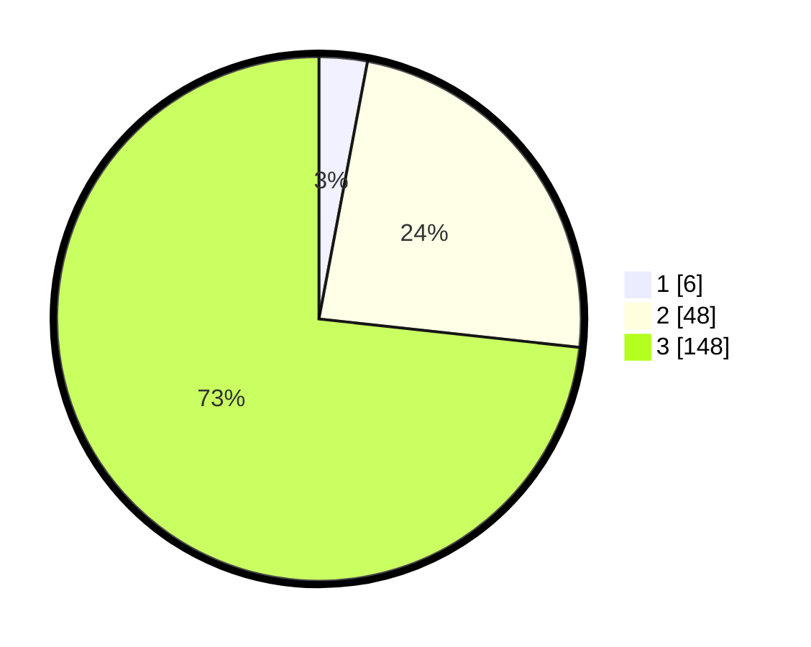

# Hasil

## Grafik

## Tabel

| No. | Nama Paslon    | Suara | Suara (raw) | Persentase |
|:--- |:-------------- | -----:| -----------:| ----------:|
| 1   | ANIES MUHAIMIN | 6     | [6][p-1]    | 2,97       |
| 2   | PRABOWO GIBRAN | 48    | [48][p-2]   | 23,76      |
| 3   | GANJAR MAHFUD  | 148   | [148][p-3]  | 73,27      |

[p-1]: https://github.com/gigit-pemilu/pemilu-2024-33-jawa-tengah/blob/main/pilpres/hitung-suara/sub/33-jawa-tengah/sub/08-magelang/sub/12-kajoran/sub/2029-sukomakmur/sub/002-tps/sub/paslon-1.txt
[p-2]: https://github.com/gigit-pemilu/pemilu-2024-33-jawa-tengah/blob/main/pilpres/hitung-suara/sub/33-jawa-tengah/sub/08-magelang/sub/12-kajoran/sub/2029-sukomakmur/sub/002-tps/sub/paslon-2.txt
[p-3]: https://github.com/gigit-pemilu/pemilu-2024-33-jawa-tengah/blob/main/pilpres/hitung-suara/sub/33-jawa-tengah/sub/08-magelang/sub/12-kajoran/sub/2029-sukomakmur/sub/002-tps/sub/paslon-3.txt

## Foto C Plano

https://sirekap-obj-formc.kpu.go.id/05a8/pemilu/ppwp/33/08/12/20/29/3308122029002-20240221-001146--f7241d8f-72f1-441c-ab2a-dfa89d93b744.jpg

https://sirekap-obj-formc.kpu.go.id/05a8/pemilu/ppwp/33/08/12/20/29/3308122029002-20240221-001325--9db8b30b-8068-4570-a6fe-1886efa679fc.jpg

https://sirekap-obj-formc.kpu.go.id/05a8/pemilu/ppwp/33/08/12/20/29/3308122029002-20240221-001448--0632285d-5f2a-4226-a0b4-6f9f4cb83b86.jpg

## Metadata

| Key        | Value               |
| ---------- | ------------------- |
| Time Stamp | 2024-02-24 22:31:28 |

