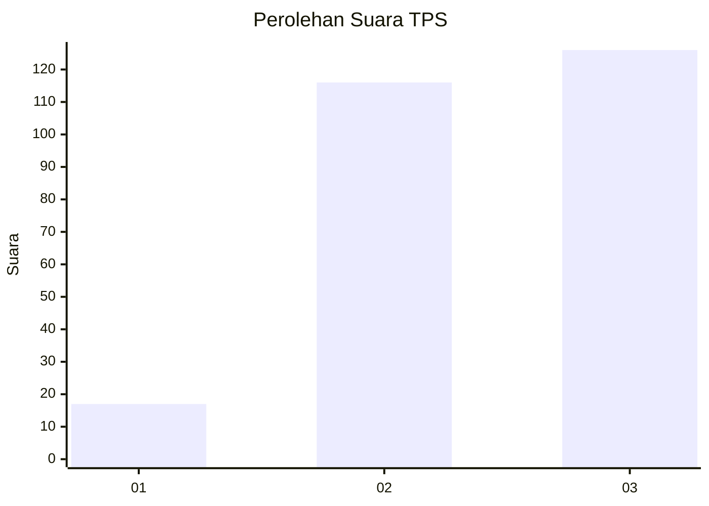
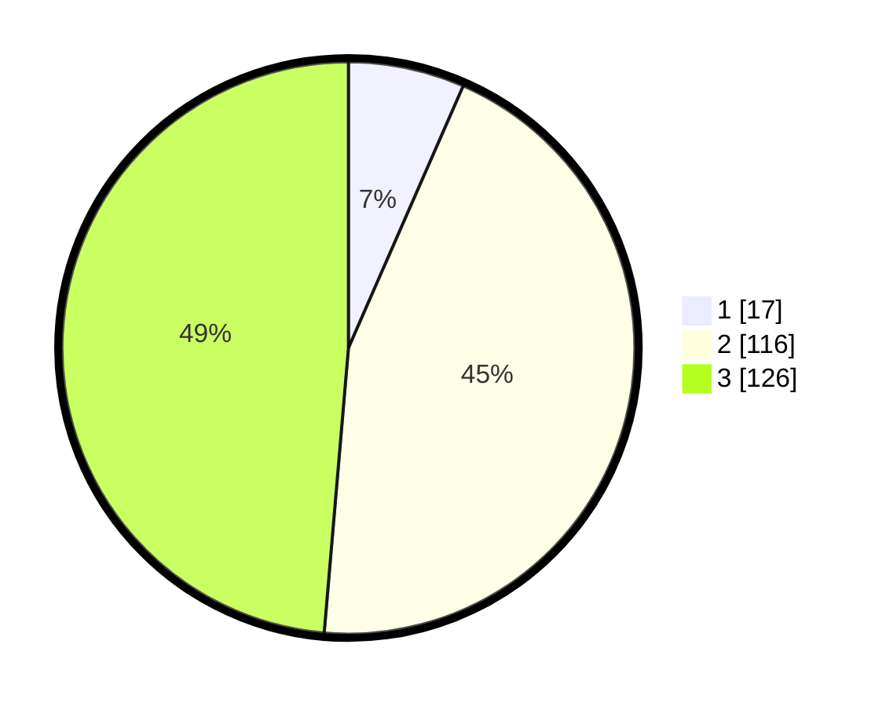

# Hasil

## Grafik

## Tabel

| No. | Nama Paslon    | Suara | Suara (raw) | Persentase |
|:--- |:-------------- | -----:| -----------:| ----------:|
| 1   | ANIES MUHAIMIN | 17    | [17][p-1]   | 6,56       |
| 2   | PRABOWO GIBRAN | 116   | [116][p-2]  | 44,79      |
| 3   | GANJAR MAHFUD  | 126   | [126][p-3]  | 48,65      |

[p-1]: https://github.com/gigit-pemilu/pemilu-2024-33-jawa-tengah/blob/main/pilpres/hitung-suara/sub/33-jawa-tengah/sub/08-magelang/sub/12-kajoran/sub/2029-sukomakmur/sub/009-tps/sub/paslon-1.txt
[p-2]: https://github.com/gigit-pemilu/pemilu-2024-33-jawa-tengah/blob/main/pilpres/hitung-suara/sub/33-jawa-tengah/sub/08-magelang/sub/12-kajoran/sub/2029-sukomakmur/sub/009-tps/sub/paslon-2.txt
[p-3]: https://github.com/gigit-pemilu/pemilu-2024-33-jawa-tengah/blob/main/pilpres/hitung-suara/sub/33-jawa-tengah/sub/08-magelang/sub/12-kajoran/sub/2029-sukomakmur/sub/009-tps/sub/paslon-3.txt

## Foto C Plano

https://sirekap-obj-formc.kpu.go.id/6ac0/pemilu/ppwp/33/08/12/20/29/3308122029009-20240215-021303--c50bc973-b642-40fa-be5e-8cd9114e2420.jpg

https://sirekap-obj-formc.kpu.go.id/6ac0/pemilu/ppwp/33/08/12/20/29/3308122029009-20240215-021419--ba625a35-2d14-4cd4-87e0-93cc9d4dda58.jpg

https://sirekap-obj-formc.kpu.go.id/6ac0/pemilu/ppwp/33/08/12/20/29/3308122029009-20240215-021536--02699847-a6fd-4336-95bb-a31fdc49cf16.jpg

## Metadata

| Key        | Value               |
| ---------- | ------------------- |
| Time Stamp | 2024-02-25 10:00:00 |

