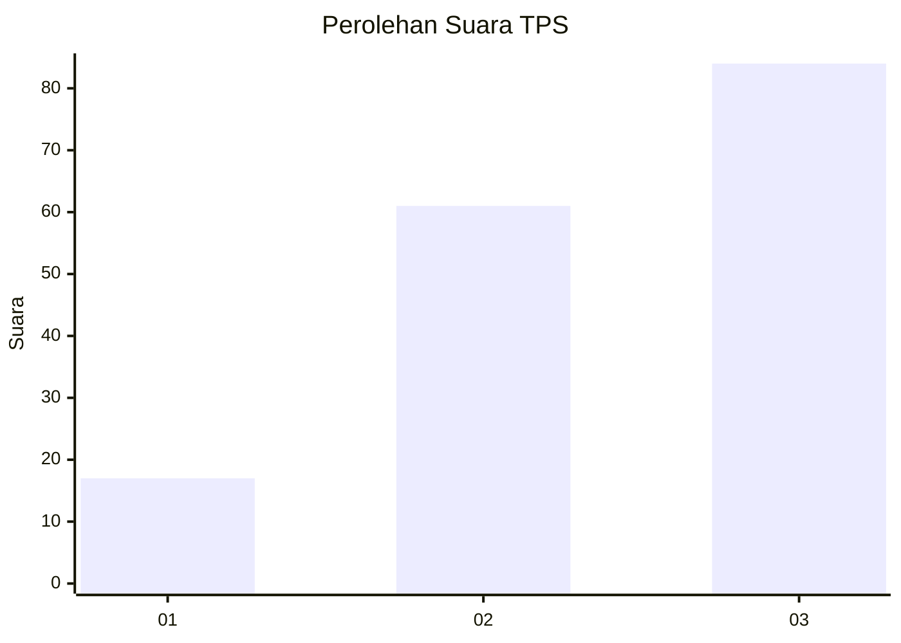
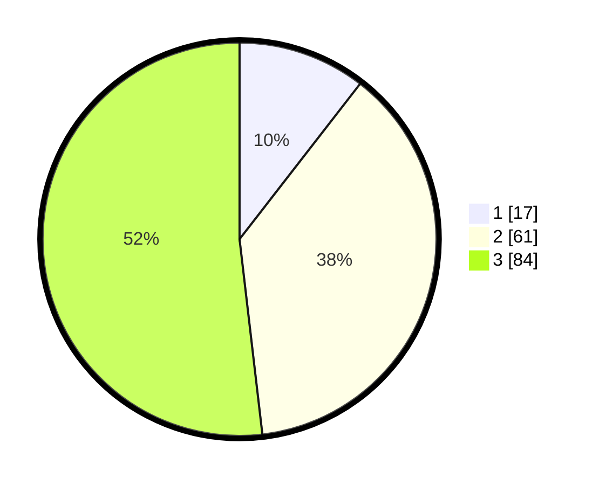

# Hasil

## Grafik

## Tabel

| No. | Nama Paslon    | Suara | Suara (raw) | Persentase |
|:--- |:-------------- | -----:| -----------:| ----------:|
| 1   | ANIES MUHAIMIN | 17    | [17][p-1]   | 10,49      |
| 2   | PRABOWO GIBRAN | 61    | [61][p-2]   | 37,65      |
| 3   | GANJAR MAHFUD  | 84    | [84][p-3]   | 51,85      |

[p-1]: https://github.com/gigit-pemilu/pemilu-2024-33-jawa-tengah/blob/main/pilpres/hitung-suara/sub/33-jawa-tengah/sub/08-magelang/sub/13-kaliangkrik/sub/2002-ngawonggo/sub/004-tps/sub/paslon-1.txt
[p-2]: https://github.com/gigit-pemilu/pemilu-2024-33-jawa-tengah/blob/main/pilpres/hitung-suara/sub/33-jawa-tengah/sub/08-magelang/sub/13-kaliangkrik/sub/2002-ngawonggo/sub/004-tps/sub/paslon-2.txt
[p-3]: https://github.com/gigit-pemilu/pemilu-2024-33-jawa-tengah/blob/main/pilpres/hitung-suara/sub/33-jawa-tengah/sub/08-magelang/sub/13-kaliangkrik/sub/2002-ngawonggo/sub/004-tps/sub/paslon-3.txt

## Foto C Plano

https://sirekap-obj-formc.kpu.go.id/e52c/pemilu/ppwp/33/08/13/20/02/3308132002004-20240215-000756--5e8ad4fa-56e6-4906-b605-bccfd5dccd60.jpg

https://sirekap-obj-formc.kpu.go.id/e52c/pemilu/ppwp/33/08/13/20/02/3308132002004-20240214-201025--34c8264d-4c10-4264-a188-cd58297e6266.jpg

https://sirekap-obj-formc.kpu.go.id/e52c/pemilu/ppwp/33/08/13/20/02/3308132002004-20240214-202140--be2a2593-098f-4265-a026-8987d6ea5f04.jpg

## Metadata

| Key        | Value               |
| ---------- | ------------------- |
| Time Stamp | 2024-02-16 02:30:27 |

