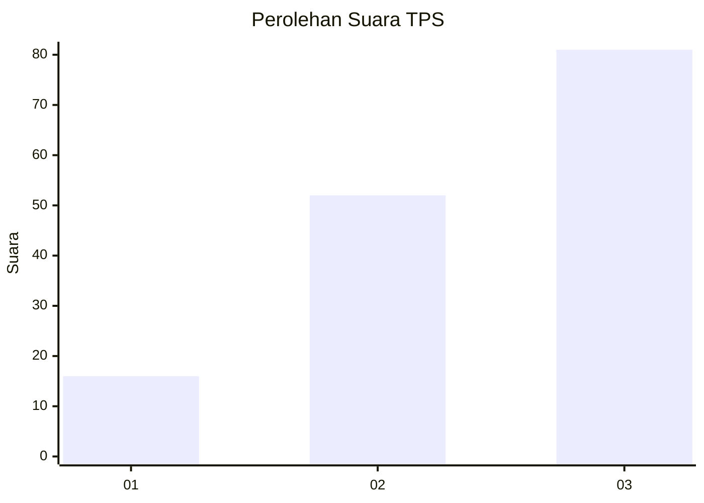
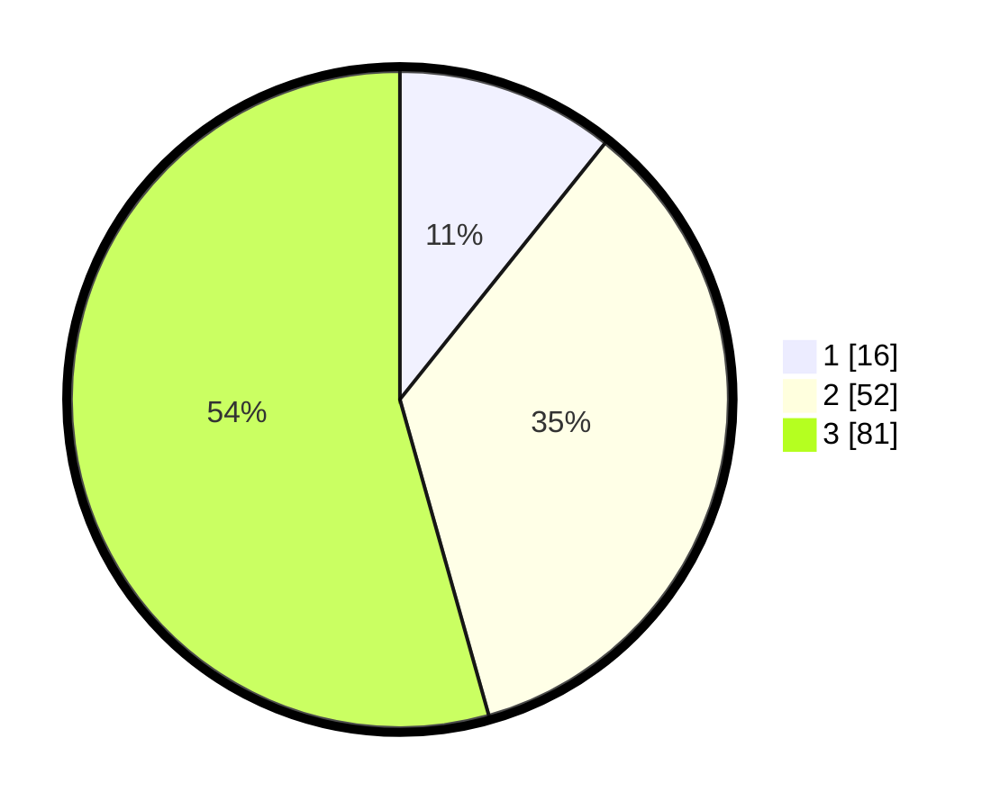

# Hasil

## Grafik

## Tabel

| No. | Nama Paslon    | Suara | Suara (raw) | Persentase |
|:--- |:-------------- | -----:| -----------:| ----------:|
| 1   | ANIES MUHAIMIN | 16    | [16][p-1]   | 10,74      |
| 2   | PRABOWO GIBRAN | 52    | [52][p-2]   | 34,90      |
| 3   | GANJAR MAHFUD  | 81    | [81][p-3]   | 54,36      |

[p-1]: https://github.com/gigit-pemilu/pemilu-2024/blob/main/pilpres/hitung-suara/sub/33-jawa-tengah/sub/08-magelang/sub/13-kaliangkrik/sub/2007-temanggung/sub/019-tps/sub/paslon-1.txt
[p-2]: https://github.com/gigit-pemilu/pemilu-2024/blob/main/pilpres/hitung-suara/sub/33-jawa-tengah/sub/08-magelang/sub/13-kaliangkrik/sub/2007-temanggung/sub/019-tps/sub/paslon-2.txt
[p-3]: https://github.com/gigit-pemilu/pemilu-2024/blob/main/pilpres/hitung-suara/sub/33-jawa-tengah/sub/08-magelang/sub/13-kaliangkrik/sub/2007-temanggung/sub/019-tps/sub/paslon-3.txt

## Foto C Plano

https://sirekap-obj-formc.kpu.go.id/a3b5/pemilu/ppwp/33/08/13/20/07/3308132007019-20240217-180130--55588bf4-6006-49c5-b7ed-acff6a2de851.jpg

https://sirekap-obj-formc.kpu.go.id/a3b5/pemilu/ppwp/33/08/13/20/07/3308132007019-20240217-180812--4c8bb2c1-80f9-4b2b-9cb9-485476d3711d.jpg

https://sirekap-obj-formc.kpu.go.id/a3b5/pemilu/ppwp/33/08/13/20/07/3308132007019-20240217-144721--33ff5f29-1b0d-44dd-ba4f-3dcb22afb1d8.jpg

## Metadata

| Key        | Value               |
| ---------- | ------------------- |
| Time Stamp | 2024-02-21 17:00:00 |

