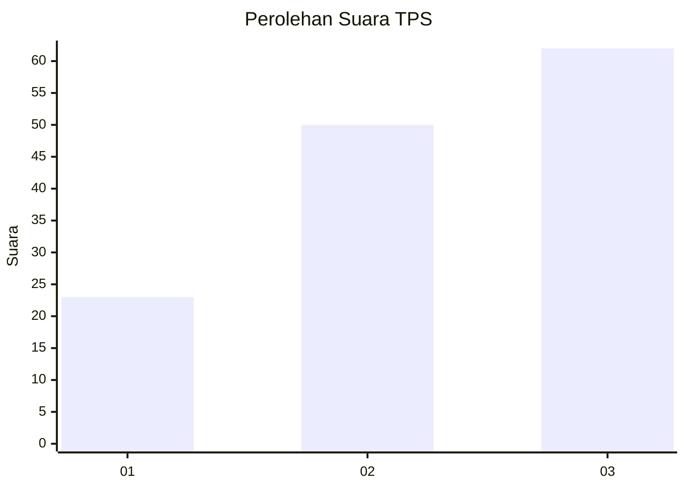
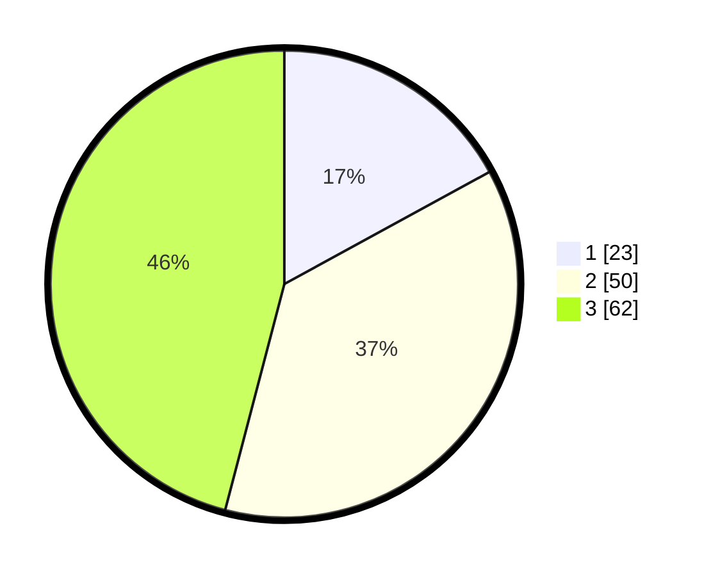

# Hasil

## Grafik

## Tabel

| No. | Nama Paslon    | Suara | Suara (raw) | Persentase |
|:--- |:-------------- | -----:| -----------:| ----------:|
| 1   | ANIES MUHAIMIN | 23    | [23][p-1]   | 17,04      |
| 2   | PRABOWO GIBRAN | 50    | [50][p-2]   | 37,04      |
| 3   | GANJAR MAHFUD  | 62    | [62][p-3]   | 45,93      |

[p-1]: https://github.com/gigit-pemilu/pemilu-2024/blob/main/pilpres/hitung-suara/sub/33-jawa-tengah/sub/08-magelang/sub/13-kaliangkrik/sub/2007-temanggung/sub/022-tps/sub/paslon-1.txt
[p-2]: https://github.com/gigit-pemilu/pemilu-2024/blob/main/pilpres/hitung-suara/sub/33-jawa-tengah/sub/08-magelang/sub/13-kaliangkrik/sub/2007-temanggung/sub/022-tps/sub/paslon-2.txt
[p-3]: https://github.com/gigit-pemilu/pemilu-2024/blob/main/pilpres/hitung-suara/sub/33-jawa-tengah/sub/08-magelang/sub/13-kaliangkrik/sub/2007-temanggung/sub/022-tps/sub/paslon-3.txt

## Foto C Plano

https://sirekap-obj-formc.kpu.go.id/5187/pemilu/ppwp/33/08/13/20/07/3308132007022-20240214-214535--3c5db3ab-02e8-42f8-8c07-58be661a5425.jpg

https://sirekap-obj-formc.kpu.go.id/5187/pemilu/ppwp/33/08/13/20/07/3308132007022-20240214-222623--6bd34c77-7cf8-4cb4-b8de-9e88eadd32ee.jpg

https://sirekap-obj-formc.kpu.go.id/5187/pemilu/ppwp/33/08/13/20/07/3308132007022-20240214-213518--16dbdd1e-25f7-476b-bbb6-4d8af4d39b9c.jpg

## Metadata

| Key        | Value               |
| ---------- | ------------------- |
| Time Stamp | 2024-02-16 12:51:22 |

