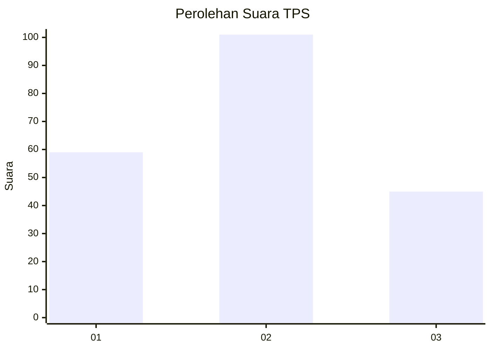
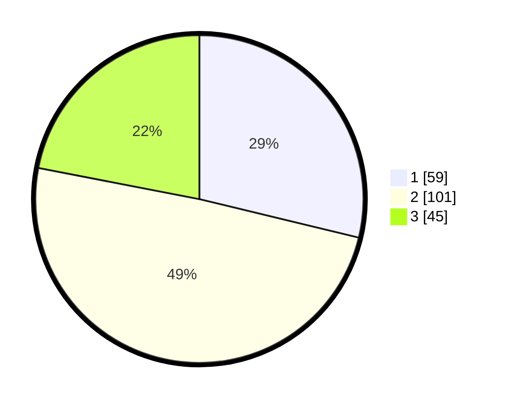

# Hasil

## Grafik

## Tabel

| No. | Nama Paslon    | Suara | Suara (raw) | Persentase |
|:--- |:-------------- | -----:| -----------:| ----------:|
| 1   | ANIES MUHAIMIN | 59    | [59][p-1]   | 28,78      |
| 2   | PRABOWO GIBRAN | 101   | [101][p-2]  | 49,27      |
| 3   | GANJAR MAHFUD  | 45    | [45][p-3]   | 21,95      |

[p-1]: https://github.com/gigit-pemilu/pemilu-2024-33-jawa-tengah/blob/main/pilpres/hitung-suara/sub/33-jawa-tengah/sub/08-magelang/sub/14-bandongan/sub/2001-bandongan/sub/003-tps/sub/paslon-1.txt
[p-2]: https://github.com/gigit-pemilu/pemilu-2024-33-jawa-tengah/blob/main/pilpres/hitung-suara/sub/33-jawa-tengah/sub/08-magelang/sub/14-bandongan/sub/2001-bandongan/sub/003-tps/sub/paslon-2.txt
[p-3]: https://github.com/gigit-pemilu/pemilu-2024-33-jawa-tengah/blob/main/pilpres/hitung-suara/sub/33-jawa-tengah/sub/08-magelang/sub/14-bandongan/sub/2001-bandongan/sub/003-tps/sub/paslon-3.txt

## Foto C Plano

https://sirekap-obj-formc.kpu.go.id/b621/pemilu/ppwp/33/08/14/20/01/3308142001003-20240214-235417--c5f8dcd9-f7d2-4112-a154-62cf71e4bd78.jpg

https://sirekap-obj-formc.kpu.go.id/b621/pemilu/ppwp/33/08/14/20/01/3308142001003-20240214-235535--ff0a6d00-47c9-4dfb-b45f-4ee11464525f.jpg

https://sirekap-obj-formc.kpu.go.id/b621/pemilu/ppwp/33/08/14/20/01/3308142001003-20240214-235649--516e946f-fac6-4497-8cd5-3fea4dfd4b56.jpg

## Metadata

| Key        | Value               |
| ---------- | ------------------- |
| Time Stamp | 2024-02-15 23:29:50 |

