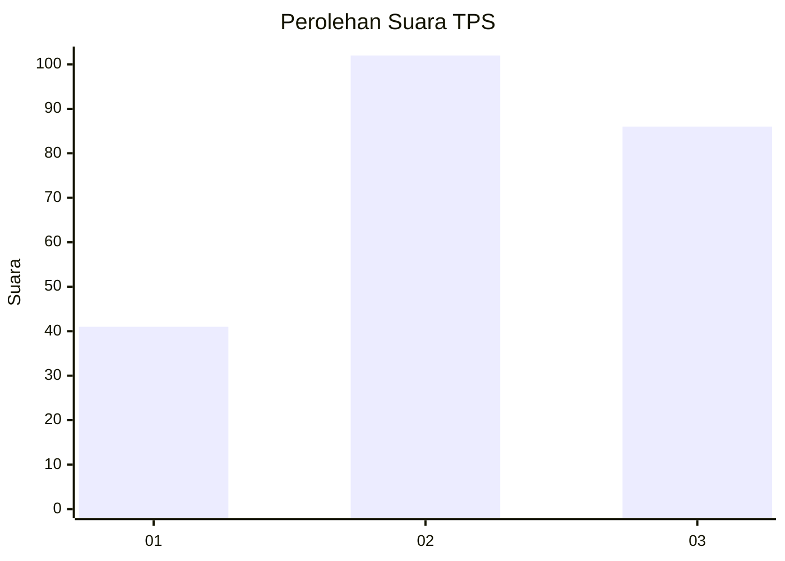
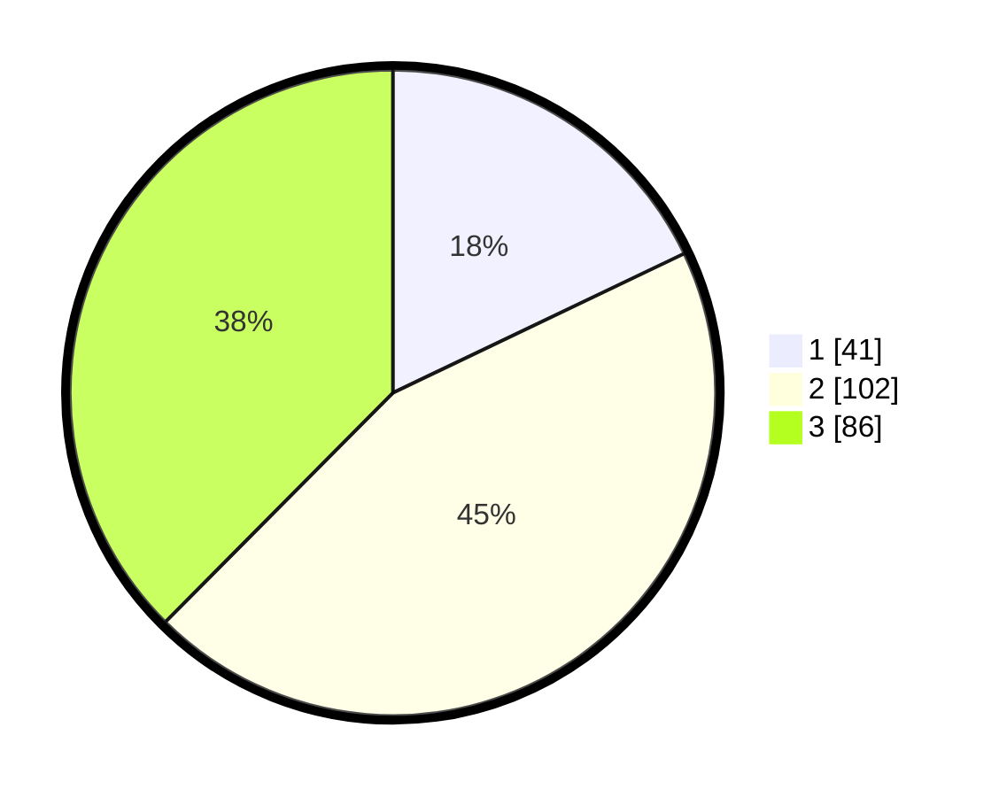

# Hasil

## Grafik

## Tabel

| No. | Nama Paslon    | Suara | Suara (raw) | Persentase |
|:--- |:-------------- | -----:| -----------:| ----------:|
| 1   | ANIES MUHAIMIN | 41    | [41][p-1]   | 17,90      |
| 2   | PRABOWO GIBRAN | 102   | [102][p-2]  | 44,54      |
| 3   | GANJAR MAHFUD  | 86    | [86][p-3]   | 37,55      |

[p-1]: https://github.com/gigit-pemilu/pemilu-2024/blob/main/pilpres/hitung-suara/sub/33-jawa-tengah/sub/08-magelang/sub/14-bandongan/sub/2001-bandongan/sub/006-tps/sub/paslon-1.txt
[p-2]: https://github.com/gigit-pemilu/pemilu-2024/blob/main/pilpres/hitung-suara/sub/33-jawa-tengah/sub/08-magelang/sub/14-bandongan/sub/2001-bandongan/sub/006-tps/sub/paslon-2.txt
[p-3]: https://github.com/gigit-pemilu/pemilu-2024/blob/main/pilpres/hitung-suara/sub/33-jawa-tengah/sub/08-magelang/sub/14-bandongan/sub/2001-bandongan/sub/006-tps/sub/paslon-3.txt

## Foto C Plano

https://sirekap-obj-formc.kpu.go.id/09d1/pemilu/ppwp/33/08/14/20/01/3308142001006-20240215-053308--968e9a01-a845-490c-aa2b-5d6fbd507699.jpg

https://sirekap-obj-formc.kpu.go.id/09d1/pemilu/ppwp/33/08/14/20/01/3308142001006-20240215-053450--c295ae25-2633-4368-9c0f-d4da0390e09c.jpg

https://sirekap-obj-formc.kpu.go.id/09d1/pemilu/ppwp/33/08/14/20/01/3308142001006-20240215-053615--890f6703-44e3-4a02-bc21-7542201453bb.jpg

## Metadata

| Key        | Value               |
| ---------- | ------------------- |
| Time Stamp | 2024-02-15 21:30:27 |

