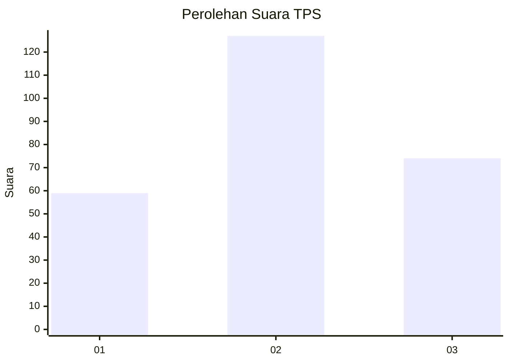
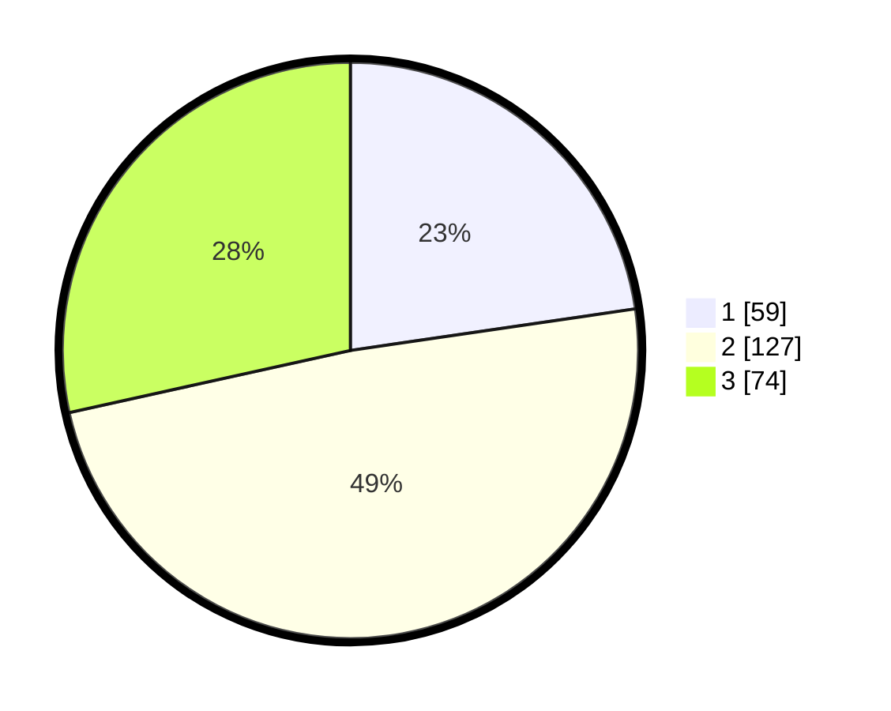

# Hasil

## Grafik

## Tabel

| No. | Nama Paslon    | Suara | Suara (raw) | Persentase |
|:--- |:-------------- | -----:| -----------:| ----------:|
| 1   | ANIES MUHAIMIN | 59    | [59][p-1]   | 22,69      |
| 2   | PRABOWO GIBRAN | 127   | [127][p-2]  | 48,85      |
| 3   | GANJAR MAHFUD  | 74    | [74][p-3]   | 28,46      |

[p-1]: https://github.com/gigit-pemilu/pemilu-2024/blob/main/pilpres/hitung-suara/sub/33-jawa-tengah/sub/08-magelang/sub/14-bandongan/sub/2001-bandongan/sub/013-tps/sub/paslon-1.txt
[p-2]: https://github.com/gigit-pemilu/pemilu-2024/blob/main/pilpres/hitung-suara/sub/33-jawa-tengah/sub/08-magelang/sub/14-bandongan/sub/2001-bandongan/sub/013-tps/sub/paslon-2.txt
[p-3]: https://github.com/gigit-pemilu/pemilu-2024/blob/main/pilpres/hitung-suara/sub/33-jawa-tengah/sub/08-magelang/sub/14-bandongan/sub/2001-bandongan/sub/013-tps/sub/paslon-3.txt

## Foto C Plano

https://sirekap-obj-formc.kpu.go.id/f3f3/pemilu/ppwp/33/08/14/20/01/3308142001013-20240215-025454--5da4fe7b-705e-4ba5-aab9-ffdab7807b5e.jpg

https://sirekap-obj-formc.kpu.go.id/f3f3/pemilu/ppwp/33/08/14/20/01/3308142001013-20240214-204912--36a565c2-d91a-4ac2-bcc2-4d714e72bf36.jpg

https://sirekap-obj-formc.kpu.go.id/f3f3/pemilu/ppwp/33/08/14/20/01/3308142001013-20240214-204919--ca431d0c-976d-4cec-8553-4091c2053d93.jpg

## Metadata

| Key        | Value               |
| ---------- | ------------------- |
| Time Stamp | 2024-02-15 03:06:03 |

