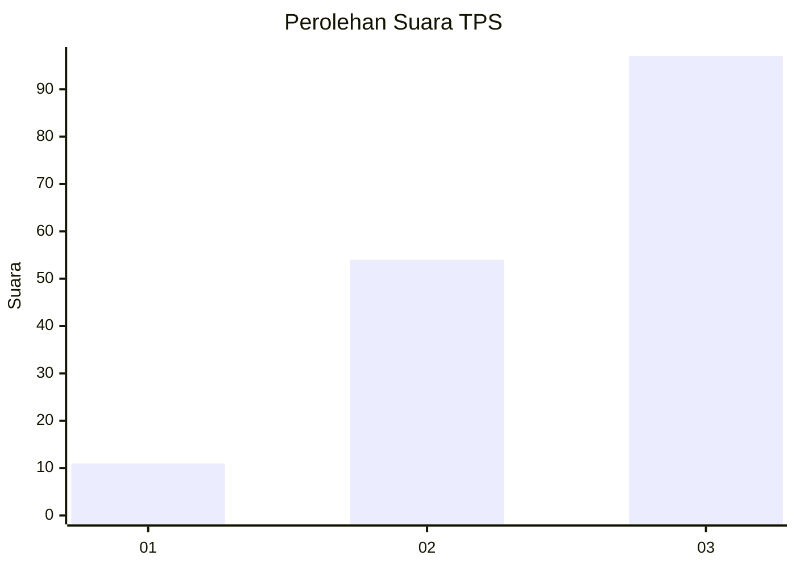
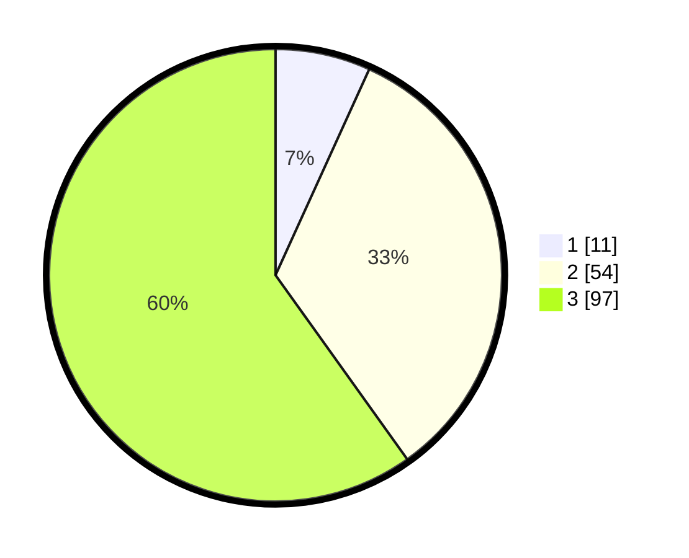

# Hasil

## Grafik

## Tabel

| No. | Nama Paslon    | Suara | Suara (raw) | Persentase |
|:--- |:-------------- | -----:| -----------:| ----------:|
| 1   | ANIES MUHAIMIN | 11    | [11][p-1]   | 6,79       |
| 2   | PRABOWO GIBRAN | 54    | [54][p-2]   | 33,33      |
| 3   | GANJAR MAHFUD  | 97    | [97][p-3]   | 59,88      |

[p-1]: https://github.com/gigit-pemilu/pemilu-2024/blob/main/pilpres/hitung-suara/sub/33-jawa-tengah/sub/08-magelang/sub/14-bandongan/sub/2006-sidorejo/sub/010-tps/sub/paslon-1.txt
[p-2]: https://github.com/gigit-pemilu/pemilu-2024/blob/main/pilpres/hitung-suara/sub/33-jawa-tengah/sub/08-magelang/sub/14-bandongan/sub/2006-sidorejo/sub/010-tps/sub/paslon-2.txt
[p-3]: https://github.com/gigit-pemilu/pemilu-2024/blob/main/pilpres/hitung-suara/sub/33-jawa-tengah/sub/08-magelang/sub/14-bandongan/sub/2006-sidorejo/sub/010-tps/sub/paslon-3.txt

## Foto C Plano

https://sirekap-obj-formc.kpu.go.id/24bc/pemilu/ppwp/33/08/14/20/06/3308142006010-20240216-154844--d7bd0020-a005-4a2a-8696-8453293ca157.jpg

https://sirekap-obj-formc.kpu.go.id/24bc/pemilu/ppwp/33/08/14/20/06/3308142006010-20240216-173412--c0869337-45bb-4bbd-a63f-9033f1851f52.jpg

https://sirekap-obj-formc.kpu.go.id/24bc/pemilu/ppwp/33/08/14/20/06/3308142006010-20240214-141949--e55da5df-942f-46a4-8ffc-2a9e4b5bc62c.jpg

## Metadata

| Key        | Value               |
| ---------- | ------------------- |
| Time Stamp | 2024-02-16 21:01:00 |

