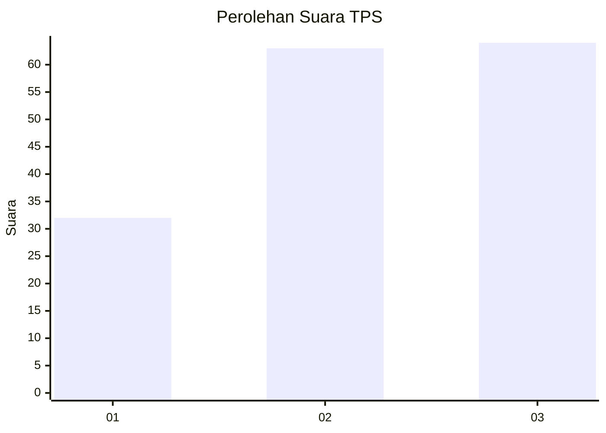
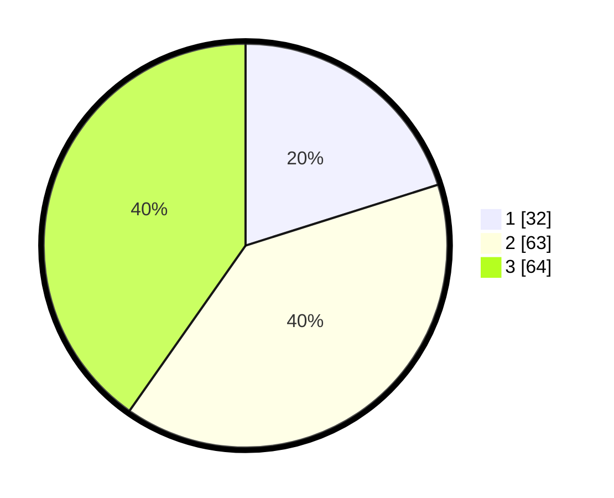

# Hasil

## Grafik

## Tabel

| No. | Nama Paslon    | Suara | Suara (raw) | Persentase |
|:--- |:-------------- | -----:| -----------:| ----------:|
| 1   | ANIES MUHAIMIN | 32    | [32][p-1]   | 20,13      |
| 2   | PRABOWO GIBRAN | 63    | [63][p-2]   | 39,62      |
| 3   | GANJAR MAHFUD  | 64    | [64][p-3]   | 40,25      |

[p-1]: https://github.com/gigit-pemilu/pemilu-2024-33-jawa-tengah/blob/main/pilpres/hitung-suara/sub/33-jawa-tengah/sub/08-magelang/sub/14-bandongan/sub/2007-trasan/sub/004-tps/sub/paslon-1.txt
[p-2]: https://github.com/gigit-pemilu/pemilu-2024-33-jawa-tengah/blob/main/pilpres/hitung-suara/sub/33-jawa-tengah/sub/08-magelang/sub/14-bandongan/sub/2007-trasan/sub/004-tps/sub/paslon-2.txt
[p-3]: https://github.com/gigit-pemilu/pemilu-2024-33-jawa-tengah/blob/main/pilpres/hitung-suara/sub/33-jawa-tengah/sub/08-magelang/sub/14-bandongan/sub/2007-trasan/sub/004-tps/sub/paslon-3.txt

## Foto C Plano

https://sirekap-obj-formc.kpu.go.id/eb44/pemilu/ppwp/33/08/14/20/07/3308142007004-20240216-193449--4a5a88e4-dd29-477e-b500-b337e9af341b.jpg

https://sirekap-obj-formc.kpu.go.id/eb44/pemilu/ppwp/33/08/14/20/07/3308142007004-20240216-191544--26d0bfdd-859b-4639-afa2-43600a5282b1.jpg

https://sirekap-obj-formc.kpu.go.id/eb44/pemilu/ppwp/33/08/14/20/07/3308142007004-20240216-193856--683106ac-4dc3-4cdb-8222-aacabb23418b.jpg

## Metadata

| Key        | Value               |
| ---------- | ------------------- |
| Time Stamp | 2024-02-17 11:30:03 |

