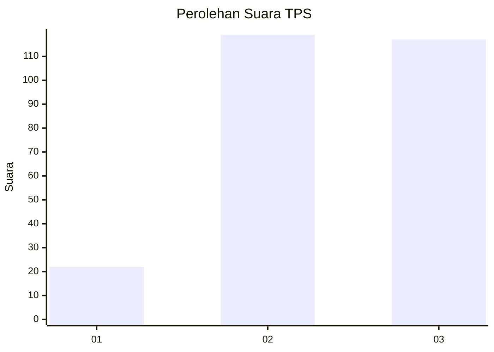
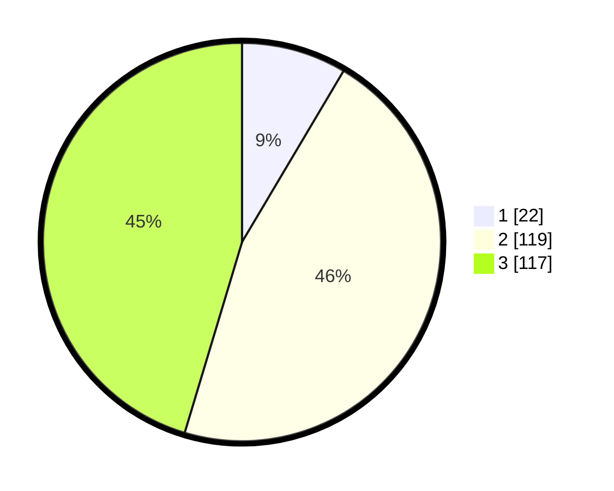

# Hasil

## Grafik

## Tabel

| No. | Nama Paslon    | Suara | Suara (raw) | Persentase |
|:--- |:-------------- | -----:| -----------:| ----------:|
| 1   | ANIES MUHAIMIN | 22    | [22][p-1]   | 8,53       |
| 2   | PRABOWO GIBRAN | 119   | [119][p-2]  | 46,12      |
| 3   | GANJAR MAHFUD  | 117   | [117][p-3]  | 45,35      |

[p-1]: https://github.com/gigit-pemilu/pemilu-2024-33-jawa-tengah/blob/main/pilpres/hitung-suara/sub/33-jawa-tengah/sub/08-magelang/sub/14-bandongan/sub/2014-rejosari/sub/013-tps/sub/paslon-1.txt
[p-2]: https://github.com/gigit-pemilu/pemilu-2024-33-jawa-tengah/blob/main/pilpres/hitung-suara/sub/33-jawa-tengah/sub/08-magelang/sub/14-bandongan/sub/2014-rejosari/sub/013-tps/sub/paslon-2.txt
[p-3]: https://github.com/gigit-pemilu/pemilu-2024-33-jawa-tengah/blob/main/pilpres/hitung-suara/sub/33-jawa-tengah/sub/08-magelang/sub/14-bandongan/sub/2014-rejosari/sub/013-tps/sub/paslon-3.txt

## Foto C Plano

https://sirekap-obj-formc.kpu.go.id/be3a/pemilu/ppwp/33/08/14/20/14/3308142014013-20240215-010445--ffd26591-b40d-4c1d-9efc-e16655ce752c.jpg

https://sirekap-obj-formc.kpu.go.id/be3a/pemilu/ppwp/33/08/14/20/14/3308142014013-20240215-024037--d7f84d6c-16e1-4f78-9e1c-074bc482e465.jpg

https://sirekap-obj-formc.kpu.go.id/be3a/pemilu/ppwp/33/08/14/20/14/3308142014013-20240215-010625--81e3d883-7d68-491e-8ca9-fbf8684697cb.jpg

## Metadata

| Key        | Value               |
| ---------- | ------------------- |
| Time Stamp | 2024-02-15 22:00:27 |

