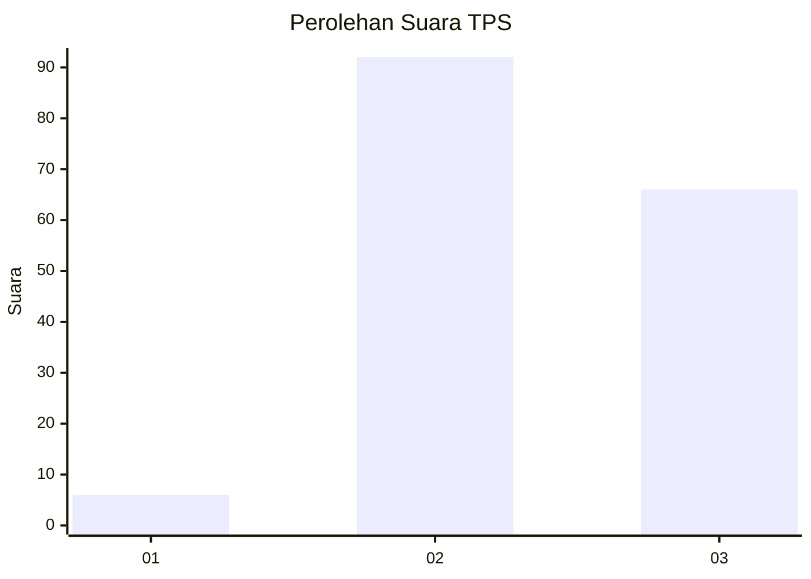
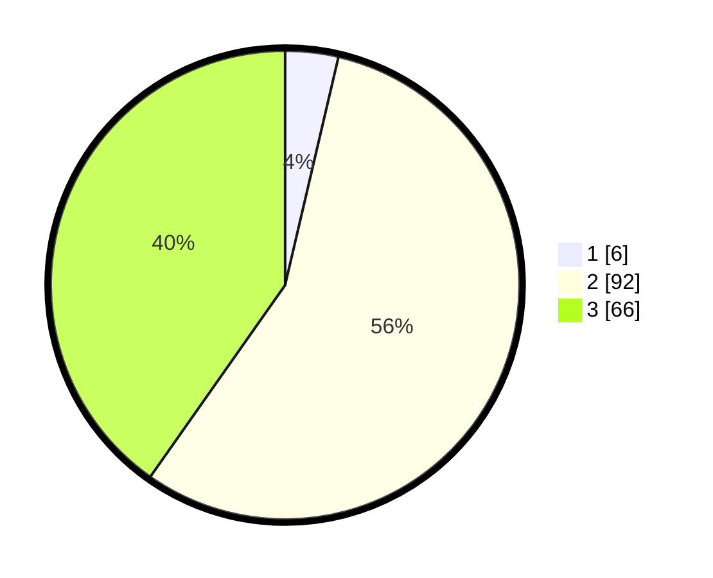

# Hasil

## Grafik

## Tabel

| No. | Nama Paslon    | Suara | Suara (raw) | Persentase |
|:--- |:-------------- | -----:| -----------:| ----------:|
| 1   | ANIES MUHAIMIN | 6     | [6][p-1]    | 3,66       |
| 2   | PRABOWO GIBRAN | 92    | [92][p-2]   | 56,10      |
| 3   | GANJAR MAHFUD  | 66    | [66][p-3]   | 40,24      |

[p-1]: https://github.com/gigit-pemilu/pemilu-2024-33-jawa-tengah/blob/main/pilpres/hitung-suara/sub/33-jawa-tengah/sub/08-magelang/sub/15-candimulyo/sub/2002-tempak/sub/001-tps/sub/paslon-1.txt
[p-2]: https://github.com/gigit-pemilu/pemilu-2024-33-jawa-tengah/blob/main/pilpres/hitung-suara/sub/33-jawa-tengah/sub/08-magelang/sub/15-candimulyo/sub/2002-tempak/sub/001-tps/sub/paslon-2.txt
[p-3]: https://github.com/gigit-pemilu/pemilu-2024-33-jawa-tengah/blob/main/pilpres/hitung-suara/sub/33-jawa-tengah/sub/08-magelang/sub/15-candimulyo/sub/2002-tempak/sub/001-tps/sub/paslon-3.txt

## Foto C Plano

https://sirekap-obj-formc.kpu.go.id/3045/pemilu/ppwp/33/08/15/20/02/3308152002001-20240215-033612--95744f4c-2d08-4f27-a3e1-4d5feba9e6be.jpg

https://sirekap-obj-formc.kpu.go.id/3045/pemilu/ppwp/33/08/15/20/02/3308152002001-20240214-230723--54945999-b418-4301-8cab-830e011250b2.jpg

https://sirekap-obj-formc.kpu.go.id/3045/pemilu/ppwp/33/08/15/20/02/3308152002001-20240215-032503--be4cfcea-6925-4db9-a0e7-cc422ca6df25.jpg

## Metadata

| Key        | Value               |
| ---------- | ------------------- |
| Time Stamp | 2024-02-15 15:00:29 |

