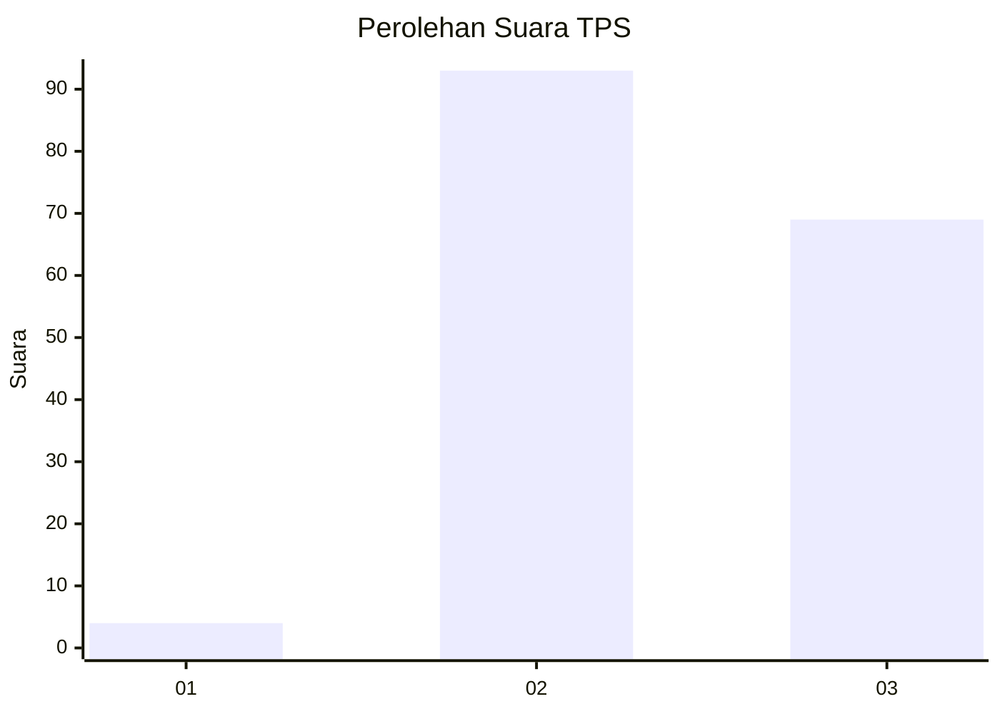
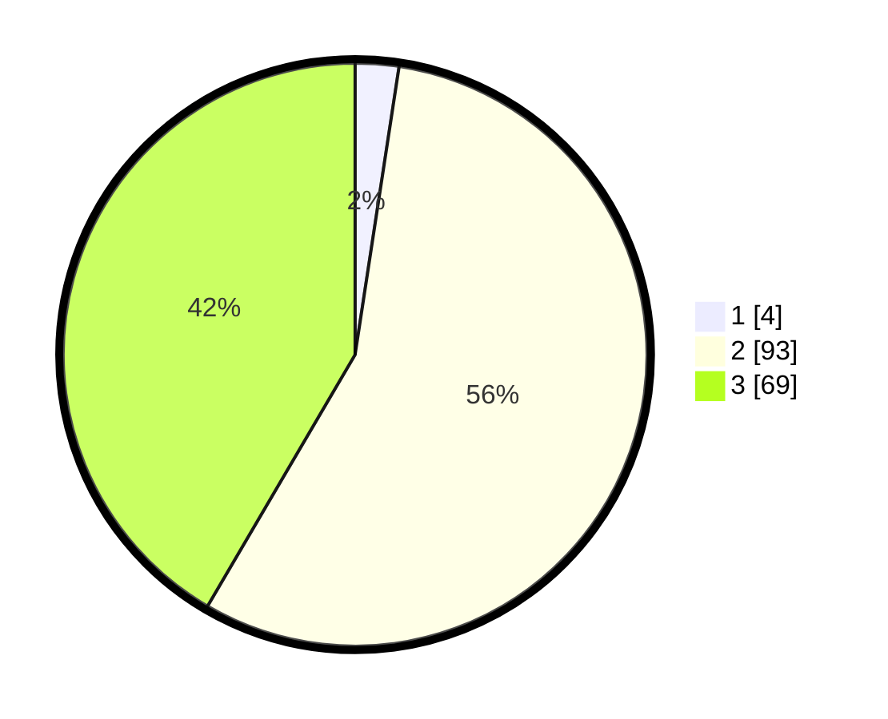

# Hasil

## Grafik

## Tabel

| No. | Nama Paslon    | Suara | Suara (raw) | Persentase |
|:--- |:-------------- | -----:| -----------:| ----------:|
| 1   | ANIES MUHAIMIN | 4     | [4][p-1]    | 2,41       |
| 2   | PRABOWO GIBRAN | 93    | [93][p-2]   | 56,02      |
| 3   | GANJAR MAHFUD  | 69    | [69][p-3]   | 41,57      |

[p-1]: https://github.com/gigit-pemilu/pemilu-2024/blob/main/pilpres/hitung-suara/sub/33-jawa-tengah/sub/08-magelang/sub/15-candimulyo/sub/2002-tempak/sub/007-tps/sub/paslon-1.txt
[p-2]: https://github.com/gigit-pemilu/pemilu-2024/blob/main/pilpres/hitung-suara/sub/33-jawa-tengah/sub/08-magelang/sub/15-candimulyo/sub/2002-tempak/sub/007-tps/sub/paslon-2.txt
[p-3]: https://github.com/gigit-pemilu/pemilu-2024/blob/main/pilpres/hitung-suara/sub/33-jawa-tengah/sub/08-magelang/sub/15-candimulyo/sub/2002-tempak/sub/007-tps/sub/paslon-3.txt

## Foto C Plano

https://sirekap-obj-formc.kpu.go.id/49e1/pemilu/ppwp/33/08/15/20/02/3308152002007-20240214-193453--6608bb67-e9ea-47fb-98b9-503a24a7a61a.jpg

https://sirekap-obj-formc.kpu.go.id/49e1/pemilu/ppwp/33/08/15/20/02/3308152002007-20240214-202456--13666415-bc88-4d60-b83b-78b669d99d5f.jpg

https://sirekap-obj-formc.kpu.go.id/49e1/pemilu/ppwp/33/08/15/20/02/3308152002007-20240214-195744--b9db151b-2ebf-4bf4-ac1b-a9acc4e86eb2.jpg

## Metadata

| Key        | Value               |
| ---------- | ------------------- |
| Time Stamp | 2024-02-14 21:46:01 |

