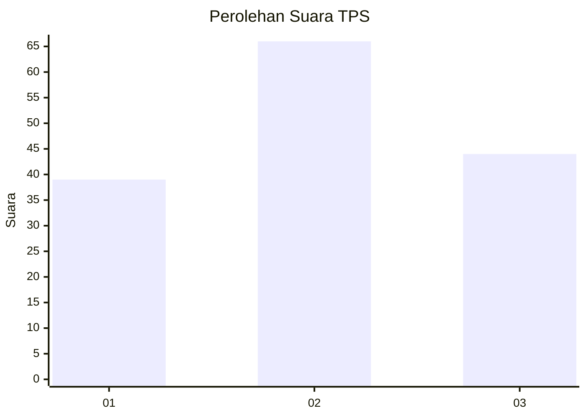
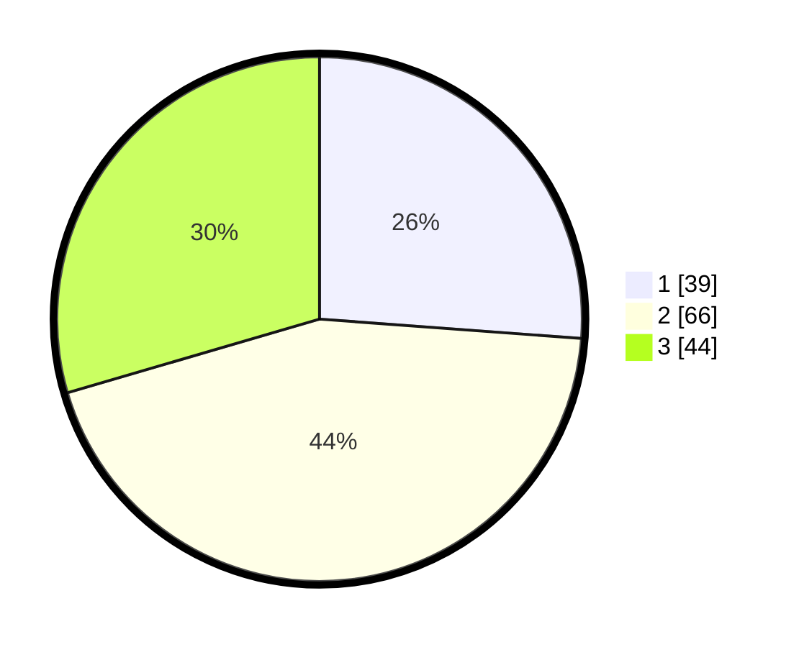

# Hasil

## Grafik

## Tabel

| No. | Nama Paslon    | Suara | Suara (raw) | Persentase |
|:--- |:-------------- | -----:| -----------:| ----------:|
| 1   | ANIES MUHAIMIN | 39    | [39][p-1]   | 26,17      |
| 2   | PRABOWO GIBRAN | 66    | [66][p-2]   | 44,30      |
| 3   | GANJAR MAHFUD  | 44    | [44][p-3]   | 29,53      |

[p-1]: https://github.com/gigit-pemilu/pemilu-2024-33-jawa-tengah/blob/main/pilpres/hitung-suara/sub/33-jawa-tengah/sub/08-magelang/sub/15-candimulyo/sub/2004-mejing/sub/014-tps/sub/paslon-1.txt
[p-2]: https://github.com/gigit-pemilu/pemilu-2024-33-jawa-tengah/blob/main/pilpres/hitung-suara/sub/33-jawa-tengah/sub/08-magelang/sub/15-candimulyo/sub/2004-mejing/sub/014-tps/sub/paslon-2.txt
[p-3]: https://github.com/gigit-pemilu/pemilu-2024-33-jawa-tengah/blob/main/pilpres/hitung-suara/sub/33-jawa-tengah/sub/08-magelang/sub/15-candimulyo/sub/2004-mejing/sub/014-tps/sub/paslon-3.txt

## Foto C Plano

https://sirekap-obj-formc.kpu.go.id/e51f/pemilu/ppwp/33/08/15/20/04/3308152004014-20240214-212554--6e742e13-8205-4c8d-a11b-8563948f4123.jpg

https://sirekap-obj-formc.kpu.go.id/e51f/pemilu/ppwp/33/08/15/20/04/3308152004014-20240214-212754--a7867d44-064a-4f31-ab51-3dcbf54e0a2d.jpg

https://sirekap-obj-formc.kpu.go.id/e51f/pemilu/ppwp/33/08/15/20/04/3308152004014-20240214-212831--cc79030b-983e-4519-9977-0bacf68ee9d4.jpg

## Metadata

| Key        | Value               |
| ---------- | ------------------- |
| Time Stamp | 2024-02-15 21:30:27 |

