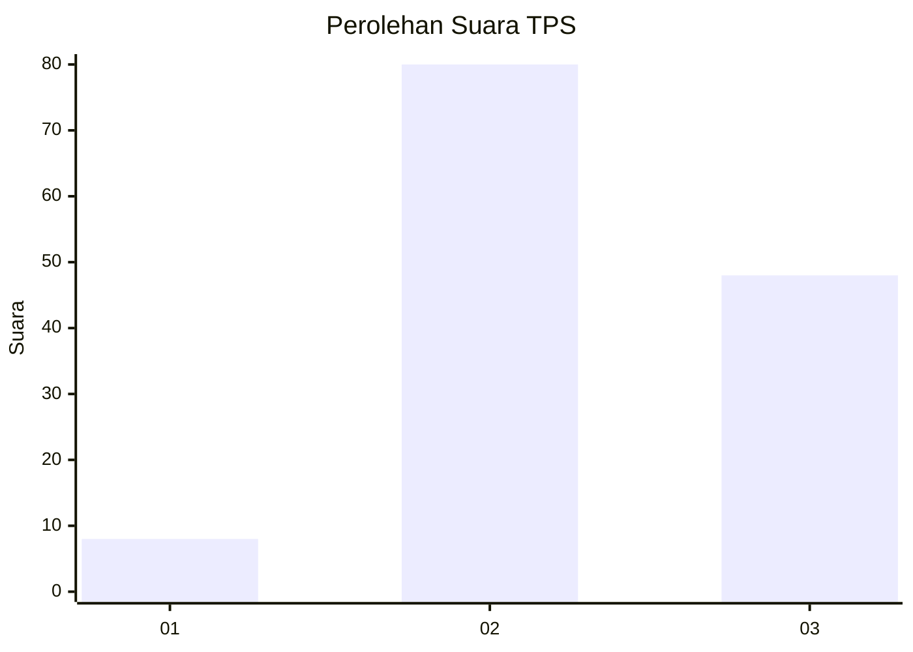
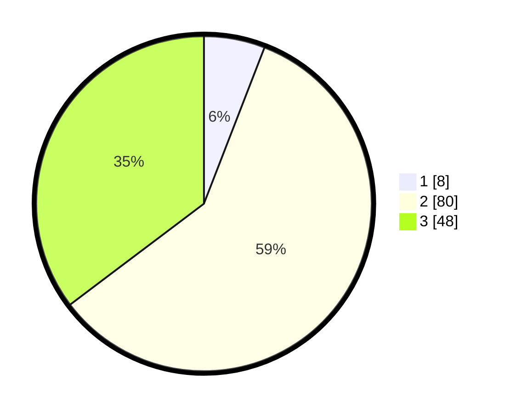

# Hasil

## Grafik

## Tabel

| No. | Nama Paslon    | Suara | Suara (raw) | Persentase |
|:--- |:-------------- | -----:| -----------:| ----------:|
| 1   | ANIES MUHAIMIN | 8     | [8][p-1]    | 5,88       |
| 2   | PRABOWO GIBRAN | 80    | [80][p-2]   | 58,82      |
| 3   | GANJAR MAHFUD  | 48    | [48][p-3]   | 35,29      |

[p-1]: https://github.com/gigit-pemilu/pemilu-2024-33-jawa-tengah/blob/main/pilpres/hitung-suara/sub/33-jawa-tengah/sub/08-magelang/sub/15-candimulyo/sub/2006-candimulyo/sub/004-tps/sub/paslon-1.txt
[p-2]: https://github.com/gigit-pemilu/pemilu-2024-33-jawa-tengah/blob/main/pilpres/hitung-suara/sub/33-jawa-tengah/sub/08-magelang/sub/15-candimulyo/sub/2006-candimulyo/sub/004-tps/sub/paslon-2.txt
[p-3]: https://github.com/gigit-pemilu/pemilu-2024-33-jawa-tengah/blob/main/pilpres/hitung-suara/sub/33-jawa-tengah/sub/08-magelang/sub/15-candimulyo/sub/2006-candimulyo/sub/004-tps/sub/paslon-3.txt

## Foto C Plano

https://sirekap-obj-formc.kpu.go.id/a4cc/pemilu/ppwp/33/08/15/20/06/3308152006004-20240214-231824--bb01358a-3758-4fb2-a4e3-838219a27fed.jpg

https://sirekap-obj-formc.kpu.go.id/a4cc/pemilu/ppwp/33/08/15/20/06/3308152006004-20240214-231849--c203d45a-3cc9-4578-9be7-34fbcb9c793e.jpg

https://sirekap-obj-formc.kpu.go.id/a4cc/pemilu/ppwp/33/08/15/20/06/3308152006004-20240214-231859--1cbef5c4-1b46-4610-87a8-70c9bc0d8771.jpg

## Metadata

| Key        | Value               |
| ---------- | ------------------- |
| Time Stamp | 2024-02-15 21:30:27 |

