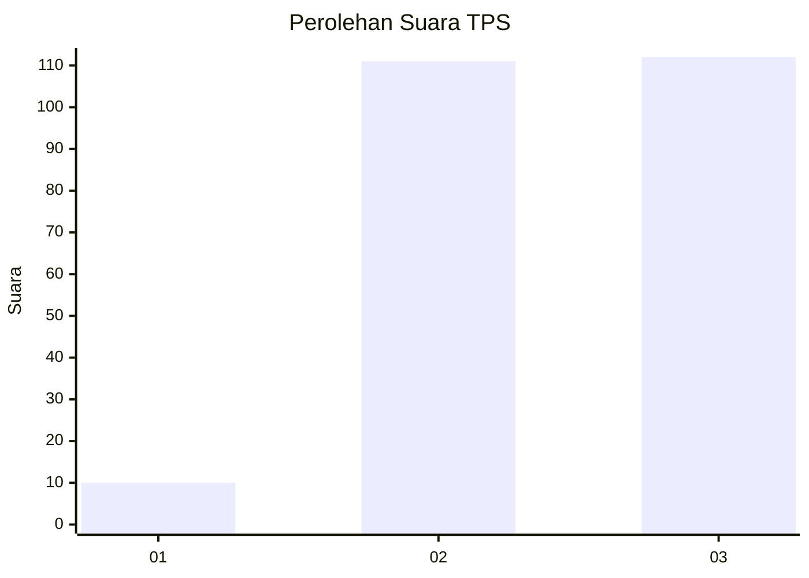
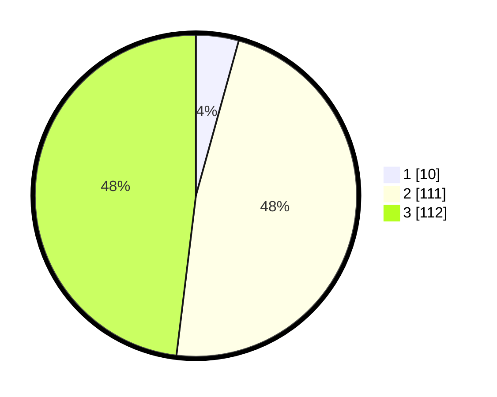

# Hasil

## Grafik

## Tabel

| No. | Nama Paslon    | Suara | Suara (raw) | Persentase |
|:--- |:-------------- | -----:| -----------:| ----------:|
| 1   | ANIES MUHAIMIN | 10    | [10][p-1]   | 4,29       |
| 2   | PRABOWO GIBRAN | 111   | [111][p-2]  | 47,64      |
| 3   | GANJAR MAHFUD  | 112   | [112][p-3]  | 48,07      |

[p-1]: https://github.com/gigit-pemilu/pemilu-2024/blob/main/pilpres/hitung-suara/sub/33-jawa-tengah/sub/08-magelang/sub/15-candimulyo/sub/2011-tampirkulon/sub/001-tps/sub/paslon-1.txt
[p-2]: https://github.com/gigit-pemilu/pemilu-2024/blob/main/pilpres/hitung-suara/sub/33-jawa-tengah/sub/08-magelang/sub/15-candimulyo/sub/2011-tampirkulon/sub/001-tps/sub/paslon-2.txt
[p-3]: https://github.com/gigit-pemilu/pemilu-2024/blob/main/pilpres/hitung-suara/sub/33-jawa-tengah/sub/08-magelang/sub/15-candimulyo/sub/2011-tampirkulon/sub/001-tps/sub/paslon-3.txt

## Foto C Plano

https://sirekap-obj-formc.kpu.go.id/2c15/pemilu/ppwp/33/08/15/20/11/3308152011001-20240214-212634--3e932389-dc51-40ce-af16-b47317e789f1.jpg

https://sirekap-obj-formc.kpu.go.id/2c15/pemilu/ppwp/33/08/15/20/11/3308152011001-20240214-221816--71a7690e-f611-45b1-b098-57033c65d793.jpg

https://sirekap-obj-formc.kpu.go.id/2c15/pemilu/ppwp/33/08/15/20/11/3308152011001-20240214-212614--c739c7c1-c59f-4d62-a890-1649c80e3926.jpg

## Metadata

| Key        | Value               |
| ---------- | ------------------- |
| Time Stamp | 2024-02-15 21:01:18 |

