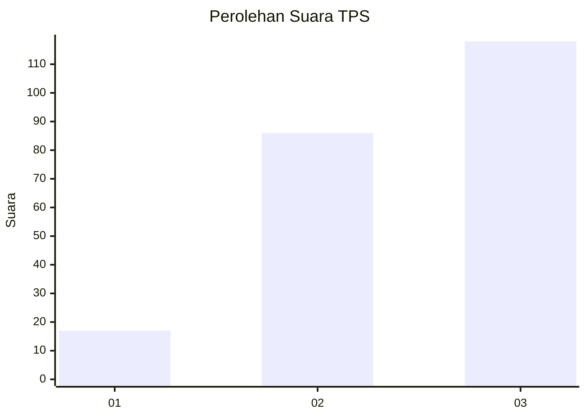
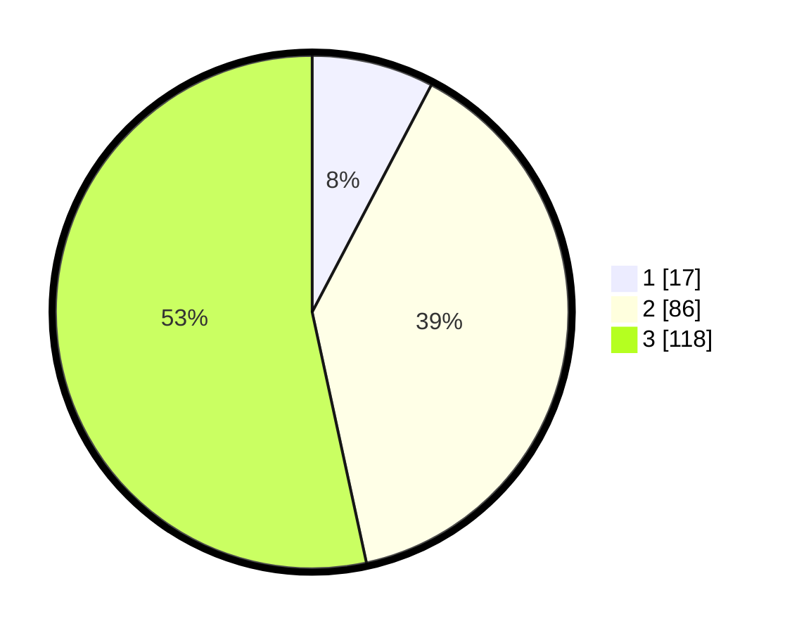

# Hasil

## Grafik

## Tabel

| No. | Nama Paslon    | Suara | Suara (raw) | Persentase |
|:--- |:-------------- | -----:| -----------:| ----------:|
| 1   | ANIES MUHAIMIN | 17    | [17][p-1]   | 7,69       |
| 2   | PRABOWO GIBRAN | 86    | [86][p-2]   | 38,91      |
| 3   | GANJAR MAHFUD  | 118   | [118][p-3]  | 53,39      |

[p-1]: https://github.com/gigit-pemilu/pemilu-2024-33-jawa-tengah/blob/main/pilpres/hitung-suara/sub/33-jawa-tengah/sub/08-magelang/sub/15-candimulyo/sub/2011-tampirkulon/sub/002-tps/sub/paslon-1.txt
[p-2]: https://github.com/gigit-pemilu/pemilu-2024-33-jawa-tengah/blob/main/pilpres/hitung-suara/sub/33-jawa-tengah/sub/08-magelang/sub/15-candimulyo/sub/2011-tampirkulon/sub/002-tps/sub/paslon-2.txt
[p-3]: https://github.com/gigit-pemilu/pemilu-2024-33-jawa-tengah/blob/main/pilpres/hitung-suara/sub/33-jawa-tengah/sub/08-magelang/sub/15-candimulyo/sub/2011-tampirkulon/sub/002-tps/sub/paslon-3.txt

## Foto C Plano

https://sirekap-obj-formc.kpu.go.id/a4e2/pemilu/ppwp/33/08/15/20/11/3308152011002-20240214-230856--e0c9437f-b48e-4fa3-8296-a3f200975697.jpg

https://sirekap-obj-formc.kpu.go.id/a4e2/pemilu/ppwp/33/08/15/20/11/3308152011002-20240214-231226--700e3925-362f-4554-940b-3c66143c98c1.jpg

https://sirekap-obj-formc.kpu.go.id/a4e2/pemilu/ppwp/33/08/15/20/11/3308152011002-20240214-231532--c0608f3c-c68b-47c8-b710-7ed4f5112688.jpg

## Metadata

| Key        | Value               |
| ---------- | ------------------- |
| Time Stamp | 2024-02-15 21:01:18 |

